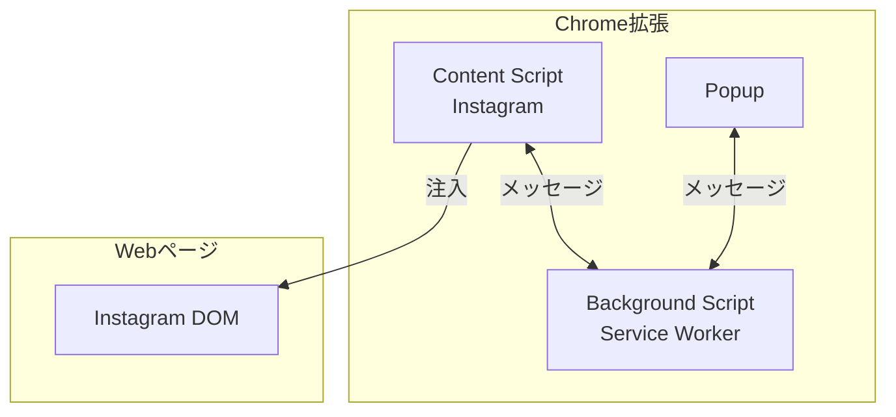
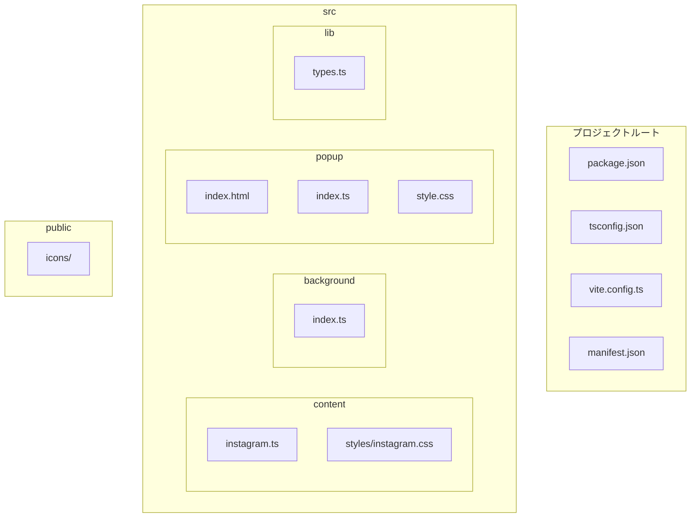

# 技術設計書 - FakeAdAlertDemo Phase 0: 環境構築

## 1. 要件トレーサビリティマトリックス

| 要件ID | 要件内容 | 設計項目 | 既存資産 | 新規理由 |
|--------|---------|---------|---------|---------|
| REQ-P0-001 | プロジェクト初期化 | package.json | ❌新規 | 新規プロジェクト |
| REQ-P0-002 | TypeScript環境 | tsconfig.json | ❌新規 | 新規プロジェクト |
| REQ-P0-003 | Viteビルド環境 | vite.config.ts | ❌新規 | 新規プロジェクト |
| REQ-P0-004 | Chrome拡張マニフェスト | manifest.json | ❌新規 | 新規プロジェクト |
| REQ-P0-005 | ディレクトリ構成 | src/, public/, config/ | ❌新規 | 新規プロジェクト |
| REQ-P0-006 | Content Script雛形 | src/content/instagram.ts | ❌新規 | 新規プロジェクト |
| REQ-P0-007 | Background Script雛形 | src/background/index.ts | ❌新規 | 新規プロジェクト |
| REQ-P0-008 | 動作確認 | 手動テスト | - | - |

---

## 2. アーキテクチャ概要

### 2.1 Chrome拡張構成図



### 2.2 ファイル構成図



---

## 3. 技術スタック

| カテゴリ | 技術 | バージョン | 用途 |
|---------|------|-----------|------|
| 言語 | TypeScript | ~5.x | 型安全な開発 |
| ビルド | Vite | ~5.x | 高速ビルド |
| 拡張ビルド | @crxjs/vite-plugin | ~2.x | Chrome拡張ビルド |
| 型定義 | @types/chrome | latest | Chrome API型定義 |
| リント | ESLint | ~9.x | コード品質 |
| パッケージ管理 | pnpm | ~9.x | 依存関係管理 |

---

## 4. モジュール設計

### 4.1 [REQ-P0-001] package.json

> 📌 要件: プロジェクト初期化、依存パッケージ、npm scripts

```json
{
  "name": "fake-ad-alert-demo",
  "version": "0.1.0",
  "private": true,
  "type": "module",
  "scripts": {
    "dev": "vite build --watch",
    "build": "vite build",
    "typecheck": "tsc --noEmit",
    "lint": "eslint src/"
  },
  "devDependencies": {
    "typescript": "^5.3.0",
    "vite": "^5.0.0",
    "@crxjs/vite-plugin": "^2.0.0-beta.23",
    "@types/chrome": "^0.0.260",
    "eslint": "^9.0.0",
    "@typescript-eslint/eslint-plugin": "^7.0.0",
    "@typescript-eslint/parser": "^7.0.0"
  }
}
```

### 4.2 [REQ-P0-002] tsconfig.json

> 📌 要件: TypeScript環境、厳格モード

```json
{
  "compilerOptions": {
    "target": "ES2020",
    "module": "ESNext",
    "moduleResolution": "bundler",
    "strict": true,
    "esModuleInterop": true,
    "skipLibCheck": true,
    "forceConsistentCasingInFileNames": true,
    "types": ["chrome"],
    "outDir": "dist",
    "rootDir": "src",
    "lib": ["ES2020", "DOM", "DOM.Iterable"]
  },
  "include": ["src/**/*"],
  "exclude": ["node_modules", "dist"]
}
```

### 4.3 [REQ-P0-003] vite.config.ts

> 📌 要件: Viteビルド環境、@crxjs/vite-plugin

```typescript
import { defineConfig } from 'vite';
import { crx } from '@crxjs/vite-plugin';
import manifest from './manifest.json';

export default defineConfig({
  plugins: [
    crx({ manifest }),
  ],
  build: {
    outDir: 'dist',
    emptyDirBeforeWrite: true,
  },
});
```

### 4.4 [REQ-P0-004] manifest.json

> 📌 要件: Manifest V3、host_permissions、Content/Background Script

```json
{
  "manifest_version": 3,
  "name": "FakeAdAlertDemo",
  "version": "0.1.0",
  "description": "SNS上のフェイク広告を検出して警告表示するデモ",
  "permissions": [
    "activeTab",
    "storage"
  ],
  "host_permissions": [
    "https://www.instagram.com/*",
    "https://www.tiktok.com/*",
    "https://www.youtube.com/*"
  ],
  "content_scripts": [
    {
      "matches": ["https://www.instagram.com/*"],
      "js": ["src/content/instagram.ts"],
      "css": ["src/content/styles/instagram.css"],
      "run_at": "document_idle"
    }
  ],
  "background": {
    "service_worker": "src/background/index.ts",
    "type": "module"
  },
  "action": {
    "default_popup": "src/popup/index.html",
    "default_icon": {
      "16": "icons/icon16.png",
      "48": "icons/icon48.png",
      "128": "icons/icon128.png"
    }
  },
  "icons": {
    "16": "icons/icon16.png",
    "48": "icons/icon48.png",
    "128": "icons/icon128.png"
  }
}
```

### 4.5 [REQ-P0-006] Content Script雛形

> 📌 要件: Instagram動作、DOMContentLoaded、ログ出力

**src/content/instagram.ts:**
```typescript
/**
 * Instagram Content Script
 * Phase 0: 動作確認用の雛形
 */

const SCRIPT_NAME = '[FakeAdAlertDemo]';

/**
 * 初期化処理
 */
const init = (): void => {
  console.log(`${SCRIPT_NAME} Initializing on Instagram...`);

  // TODO: Phase 1で広告検出ロジックを実装
};

/**
 * エントリーポイント
 */
const main = (): void => {
  console.log(`${SCRIPT_NAME} Instagram Content Script loaded`);

  if (document.readyState === 'loading') {
    document.addEventListener('DOMContentLoaded', init);
  } else {
    init();
  }
};

main();
```

**src/content/styles/instagram.css:**
```css
/*
 * Instagram用スタイル
 * Phase 1で警告オーバーレイ等のスタイルを実装
 */
```

### 4.6 [REQ-P0-007] Background Script雛形

> 📌 要件: Service Worker、インストールイベント、メッセージ受信

**src/background/index.ts:**
```typescript
/**
 * Background Script (Service Worker)
 * Phase 0: 動作確認用の雛形
 */

const SCRIPT_NAME = '[FakeAdAlertDemo]';

// 拡張機能インストール時の処理
chrome.runtime.onInstalled.addListener((details) => {
  console.log(`${SCRIPT_NAME} Extension installed:`, details.reason);
});

// Content Scriptからのメッセージを受信
chrome.runtime.onMessage.addListener((message, sender, sendResponse) => {
  console.log(`${SCRIPT_NAME} Message received:`, message);
  console.log(`${SCRIPT_NAME} From:`, sender.tab?.url);

  // TODO: Phase 1以降でメッセージハンドリングを実装
  sendResponse({ status: 'ok' });
  return true; // 非同期レスポンスを有効化
});

console.log(`${SCRIPT_NAME} Background Script loaded`);
```

---

## 5. ディレクトリ構成

> 📌 要件: REQ-P0-005

```
fake-ad-alert-demo/
├── src/
│   ├── content/                 # Content Scripts
│   │   ├── instagram.ts         # Instagram用（Phase 0で作成）
│   │   ├── tiktok.ts            # TikTok用（Phase 2で作成）
│   │   ├── youtube.ts           # YouTube用（Phase 4で作成）
│   │   └── styles/              # 注入用CSS
│   │       └── instagram.css    # Instagram用（Phase 0で作成）
│   ├── background/              # Background Script
│   │   └── index.ts             # Service Worker（Phase 0で作成）
│   ├── popup/                   # ポップアップUI
│   │   ├── index.html           # HTML（Phase 0で空ファイル）
│   │   ├── index.ts             # TS（Phase 3で実装）
│   │   └── style.css            # CSS（Phase 3で実装）
│   ├── lib/                     # 共通ライブラリ
│   │   └── types.ts             # 型定義（Phase 0で空ファイル）
│   └── components/              # UIコンポーネント（Phase 1で作成）
├── config/                      # 設定ファイル（Phase 1で作成）
├── public/
│   └── icons/                   # 拡張機能アイコン
│       ├── icon16.png           # 16x16（プレースホルダー）
│       ├── icon48.png           # 48x48（プレースホルダー）
│       └── icon128.png          # 128x128（プレースホルダー）
├── dist/                        # ビルド出力（.gitignore）
├── .specs/                      # 仕様書
├── docs/                        # ドキュメント
├── manifest.json                # Chrome拡張マニフェスト
├── package.json                 # プロジェクト設定
├── tsconfig.json                # TypeScript設定
├── vite.config.ts               # Vite設定
├── .gitignore                   # Git除外設定
├── CONCEPT.md                   # コンセプト
└── CLAUDE.md                    # 開発ガイドライン
```

---

## 6. 技術的決定事項

| 決定項目 | 選択 | 理由 |
|---------|------|------|
| ビルドツール | Vite + @crxjs/vite-plugin | 高速、HMR対応、Chrome拡張に特化 |
| 言語 | TypeScript | 型安全性、IDE支援 |
| マニフェスト | V3 | Chrome最新仕様、V2は非推奨 |
| パッケージマネージャ | pnpm | 高速、ディスク効率 |
| Content Script実行タイミング | document_idle | DOM構築完了後に実行 |

---

## 7. 実装ガイドライン

### 7.1 コーディング規約
- ファイル名: kebab-case（例: instagram.ts）
- 関数名: camelCase（例: initContentScript）
- 定数: UPPER_SNAKE_CASE（例: SCRIPT_NAME）
- 型定義: PascalCase（例: AdInfo）

### 7.2 ログ出力
- プレフィックス `[FakeAdAlertDemo]` を付与
- 開発時のデバッグに使用

### 7.3 アイコン（プレースホルダー）
- Phase 0では単色の仮アイコンでOK
- Phase 3で正式なアイコンに差し替え
