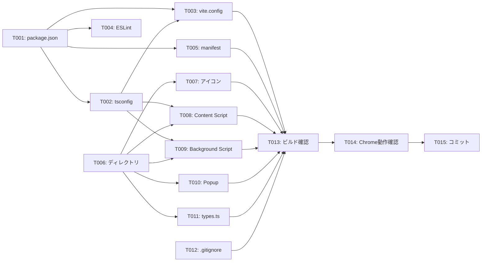

# タスクリスト - FakeAdAlertDemo Phase 0: 環境構築

## 1. 概要

Phase 0の設計書に基づくタスク分解。Chrome拡張の開発基盤を構築し、Instagramでの動作確認まで完了させる。

### 完了条件
- Chrome拡張として読み込み可能
- Instagramでコンソールログが出力される
- `pnpm typecheck` がエラーなし

---

## 2. タスク一覧

### Phase 0-A: プロジェクト基盤
- [x] T001: package.json作成・依存関係インストール
- [x] T002: TypeScript設定（tsconfig.json）
- [x] T003: Viteビルド設定（vite.config.ts）
- [x] T004: ESLint設定

### Phase 0-B: Chrome拡張設定
- [x] T005: manifest.json作成
- [x] T006: ディレクトリ構成作成
- [x] T007: プレースホルダーアイコン作成

### Phase 0-C: 雛形コード
- [x] T008: Content Script雛形（Instagram）
- [x] T009: Background Script雛形
- [x] T010: Popup雛形（空ファイル）
- [x] T011: 型定義ファイル（空ファイル）

### Phase 0-D: 確認・整備
- [x] T012: .gitignore作成
- [x] T013: ビルド動作確認
- [ ] T014: Chrome拡張読み込み・動作確認（手動テスト）
- [x] T015: コミット・プッシュ（PR #5）

---

## 3. タスク詳細

### T001: package.json作成・依存関係インストール
- **要件ID**: REQ-P0-001
- **設計書参照**: design.md §4.1
- **依存関係**: なし
- **対象ファイル**: package.json
- **完了条件**:
  - [ ] `pnpm init` でpackage.json作成
  - [ ] devDependencies追加（typescript, vite, @crxjs/vite-plugin, @types/chrome, eslint）
  - [ ] npm scripts定義（dev, build, typecheck, lint）
  - [ ] `pnpm install` が正常完了
- **並列実行**: T002, T004と同時実行不可（依存関係あり）

---

### T002: TypeScript設定（tsconfig.json）
- **要件ID**: REQ-P0-002
- **設計書参照**: design.md §4.2
- **依存関係**: T001
- **対象ファイル**: tsconfig.json
- **完了条件**:
  - [ ] tsconfig.json作成
  - [ ] strict: true 設定
  - [ ] types: ["chrome"] 設定
  - [ ] `pnpm typecheck` が実行可能
- **並列実行**: T003, T004, T005と同時実行可能

---

### T003: Viteビルド設定（vite.config.ts）
- **要件ID**: REQ-P0-003
- **設計書参照**: design.md §4.3
- **依存関係**: T001, T002
- **対象ファイル**: vite.config.ts
- **完了条件**:
  - [ ] vite.config.ts作成
  - [ ] @crxjs/vite-plugin設定
  - [ ] manifest.jsonの読み込み設定
- **並列実行**: T004, T005と同時実行可能

---

### T004: ESLint設定
- **要件ID**: REQ-P0-001（npm scripts）
- **設計書参照**: design.md §4.1
- **依存関係**: T001
- **対象ファイル**: eslint.config.js
- **完了条件**:
  - [ ] eslint.config.js作成（Flat Config形式）
  - [ ] TypeScript用設定
  - [ ] `pnpm lint` が実行可能
- **並列実行**: T002, T003, T005と同時実行可能

---

### T005: manifest.json作成
- **要件ID**: REQ-P0-004
- **設計書参照**: design.md §4.4
- **依存関係**: T001
- **対象ファイル**: manifest.json
- **完了条件**:
  - [ ] Manifest V3形式で作成
  - [ ] host_permissions設定（Instagram, TikTok, YouTube）
  - [ ] content_scripts設定（Instagram）
  - [ ] background設定（Service Worker）
  - [ ] action設定（Popup, アイコン）
- **並列実行**: T002, T003, T004と同時実行可能

---

### T006: ディレクトリ構成作成
- **要件ID**: REQ-P0-005
- **設計書参照**: design.md §5
- **依存関係**: なし
- **対象ファイル**: src/, public/, config/ ディレクトリ
- **完了条件**:
  - [ ] src/content/ 作成
  - [ ] src/content/styles/ 作成
  - [ ] src/background/ 作成
  - [ ] src/popup/ 作成
  - [ ] src/lib/ 作成
  - [ ] src/components/ 作成
  - [ ] config/ 作成
  - [ ] public/icons/ 作成
- **並列実行**: T001〜T005と同時実行可能

---

### T007: プレースホルダーアイコン作成
- **要件ID**: REQ-P0-004（アイコン参照）
- **設計書参照**: design.md §5
- **依存関係**: T006
- **対象ファイル**: public/icons/icon16.png, icon48.png, icon128.png
- **完了条件**:
  - [ ] 16x16 PNGアイコン作成
  - [ ] 48x48 PNGアイコン作成
  - [ ] 128x128 PNGアイコン作成
  - [ ] 単色の仮アイコンでOK
- **並列実行**: T008〜T011と同時実行可能

---

### T008: Content Script雛形（Instagram）
- **要件ID**: REQ-P0-006
- **設計書参照**: design.md §4.5
- **依存関係**: T002, T006
- **対象ファイル**: src/content/instagram.ts, src/content/styles/instagram.css
- **完了条件**:
  - [ ] instagram.ts作成
  - [ ] main()関数実装
  - [ ] init()関数実装
  - [ ] コンソールログ出力
  - [ ] instagram.css作成（空ファイル）
- **並列実行**: T009, T010, T011と同時実行可能

---

### T009: Background Script雛形
- **要件ID**: REQ-P0-007
- **設計書参照**: design.md §4.6
- **依存関係**: T002, T006
- **対象ファイル**: src/background/index.ts
- **完了条件**:
  - [ ] index.ts作成
  - [ ] onInstalled イベントハンドラ
  - [ ] onMessage イベントハンドラ
  - [ ] コンソールログ出力
- **並列実行**: T008, T010, T011と同時実行可能

---

### T010: Popup雛形（空ファイル）
- **要件ID**: REQ-P0-005
- **設計書参照**: design.md §5
- **依存関係**: T006
- **対象ファイル**: src/popup/index.html, index.ts, style.css
- **完了条件**:
  - [ ] index.html作成（最小限のHTML）
  - [ ] index.ts作成（空または最小限）
  - [ ] style.css作成（空ファイル）
- **並列実行**: T008, T009, T011と同時実行可能

---

### T011: 型定義ファイル（空ファイル）
- **要件ID**: REQ-P0-005
- **設計書参照**: design.md §5
- **依存関係**: T006
- **対象ファイル**: src/lib/types.ts
- **完了条件**:
  - [ ] types.ts作成（空または最小限のexport）
- **並列実行**: T008, T009, T010と同時実行可能

---

### T012: .gitignore作成
- **要件ID**: -（基盤タスク）
- **設計書参照**: design.md §5
- **依存関係**: なし
- **対象ファイル**: .gitignore
- **完了条件**:
  - [ ] node_modules/ 除外
  - [ ] dist/ 除外
  - [ ] .env 除外
  - [ ] *.local 除外
- **並列実行**: 全タスクと同時実行可能

---

### T013: ビルド動作確認
- **要件ID**: REQ-P0-003
- **設計書参照**: design.md §4.3
- **依存関係**: T001〜T011
- **対象ファイル**: dist/
- **完了条件**:
  - [ ] `pnpm build` が正常完了
  - [ ] dist/ フォルダが生成される
  - [ ] エラーが0件
  - [ ] `pnpm typecheck` がエラーなし
- **並列実行**: 不可（全タスク完了後）

---

### T014: Chrome拡張読み込み・動作確認
- **要件ID**: REQ-P0-008
- **設計書参照**: design.md（全体）
- **依存関係**: T013
- **対象ファイル**: -
- **完了条件**:
  - [ ] chrome://extensions/ で開発者モード有効化
  - [ ] dist/ フォルダを読み込み
  - [ ] 拡張機能アイコンがツールバーに表示
  - [ ] Instagramを開く
  - [ ] コンソールに `[FakeAdAlertDemo] Instagram Content Script loaded` 出力
  - [ ] コンソールに `[FakeAdAlertDemo] Initializing on Instagram...` 出力
  - [ ] エラーが0件
- **並列実行**: 不可（T013完了後）

---

### T015: コミット・プッシュ
- **要件ID**: -（基盤タスク）
- **設計書参照**: -
- **依存関係**: T014
- **対象ファイル**: -
- **完了条件**:
  - [ ] 全ファイルをステージング
  - [ ] コミットメッセージ（日本語）
  - [ ] GitHubにプッシュ
- **並列実行**: 不可（T014完了後）

---

## 4. 依存関係図

---

## 5. 並列実行計画

| フェーズ | 並列実行可能タスク | 備考 |
|---------|-------------------|------|
| 1 | T001, T006, T012 | 独立タスク |
| 2 | T002, T003, T004, T005, T007 | T001完了後 |
| 3 | T008, T009, T010, T011 | T002, T006完了後 |
| 4 | T013 | 全コード完了後 |
| 5 | T014 | ビルド完了後 |
| 6 | T015 | 動作確認完了後 |

---

## 6. 品質チェックリスト

- [x] すべてのタスクが要件IDと紐付いているか
- [x] 設計書にない機能のタスクは含まれていないか
- [x] 依存関係が明確に定義されているか
- [x] 完了条件が具体的で測定可能か
- [x] 並列実行の機会が最大化されているか
