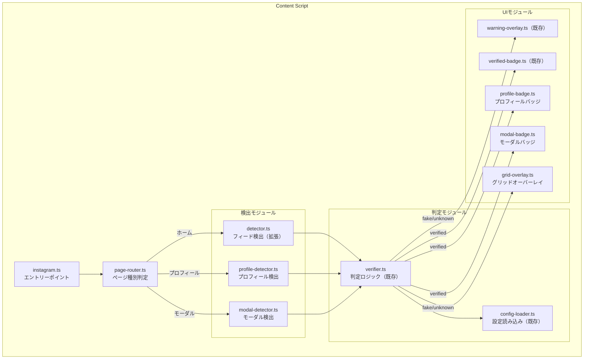
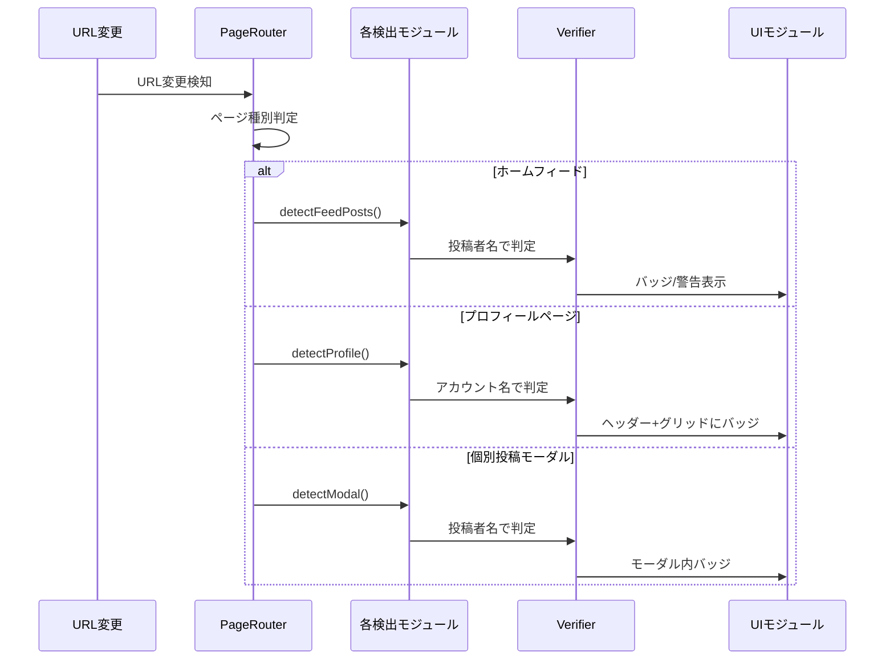

# 技術設計書 - FakeAdAlertDemo Phase 1.5: Instagram デモモード対応

## 1. 要件トレーサビリティマトリックス

| 要件ID | 要件内容 | 設計項目 | 既存資産 | 新規理由 |
|--------|---------|---------|---------|---------|
| REQ-P1.5-001 | 全投稿の検出 | detector.ts拡張 | ✅流用 | 条件変更 |
| REQ-P1.5-002 | アカウント名判定 | verifier.ts | ✅流用 | そのまま |
| REQ-P1.5-003 | プロフィールページ検出 | profile-detector.ts | ❌新規 | 新機能 |
| REQ-P1.5-004 | プロフィールヘッダーバッジ | profile-badge.ts | ❌新規 | 新機能 |
| REQ-P1.5-005 | グリッド表示対応 | grid-overlay.ts | ❌新規 | 新機能 |
| REQ-P1.5-006 | モーダル検出 | modal-detector.ts | ❌新規 | 新機能 |
| REQ-P1.5-007 | モーダル内バッジ | modal-badge.ts | ❌新規 | 新機能 |
| REQ-P1.5-008 | ホームフィード拡張 | detector.ts | ✅流用 | 条件変更 |
| REQ-P1.5-009 | 判定共通化 | verifier.ts | ✅流用 | そのまま |

---

## 2. アーキテクチャ概要

### 2.1 モジュール構成図



### 2.2 ページ種別と処理フロー



---

## 3. 技術スタック

| カテゴリ | 技術 | 用途 |
|---------|------|------|
| 既存 | TypeScript | 型安全な実装 |
| 既存 | MutationObserver | DOM変更監視 |
| 既存 | js-yaml | YAML設定読み込み |
| 新規 | History API | SPA URL変更監視 |

### 追加依存パッケージ

なし（既存の依存関係で対応可能）

---

## 4. モジュール設計

### 4.1 ページルーター（src/lib/page-router.ts）

> 📌 要件: REQ-P1.5-003

```typescript
/**
 * ページ種別
 */
export type PageType = 'home' | 'profile' | 'post' | 'other';

/**
 * 現在のページ種別を判定
 */
export const getPageType = (): PageType => {
  const path = window.location.pathname;

  // ホームフィード
  if (path === '/' || path === '/home/') {
    return 'home';
  }

  // 個別投稿 /p/{post_id}/
  if (path.match(/^\/p\/[\w-]+\/?$/)) {
    return 'post';
  }

  // プロフィールページ /{username}/
  if (path.match(/^\/[\w.]+\/?$/) && !path.includes('/p/')) {
    return 'profile';
  }

  return 'other';
};

/**
 * URLからユーザー名を取得
 */
export const getUsernameFromUrl = (): string | null => {
  const path = window.location.pathname;
  const match = path.match(/^\/([\w.]+)\/?$/);
  return match ? match[1] : null;
};

/**
 * URL変更を監視
 */
export const observeUrlChanges = (callback: () => void): void => {
  // popstateイベント（ブラウザバック/フォワード）
  window.addEventListener('popstate', callback);

  // pushState/replaceStateをフック
  const originalPushState = history.pushState;
  const originalReplaceState = history.replaceState;

  history.pushState = function(...args) {
    originalPushState.apply(this, args);
    callback();
  };

  history.replaceState = function(...args) {
    originalReplaceState.apply(this, args);
    callback();
  };
};
```

### 4.2 フィード検出の拡張（src/lib/detector.ts）

> 📌 要件: REQ-P1.5-001, REQ-P1.5-008

```typescript
// 既存のdetector.tsに追加

/**
 * デモモード: 広告ラベルなしでも全投稿を検出
 */
export const extractPostInfo = (articleElement: HTMLElement): AdInfo | null => {
  // 処理済みチェック
  if (articleElement.hasAttribute(PROCESSED_ATTR)) {
    return null;
  }

  // 投稿者名を取得（広告かどうかに関わらず）
  const header = articleElement.querySelector('header');
  const nameElement = header?.querySelector('a span, span span');
  const advertiserName = nameElement?.textContent?.trim() || 'Unknown';

  // 画像/動画コンテナを取得
  const mediaContainer = articleElement.querySelector('div > div > div');

  // 処理済みマーク
  articleElement.setAttribute(PROCESSED_ATTR, 'true');

  return {
    element: articleElement,
    advertiserName,
    imageElement: mediaContainer as HTMLElement | undefined,
    headerElement: header as HTMLElement | undefined,
  };
};

/**
 * デモモード: 全投稿を検出
 */
export const detectAllPosts = (): AdInfo[] => {
  const articles = document.querySelectorAll('article');
  const posts: AdInfo[] = [];

  articles.forEach((article) => {
    const postInfo = extractPostInfo(article as HTMLElement);
    if (postInfo) {
      posts.push(postInfo);
    }
  });

  return posts;
};
```

### 4.3 プロフィール検出（src/lib/profile-detector.ts）

> 📌 要件: REQ-P1.5-003, REQ-P1.5-004, REQ-P1.5-005

```typescript
import { getUsernameFromUrl } from './page-router';

const PROFILE_PROCESSED_ATTR = 'data-fakead-profile-processed';
const GRID_PROCESSED_ATTR = 'data-fakead-grid-processed';

/**
 * プロフィール情報
 */
export interface ProfileInfo {
  username: string;
  headerElement: HTMLElement | null;
  gridItems: HTMLElement[];
}

/**
 * プロフィールページの情報を取得
 */
export const detectProfile = (): ProfileInfo | null => {
  const username = getUsernameFromUrl();
  if (!username) {
    return null;
  }

  // ヘッダー要素を取得
  const headerElement = document.querySelector('header section') as HTMLElement;

  // グリッドアイテムを取得
  const gridContainer = document.querySelector('article') ||
                        document.querySelector('main > div > div');
  const gridItems = gridContainer
    ? Array.from(gridContainer.querySelectorAll('a[href*="/p/"]')) as HTMLElement[]
    : [];

  // 処理済みでないアイテムのみ
  const unprocessedItems = gridItems.filter(
    item => !item.hasAttribute(GRID_PROCESSED_ATTR)
  );

  return {
    username,
    headerElement: headerElement?.hasAttribute(PROFILE_PROCESSED_ATTR)
      ? null
      : headerElement,
    gridItems: unprocessedItems,
  };
};

/**
 * プロフィールヘッダーを処理済みにマーク
 */
export const markProfileProcessed = (element: HTMLElement): void => {
  element.setAttribute(PROFILE_PROCESSED_ATTR, 'true');
};

/**
 * グリッドアイテムを処理済みにマーク
 */
export const markGridItemProcessed = (element: HTMLElement): void => {
  element.setAttribute(GRID_PROCESSED_ATTR, 'true');
};
```

### 4.4 モーダル検出（src/lib/modal-detector.ts）

> 📌 要件: REQ-P1.5-006, REQ-P1.5-007

```typescript
const MODAL_PROCESSED_ATTR = 'data-fakead-modal-processed';

/**
 * モーダル情報
 */
export interface ModalInfo {
  username: string;
  modalElement: HTMLElement;
  headerElement: HTMLElement | null;
  mediaElement: HTMLElement | null;
}

/**
 * 個別投稿モーダルを検出
 */
export const detectModal = (): ModalInfo | null => {
  // モーダルの検出（role="dialog" または特定のクラス）
  const modal = document.querySelector('[role="dialog"] article') as HTMLElement;

  if (!modal || modal.hasAttribute(MODAL_PROCESSED_ATTR)) {
    return null;
  }

  // 投稿者名を取得
  const header = modal.querySelector('header');
  const nameElement = header?.querySelector('a span, span span');
  const username = nameElement?.textContent?.trim() || 'Unknown';

  // メディア要素
  const mediaElement = modal.querySelector('div > div > div') as HTMLElement;

  return {
    username,
    modalElement: modal,
    headerElement: header as HTMLElement | null,
    mediaElement,
  };
};

/**
 * モーダルを処理済みにマーク
 */
export const markModalProcessed = (element: HTMLElement): void => {
  element.setAttribute(MODAL_PROCESSED_ATTR, 'true');
};

/**
 * モーダルの開閉を監視
 */
export const observeModal = (callback: () => void): MutationObserver => {
  const observer = new MutationObserver((mutations) => {
    for (const mutation of mutations) {
      if (mutation.type === 'childList') {
        const hasDialog = document.querySelector('[role="dialog"]');
        if (hasDialog) {
          callback();
        }
      }
    }
  });

  observer.observe(document.body, {
    childList: true,
    subtree: true,
  });

  return observer;
};
```

### 4.5 プロフィールバッジ（src/components/profile-badge.ts）

> 📌 要件: REQ-P1.5-004

```typescript
import type { VerificationInfo } from '../lib/types';

const PROFILE_BADGE_CLASS = 'fakead-profile-badge';
const PROFILE_WARNING_CLASS = 'fakead-profile-warning';

/**
 * プロフィールヘッダーにバッジを表示
 */
export const showProfileBadge = (
  headerElement: HTMLElement,
  verification: VerificationInfo
): void => {
  // 既にバッジがあれば何もしない
  if (headerElement.querySelector(`.${PROFILE_BADGE_CLASS}, .${PROFILE_WARNING_CLASS}`)) {
    return;
  }

  const badge = document.createElement('div');

  if (verification.result === 'verified') {
    badge.className = PROFILE_BADGE_CLASS;
    badge.innerHTML = `
      <span class="fakead-profile-badge-icon">✅</span>
      <span class="fakead-profile-badge-text">VeriCerts認証済み</span>
    `;
  } else {
    badge.className = PROFILE_WARNING_CLASS;
    badge.innerHTML = `
      <span class="fakead-profile-warning-icon">⚠️</span>
      <span class="fakead-profile-warning-text">未認証アカウント</span>
    `;
  }

  // ヘッダー内の適切な位置に挿入
  const titleElement = headerElement.querySelector('h2, h1');
  if (titleElement) {
    titleElement.parentElement?.appendChild(badge);
  } else {
    headerElement.appendChild(badge);
  }
};
```

### 4.6 グリッドオーバーレイ（src/components/grid-overlay.ts）

> 📌 要件: REQ-P1.5-005

```typescript
import type { VerificationInfo } from '../lib/types';

const GRID_BADGE_CLASS = 'fakead-grid-badge';
const GRID_WARNING_CLASS = 'fakead-grid-warning';

/**
 * グリッドアイテムにオーバーレイを表示
 */
export const showGridOverlay = (
  gridItem: HTMLElement,
  verification: VerificationInfo
): void => {
  // 既にオーバーレイがあれば何もしない
  if (gridItem.querySelector(`.${GRID_BADGE_CLASS}, .${GRID_WARNING_CLASS}`)) {
    return;
  }

  // 親要素をrelativeに
  gridItem.style.position = 'relative';

  const overlay = document.createElement('div');

  if (verification.result === 'verified') {
    overlay.className = GRID_BADGE_CLASS;
    overlay.innerHTML = '✅';
  } else {
    overlay.className = GRID_WARNING_CLASS;
    overlay.innerHTML = '⚠️';
  }

  gridItem.appendChild(overlay);
};
```

### 4.7 モーダルバッジ（src/components/modal-badge.ts）

> 📌 要件: REQ-P1.5-007

```typescript
import type { VerificationInfo } from '../lib/types';

const MODAL_BADGE_CLASS = 'fakead-modal-badge';
const MODAL_OVERLAY_CLASS = 'fakead-modal-overlay';

/**
 * モーダル内にバッジを表示
 */
export const showModalBadge = (
  headerElement: HTMLElement,
  verification: VerificationInfo
): void => {
  if (headerElement.querySelector(`.${MODAL_BADGE_CLASS}`)) {
    return;
  }

  const badge = document.createElement('span');
  badge.className = MODAL_BADGE_CLASS;

  if (verification.result === 'verified') {
    badge.innerHTML = `
      <span class="fakead-modal-badge-icon">✅</span>
      <span class="fakead-modal-badge-text">認証済み</span>
    `;
  } else {
    badge.innerHTML = `
      <span class="fakead-modal-badge-icon">⚠️</span>
      <span class="fakead-modal-badge-text">未認証</span>
    `;
  }

  const nameElement = headerElement.querySelector('a');
  if (nameElement) {
    nameElement.parentElement?.appendChild(badge);
  }
};

/**
 * モーダル内に警告オーバーレイを表示
 */
export const showModalOverlay = (
  mediaElement: HTMLElement,
  verification: VerificationInfo
): void => {
  if (verification.result === 'verified') {
    return;
  }

  if (mediaElement.parentElement?.querySelector(`.${MODAL_OVERLAY_CLASS}`)) {
    return;
  }

  const overlay = document.createElement('div');
  overlay.className = MODAL_OVERLAY_CLASS;
  overlay.innerHTML = `
    <div class="fakead-modal-overlay-content">
      <span class="fakead-modal-overlay-icon">⚠️</span>
      <span class="fakead-modal-overlay-text">未認証アカウント</span>
    </div>
  `;

  const parent = mediaElement.parentElement;
  if (parent) {
    parent.style.position = 'relative';
    parent.appendChild(overlay);
  }
};
```

---

## 5. CSS設計（src/content/styles/instagram.css 追加分）

> 📌 要件: REQ-P1.5-004, REQ-P1.5-005, REQ-P1.5-007

```css
/* ==================== プロフィールバッジ ==================== */

.fakead-profile-badge {
  display: inline-flex;
  align-items: center;
  gap: 6px;
  margin-top: 8px;
  padding: 6px 12px;
  background: rgba(34, 197, 94, 0.15);
  border: 1px solid rgba(34, 197, 94, 0.3);
  border-radius: 16px;
  font-size: 14px;
  color: #16a34a;
  font-family: -apple-system, BlinkMacSystemFont, 'Segoe UI', Roboto, sans-serif;
}

.fakead-profile-warning {
  display: inline-flex;
  align-items: center;
  gap: 6px;
  margin-top: 8px;
  padding: 6px 12px;
  background: rgba(239, 68, 68, 0.15);
  border: 1px solid rgba(239, 68, 68, 0.3);
  border-radius: 16px;
  font-size: 14px;
  color: #dc2626;
  font-family: -apple-system, BlinkMacSystemFont, 'Segoe UI', Roboto, sans-serif;
}

/* ==================== グリッドオーバーレイ ==================== */

.fakead-grid-badge,
.fakead-grid-warning {
  position: absolute;
  top: 8px;
  right: 8px;
  width: 24px;
  height: 24px;
  display: flex;
  align-items: center;
  justify-content: center;
  border-radius: 50%;
  font-size: 14px;
  z-index: 10;
  pointer-events: none;
}

.fakead-grid-badge {
  background: rgba(34, 197, 94, 0.9);
  box-shadow: 0 2px 4px rgba(0, 0, 0, 0.2);
}

.fakead-grid-warning {
  background: rgba(239, 68, 68, 0.9);
  box-shadow: 0 2px 4px rgba(0, 0, 0, 0.2);
}

/* ==================== モーダルバッジ ==================== */

.fakead-modal-badge {
  display: inline-flex;
  align-items: center;
  gap: 4px;
  margin-left: 8px;
  padding: 2px 8px;
  border-radius: 12px;
  font-size: 12px;
  font-family: -apple-system, BlinkMacSystemFont, 'Segoe UI', Roboto, sans-serif;
}

.fakead-modal-badge:has(.fakead-modal-badge-icon:first-child:contains("✅")) {
  background: rgba(34, 197, 94, 0.15);
  color: #16a34a;
}

.fakead-modal-overlay {
  position: absolute;
  top: 0;
  left: 0;
  right: 0;
  bottom: 0;
  background: rgba(239, 68, 68, 0.75);
  display: flex;
  align-items: center;
  justify-content: center;
  z-index: 100;
}

.fakead-modal-overlay-content {
  display: flex;
  flex-direction: column;
  align-items: center;
  gap: 8px;
  color: white;
  text-align: center;
}

.fakead-modal-overlay-icon {
  font-size: 36px;
}

.fakead-modal-overlay-text {
  font-size: 16px;
  font-weight: 600;
}
```

---

## 6. 更新版Content Script（src/content/instagram.ts）

```typescript
/**
 * Instagram Content Script
 * Phase 1.5: デモモード対応
 */

import { getPageType, observeUrlChanges } from '../lib/page-router';
import { detectAllPosts } from '../lib/detector';
import { detectProfile, markProfileProcessed, markGridItemProcessed } from '../lib/profile-detector';
import { detectModal, markModalProcessed, observeModal } from '../lib/modal-detector';
import { verifyAdvertiser } from '../lib/verifier';
import { showWarningOverlay } from '../components/warning-overlay';
import { showVerifiedBadge } from '../components/verified-badge';
import { showProfileBadge } from '../components/profile-badge';
import { showGridOverlay } from '../components/grid-overlay';
import { showModalBadge, showModalOverlay } from '../components/modal-badge';
import './styles/instagram.css';

const SCRIPT_NAME = '[FakeAdAlertDemo]';

/**
 * ホームフィードの処理
 */
const processHomeFeed = (): void => {
  const posts = detectAllPosts();

  posts.forEach((post) => {
    const verification = verifyAdvertiser(post.advertiserName);
    console.log(`${SCRIPT_NAME} Post: ${post.advertiserName} -> ${verification.result}`);

    if (verification.result === 'verified') {
      showVerifiedBadge(post);
    } else {
      showWarningOverlay(post, verification);
    }
  });
};

/**
 * プロフィールページの処理
 */
const processProfilePage = (): void => {
  const profile = detectProfile();
  if (!profile) return;

  const verification = verifyAdvertiser(profile.username);
  console.log(`${SCRIPT_NAME} Profile: ${profile.username} -> ${verification.result}`);

  // ヘッダーバッジ
  if (profile.headerElement) {
    showProfileBadge(profile.headerElement, verification);
    markProfileProcessed(profile.headerElement);
  }

  // グリッドオーバーレイ
  profile.gridItems.forEach((item) => {
    showGridOverlay(item, verification);
    markGridItemProcessed(item);
  });
};

/**
 * モーダルの処理
 */
const processModal = (): void => {
  const modal = detectModal();
  if (!modal) return;

  const verification = verifyAdvertiser(modal.username);
  console.log(`${SCRIPT_NAME} Modal: ${modal.username} -> ${verification.result}`);

  if (modal.headerElement) {
    showModalBadge(modal.headerElement, verification);
  }

  if (modal.mediaElement) {
    showModalOverlay(modal.mediaElement, verification);
  }

  markModalProcessed(modal.modalElement);
};

/**
 * ページ種別に応じた処理を実行
 */
const processPage = (): void => {
  const pageType = getPageType();
  console.log(`${SCRIPT_NAME} Page type: ${pageType}`);

  switch (pageType) {
    case 'home':
      processHomeFeed();
      break;
    case 'profile':
      processProfilePage();
      break;
    case 'post':
      // 個別投稿ページ（直接アクセス時）
      processHomeFeed(); // articleがあれば処理
      break;
  }
};

/**
 * 初期化処理
 */
const init = (): void => {
  console.log(`${SCRIPT_NAME} Initializing (Demo Mode)...`);

  // 初回処理
  processPage();

  // URL変更を監視（SPA対応）
  observeUrlChanges(() => {
    console.log(`${SCRIPT_NAME} URL changed`);
    setTimeout(processPage, 500); // DOM更新を待つ
  });

  // モーダルを監視
  observeModal(() => {
    setTimeout(processModal, 300);
  });

  // DOM変更を監視（スクロールで追加される要素用）
  const observer = new MutationObserver(() => {
    requestAnimationFrame(processPage);
  });

  observer.observe(document.body, {
    childList: true,
    subtree: true,
  });

  // ページ離脱時にクリーンアップ
  window.addEventListener('beforeunload', () => {
    observer.disconnect();
  });
};

/**
 * エントリーポイント
 */
const main = (): void => {
  console.log(`${SCRIPT_NAME} Instagram Content Script loaded (Demo Mode)`);

  if (document.readyState === 'loading') {
    document.addEventListener('DOMContentLoaded', init);
  } else {
    init();
  }
};

main();
```

---

## 7. ディレクトリ構成（Phase 1.5追加分）

```
fake-ad-alert-demo/
├── src/
│   ├── content/
│   │   ├── instagram.ts          # 更新（デモモード対応）
│   │   └── styles/
│   │       └── instagram.css     # 更新（新スタイル追加）
│   ├── lib/
│   │   ├── types.ts              # 既存
│   │   ├── config-loader.ts      # 既存
│   │   ├── detector.ts           # 更新（extractPostInfo追加）
│   │   ├── verifier.ts           # 既存
│   │   ├── observer.ts           # 既存（使用継続）
│   │   ├── page-router.ts        # 新規
│   │   ├── profile-detector.ts   # 新規
│   │   └── modal-detector.ts     # 新規
│   └── components/
│       ├── warning-overlay.ts    # 既存
│       ├── verified-badge.ts     # 既存
│       ├── profile-badge.ts      # 新規
│       ├── grid-overlay.ts       # 新規
│       └── modal-badge.ts        # 新規
└── ...
```

---

## 8. 技術的決定事項

| 決定項目 | 選択 | 理由 |
|---------|------|------|
| URL変更検知 | History APIフック | SPAナビゲーション対応 |
| モーダル検知 | role="dialog"属性 | Instagram標準のアクセシビリティ属性 |
| グリッドバッジ | 絶対配置アイコン | サムネイルの視認性を維持 |
| 処理タイミング | setTimeout | DOM更新完了を待つ |
| 処理済みマーク | data属性 | シンプルで確実 |
