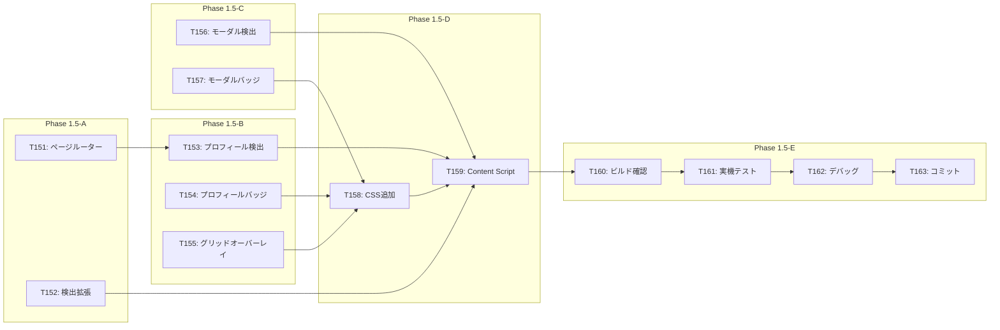

# タスクリスト - FakeAdAlertDemo Phase 1.5: Instagram デモモード対応

## 1. 概要

Phase 1.5の設計書に基づくタスク分解。デモモード・プロフィールページ・個別投稿モーダル対応を実装する。

### 前提条件
- Phase 1が完了していること（PR #6がマージ済み）

### 完了条件
- ホームフィードの通常投稿にバッジ/警告が表示される
- プロフィールページのヘッダー・グリッドにバッジが表示される
- 個別投稿モーダルにバッジ/警告が表示される

---

## 2. タスク一覧

### Phase 1.5-A: 基盤モジュール
- [ ] T151: ページルーター（page-router.ts）実装
- [ ] T152: フィード検出拡張（detector.ts）

### Phase 1.5-B: プロフィール対応
- [ ] T153: プロフィール検出（profile-detector.ts）実装
- [ ] T154: プロフィールバッジ（profile-badge.ts）実装
- [ ] T155: グリッドオーバーレイ（grid-overlay.ts）実装

### Phase 1.5-C: モーダル対応
- [ ] T156: モーダル検出（modal-detector.ts）実装
- [ ] T157: モーダルバッジ（modal-badge.ts）実装

### Phase 1.5-D: 統合
- [ ] T158: CSS追加（instagram.css拡張）
- [ ] T159: Content Script更新（instagram.ts）

### Phase 1.5-E: テスト・完了
- [ ] T160: ビルド・型チェック
- [ ] T161: 実機テスト（デモシナリオ確認）
- [ ] T162: デバッグ・調整
- [ ] T163: コミット・PR作成

---

## 3. タスク詳細

### T151: ページルーター（page-router.ts）実装
- **要件ID**: REQ-P1.5-003
- **設計書参照**: design.md §4.1
- **依存関係**: なし
- **対象ファイル**: src/lib/page-router.ts（新規）
- **完了条件**:
  - [ ] PageType型定義
  - [ ] getPageType関数実装
  - [ ] getUsernameFromUrl関数実装
  - [ ] observeUrlChanges関数実装
  - [ ] `pnpm typecheck` エラーなし
- **並列実行**: T152と同時実行可能

---

### T152: フィード検出拡張（detector.ts）
- **要件ID**: REQ-P1.5-001, REQ-P1.5-008
- **設計書参照**: design.md §4.2
- **依存関係**: なし
- **対象ファイル**: src/lib/detector.ts（更新）
- **完了条件**:
  - [ ] extractPostInfo関数追加（広告ラベル不要版）
  - [ ] detectAllPosts関数追加
  - [ ] 既存関数との共存確認
  - [ ] `pnpm typecheck` エラーなし
- **並列実行**: T151と同時実行可能

---

### T153: プロフィール検出（profile-detector.ts）実装
- **要件ID**: REQ-P1.5-003, REQ-P1.5-004, REQ-P1.5-005
- **設計書参照**: design.md §4.3
- **依存関係**: T151
- **対象ファイル**: src/lib/profile-detector.ts（新規）
- **完了条件**:
  - [ ] ProfileInfo型定義
  - [ ] detectProfile関数実装
  - [ ] markProfileProcessed関数実装
  - [ ] markGridItemProcessed関数実装
  - [ ] `pnpm typecheck` エラーなし
- **並列実行**: T154, T155, T156と同時実行可能

---

### T154: プロフィールバッジ（profile-badge.ts）実装
- **要件ID**: REQ-P1.5-004
- **設計書参照**: design.md §4.5
- **依存関係**: なし（types.tsのみ）
- **対象ファイル**: src/components/profile-badge.ts（新規）
- **完了条件**:
  - [ ] showProfileBadge関数実装
  - [ ] 認証済み/未認証の分岐
  - [ ] `pnpm typecheck` エラーなし
- **並列実行**: T153, T155, T156と同時実行可能

---

### T155: グリッドオーバーレイ（grid-overlay.ts）実装
- **要件ID**: REQ-P1.5-005
- **設計書参照**: design.md §4.6
- **依存関係**: なし（types.tsのみ）
- **対象ファイル**: src/components/grid-overlay.ts（新規）
- **完了条件**:
  - [ ] showGridOverlay関数実装
  - [ ] アイコン表示（✅/⚠️）
  - [ ] `pnpm typecheck` エラーなし
- **並列実行**: T153, T154, T156と同時実行可能

---

### T156: モーダル検出（modal-detector.ts）実装
- **要件ID**: REQ-P1.5-006
- **設計書参照**: design.md §4.4
- **依存関係**: なし
- **対象ファイル**: src/lib/modal-detector.ts（新規）
- **完了条件**:
  - [ ] ModalInfo型定義
  - [ ] detectModal関数実装
  - [ ] markModalProcessed関数実装
  - [ ] observeModal関数実装
  - [ ] `pnpm typecheck` エラーなし
- **並列実行**: T153, T154, T155と同時実行可能

---

### T157: モーダルバッジ（modal-badge.ts）実装
- **要件ID**: REQ-P1.5-007
- **設計書参照**: design.md §4.7
- **依存関係**: なし（types.tsのみ）
- **対象ファイル**: src/components/modal-badge.ts（新規）
- **完了条件**:
  - [ ] showModalBadge関数実装
  - [ ] showModalOverlay関数実装
  - [ ] `pnpm typecheck` エラーなし
- **並列実行**: T156と同時実行可能

---

### T158: CSS追加（instagram.css拡張）
- **要件ID**: REQ-P1.5-004, REQ-P1.5-005, REQ-P1.5-007
- **設計書参照**: design.md §5
- **依存関係**: T154, T155, T157
- **対象ファイル**: src/content/styles/instagram.css（更新）
- **完了条件**:
  - [ ] プロフィールバッジスタイル追加
  - [ ] グリッドオーバーレイスタイル追加
  - [ ] モーダルバッジ/オーバーレイスタイル追加
- **並列実行**: 不可（UIモジュール完了後）

---

### T159: Content Script更新（instagram.ts）
- **要件ID**: 全REQ-P1.5-xxx
- **設計書参照**: design.md §6
- **依存関係**: T151〜T158
- **対象ファイル**: src/content/instagram.ts（更新）
- **完了条件**:
  - [ ] 新モジュールのインポート追加
  - [ ] processHomeFeed関数実装
  - [ ] processProfilePage関数実装
  - [ ] processModal関数実装
  - [ ] processPage関数実装（ルーティング）
  - [ ] init関数更新
  - [ ] `pnpm typecheck` エラーなし
- **並列実行**: 不可（全モジュール完了後）

---

### T160: ビルド・型チェック
- **要件ID**: -
- **設計書参照**: -
- **依存関係**: T151〜T159
- **対象ファイル**: dist/
- **完了条件**:
  - [ ] `pnpm typecheck` エラーなし
  - [ ] `pnpm build` 正常完了
  - [ ] dist/ フォルダ生成
- **並列実行**: 不可（全実装完了後）

---

### T161: 実機テスト（デモシナリオ確認）
- **要件ID**: -
- **設計書参照**: requirement.md §1.3
- **依存関係**: T160
- **対象ファイル**: -
- **完了条件**:
  - [ ] Chrome拡張を再読み込み
  - [ ] ホームフィードで投稿にバッジ/警告表示確認
  - [ ] プロフィールページでヘッダーバッジ確認
  - [ ] プロフィールグリッドでアイコン表示確認
  - [ ] 個別投稿モーダルでバッジ/警告確認
  - [ ] ホワイトリストアカウント（nike等）で認証バッジ確認
  - [ ] その他アカウントで警告表示確認
- **並列実行**: 不可

---

### T162: デバッグ・調整
- **要件ID**: -
- **設計書参照**: -
- **依存関係**: T161
- **対象ファイル**: 各種
- **完了条件**:
  - [ ] DOM構造の差異に対応（必要に応じて）
  - [ ] UIの位置・サイズ調整（必要に応じて）
  - [ ] コンソールエラーなし
  - [ ] デモシナリオが正常に動作
- **並列実行**: 不可

---

### T163: コミット・PR作成
- **要件ID**: -
- **設計書参照**: -
- **依存関係**: T162
- **対象ファイル**: -
- **完了条件**:
  - [ ] 全ファイルをステージング
  - [ ] コミットメッセージ（日本語）
  - [ ] PR作成（Issue #7 をCloses）
- **コミットメッセージ例**:
  ```
  feat: Phase 1.5完了 - デモモード・プロフィール・モーダル対応

  - デモモード実装（全投稿をバッジ表示対象に）
  - プロフィールページ対応（ヘッダー+グリッド）
  - 個別投稿モーダル対応
  - SPA URL変更検知
  ```
- **並列実行**: 不可

---

## 4. 依存関係図



---

## 5. 並列実行計画

| フェーズ | 並列実行可能タスク | 備考 |
|---------|-------------------|------|
| 1 | T151, T152 | 基盤モジュール |
| 2 | T153, T154, T155, T156, T157 | 検出・UIモジュール |
| 3 | T158 | CSS追加 |
| 4 | T159 | 統合 |
| 5 | T160 | ビルド確認 |
| 6 | T161 | 実機テスト |
| 7 | T162 | デバッグ |
| 8 | T163 | コミット |

---

## 6. 見積もり

| タスクグループ | 見積もり時間 |
|---------------|-------------|
| Phase 1.5-A（基盤） | 30分 |
| Phase 1.5-B（プロフィール） | 45分 |
| Phase 1.5-C（モーダル） | 30分 |
| Phase 1.5-D（統合） | 30分 |
| Phase 1.5-E（テスト・完了） | 45分 |
| **合計** | **約3時間** |

---

## 7. 品質チェックリスト

- [x] すべてのタスクが要件IDと紐付いているか
- [x] 設計書にない機能のタスクは含まれていないか
- [x] 依存関係が明確に定義されているか
- [x] 完了条件が具体的で測定可能か
- [x] 並列実行の機会が最大化されているか
- [x] 実機テストが含まれているか
- [x] デモシナリオの確認項目が含まれているか
