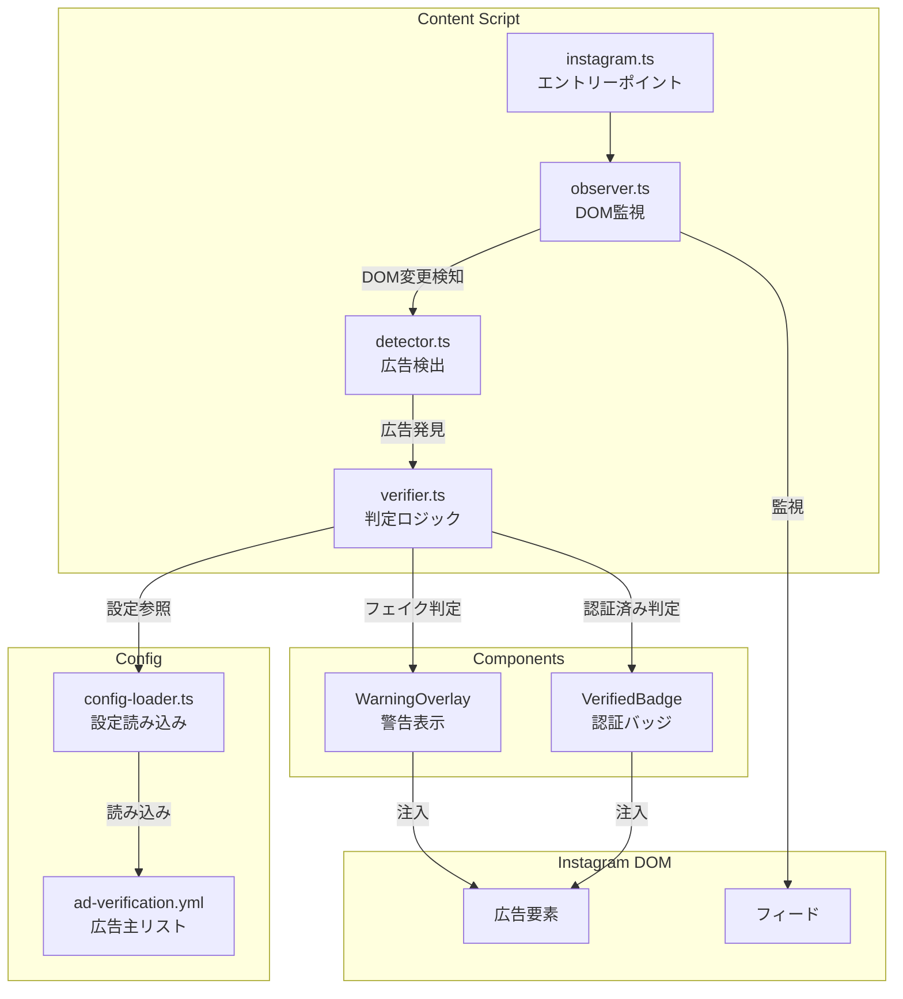
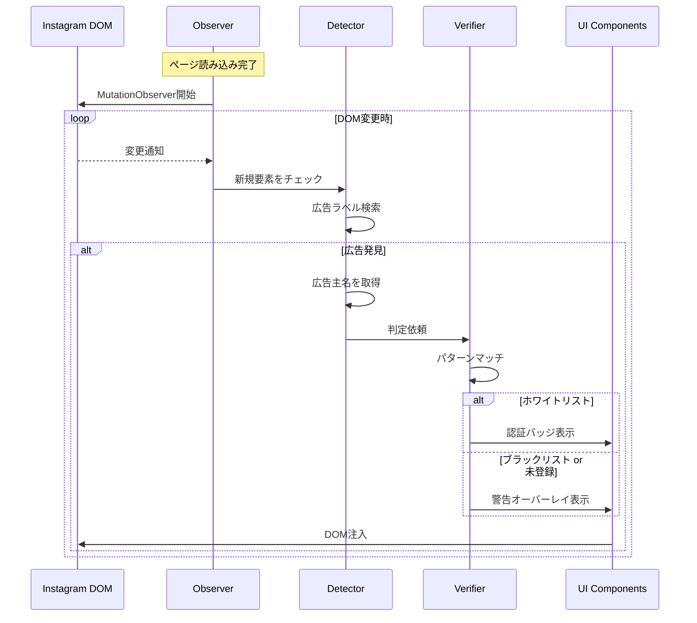

# 技術設計書 - FakeAdAlertDemo Phase 1: Instagram対応（MVP）

## 1. 要件トレーサビリティマトリックス

| 要件ID | 要件内容 | 設計項目 | 既存資産 | 新規理由 |
|--------|---------|---------|---------|---------|
| REQ-P1-001 | Instagram広告検出 | AdDetector | ❌新規 | 新機能 |
| REQ-P1-002 | 動的コンテンツ監視 | AdObserver | ❌新規 | 新機能 |
| REQ-P1-003 | 広告主名取得 | AdDetector | ❌新規 | 新機能 |
| REQ-P1-004 | 設定ファイル読み込み | ConfigLoader | ❌新規 | 新機能 |
| REQ-P1-005 | ホワイトリスト判定 | Verifier | ❌新規 | 新機能 |
| REQ-P1-006 | ブラックリスト判定 | Verifier | ❌新規 | 新機能 |
| REQ-P1-007 | デフォルト判定 | Verifier | ❌新規 | 新機能 |
| REQ-P1-008 | 警告オーバーレイ | WarningOverlay | ❌新規 | 新機能 |
| REQ-P1-009 | 認証バッジ | VerifiedBadge | ❌新規 | 新機能 |
| REQ-P1-010 | デザイン調和 | CSS設計 | ❌新規 | 新機能 |
| REQ-P1-011 | 重複表示防止 | ProcessedMarker | ❌新規 | 新機能 |
| REQ-P1-012 | 設定ファイル | ad-verification.yml | ❌新規 | 新機能 |

---

## 2. アーキテクチャ概要

### 2.1 モジュール構成図



### 2.2 処理フロー



---

## 3. 技術スタック

| カテゴリ | 技術 | 用途 |
|---------|------|------|
| 言語 | TypeScript | 型安全な実装 |
| DOM操作 | MutationObserver | 動的コンテンツ監視 |
| 設定 | YAML | 広告主リスト管理 |
| YAMLパース | js-yaml | YAML読み込み |
| スタイル | CSS | UI表示 |

### 追加依存パッケージ

```json
{
  "dependencies": {
    "js-yaml": "^4.1.0"
  },
  "devDependencies": {
    "@types/js-yaml": "^4.0.9"
  }
}
```

---

## 4. モジュール設計

### 4.1 型定義（src/lib/types.ts）

```typescript
/**
 * 判定結果
 */
export type VerificationResult = 'verified' | 'fake' | 'unknown';

/**
 * 広告情報
 */
export interface AdInfo {
  element: HTMLElement;        // 広告のルート要素
  advertiserName: string;      // 広告主名
  imageElement?: HTMLElement;  // 広告画像/動画要素
  headerElement?: HTMLElement; // ヘッダー要素（バッジ表示用）
}

/**
 * 判定結果（詳細）
 */
export interface VerificationInfo {
  result: VerificationResult;
  advertiserName: string;
  matchedPattern?: string;
  listType?: 'whitelist' | 'blacklist';
}

/**
 * 広告主設定
 */
export interface AdvertiserConfig {
  name: string;
  patterns: string[];
}

/**
 * 設定ファイル構造
 */
export interface AdVerificationConfig {
  whitelist: AdvertiserConfig[];
  blacklist: AdvertiserConfig[];
}
```

### 4.2 設定ファイル（config/ad-verification.yml）

> 📌 要件: REQ-P1-012

```yaml
# 広告認証設定ファイル
# FakeAdAlertDemo デモ用

whitelist:
  # 認証済み広告主（VeriCerts認証済み）
  - name: "トヨタ自動車"
    patterns:
      - "toyota"
      - "トヨタ"
      - "TOYOTA"
  - name: "ソニー"
    patterns:
      - "sony"
      - "Sony"
      - "ソニー"
  - name: "Apple Japan"
    patterns:
      - "apple"
      - "Apple"
  - name: "Nike"
    patterns:
      - "nike"
      - "Nike"
      - "ナイキ"
  - name: "ユニクロ"
    patterns:
      - "uniqlo"
      - "UNIQLO"
      - "ユニクロ"

blacklist:
  # フェイク広告パターン（詐欺の可能性）
  - name: "投資詐欺系"
    patterns:
      - "今すぐ100万円"
      - "誰でも簡単に稼げる"
      - "副業で月収100万"
      - "投資で10倍"
  - name: "なりすまし系"
    patterns:
      - "前澤友作"
      - "堀江貴文"
      - "孫正義"
      - "イーロン・マスク"
  - name: "情報商材系"
    patterns:
      - "限定公開"
      - "今だけ無料"
      - "残りわずか"
      - "秘密の方法"
  - name: "怪しい美容系"
    patterns:
      - "たった1週間で"
      - "驚きの効果"
      - "医者も驚く"
```

### 4.3 設定読み込み（src/lib/config-loader.ts）

> 📌 要件: REQ-P1-004

```typescript
import yaml from 'js-yaml';
import type { AdVerificationConfig } from './types';

// 設定ファイルの内容（ビルド時に埋め込み or fetch）
import configYaml from '../../config/ad-verification.yml?raw';

/**
 * 設定ファイルを読み込む
 */
export const loadConfig = (): AdVerificationConfig => {
  try {
    const config = yaml.load(configYaml) as AdVerificationConfig;
    return config;
  } catch (error) {
    console.error('[FakeAdAlertDemo] Failed to load config:', error);
    return { whitelist: [], blacklist: [] };
  }
};

/**
 * シングルトンで設定を保持
 */
let cachedConfig: AdVerificationConfig | null = null;

export const getConfig = (): AdVerificationConfig => {
  if (!cachedConfig) {
    cachedConfig = loadConfig();
  }
  return cachedConfig;
};
```

### 4.4 判定ロジック（src/lib/verifier.ts）

> 📌 要件: REQ-P1-005, REQ-P1-006, REQ-P1-007

```typescript
import type { VerificationResult, VerificationInfo, AdVerificationConfig } from './types';
import { getConfig } from './config-loader';

/**
 * 広告主名を判定する
 */
export const verifyAdvertiser = (advertiserName: string): VerificationInfo => {
  const config = getConfig();
  const lowerName = advertiserName.toLowerCase();

  // ホワイトリストチェック
  for (const advertiser of config.whitelist) {
    for (const pattern of advertiser.patterns) {
      if (lowerName.includes(pattern.toLowerCase())) {
        return {
          result: 'verified',
          advertiserName,
          matchedPattern: pattern,
          listType: 'whitelist',
        };
      }
    }
  }

  // ブラックリストチェック
  for (const advertiser of config.blacklist) {
    for (const pattern of advertiser.patterns) {
      if (lowerName.includes(pattern.toLowerCase())) {
        return {
          result: 'fake',
          advertiserName,
          matchedPattern: pattern,
          listType: 'blacklist',
        };
      }
    }
  }

  // どちらにもマッチしない場合は未検証（警告表示）
  return {
    result: 'unknown',
    advertiserName,
  };
};
```

### 4.5 広告検出（src/lib/detector.ts）

> 📌 要件: REQ-P1-001, REQ-P1-003

```typescript
import type { AdInfo } from './types';

// Instagram広告を示すセレクタ（変更される可能性あり）
const SELECTORS = {
  // 広告ラベル
  sponsoredLabel: 'span:contains("広告"), span:contains("Sponsored")',
  // 投稿コンテナ
  postContainer: 'article',
  // 広告主名（ヘッダー部分）
  advertiserName: 'header a > span, header span > span',
  // 画像/動画コンテナ
  mediaContainer: 'article > div > div',
} as const;

// 処理済みマーカー
const PROCESSED_ATTR = 'data-fakead-processed';

/**
 * 要素が広告かどうかを判定
 */
export const isAdElement = (element: HTMLElement): boolean => {
  const text = element.textContent || '';
  return text.includes('広告') || text.includes('Sponsored');
};

/**
 * 広告要素から情報を抽出
 */
export const extractAdInfo = (articleElement: HTMLElement): AdInfo | null => {
  // 処理済みチェック
  if (articleElement.hasAttribute(PROCESSED_ATTR)) {
    return null;
  }

  // 広告ラベルを探す
  const hasAdLabel = isAdElement(articleElement);
  if (!hasAdLabel) {
    return null;
  }

  // 広告主名を取得
  const header = articleElement.querySelector('header');
  const nameElement = header?.querySelector('a span, span span');
  const advertiserName = nameElement?.textContent?.trim() || 'Unknown';

  // 画像/動画コンテナを取得
  const mediaContainer = articleElement.querySelector('div > div > div');

  // 処理済みマーク
  articleElement.setAttribute(PROCESSED_ATTR, 'true');

  return {
    element: articleElement,
    advertiserName,
    imageElement: mediaContainer as HTMLElement | undefined,
    headerElement: header as HTMLElement | undefined,
  };
};

/**
 * ページ内の全広告を検出
 */
export const detectAds = (): AdInfo[] => {
  const articles = document.querySelectorAll('article');
  const ads: AdInfo[] = [];

  articles.forEach((article) => {
    const adInfo = extractAdInfo(article as HTMLElement);
    if (adInfo) {
      ads.push(adInfo);
    }
  });

  return ads;
};
```

### 4.6 DOM監視（src/lib/observer.ts）

> 📌 要件: REQ-P1-002

```typescript
import { detectAds } from './detector';
import { verifyAdvertiser } from './verifier';
import { showWarningOverlay } from '../components/warning-overlay';
import { showVerifiedBadge } from '../components/verified-badge';

let observer: MutationObserver | null = null;

/**
 * 検出した広告を処理
 */
const processAds = (): void => {
  const ads = detectAds();

  ads.forEach((ad) => {
    const verification = verifyAdvertiser(ad.advertiserName);

    console.log(`[FakeAdAlertDemo] Ad detected: ${ad.advertiserName} -> ${verification.result}`);

    if (verification.result === 'verified') {
      showVerifiedBadge(ad);
    } else {
      showWarningOverlay(ad, verification);
    }
  });
};

/**
 * MutationObserverを開始
 */
export const startObserver = (): void => {
  if (observer) {
    return;
  }

  // 初回スキャン
  processAds();

  // DOM変更を監視
  observer = new MutationObserver((mutations) => {
    // 追加されたノードがあれば処理
    const hasAddedNodes = mutations.some((m) => m.addedNodes.length > 0);
    if (hasAddedNodes) {
      // デバウンス（頻繁な呼び出しを防ぐ）
      requestAnimationFrame(() => {
        processAds();
      });
    }
  });

  observer.observe(document.body, {
    childList: true,
    subtree: true,
  });

  console.log('[FakeAdAlertDemo] Observer started');
};

/**
 * MutationObserverを停止
 */
export const stopObserver = (): void => {
  if (observer) {
    observer.disconnect();
    observer = null;
    console.log('[FakeAdAlertDemo] Observer stopped');
  }
};
```

### 4.7 警告オーバーレイ（src/components/warning-overlay.ts）

> 📌 要件: REQ-P1-008

```typescript
import type { AdInfo, VerificationInfo } from '../lib/types';

const OVERLAY_CLASS = 'fakead-warning-overlay';

/**
 * 警告オーバーレイを表示
 */
export const showWarningOverlay = (ad: AdInfo, verification: VerificationInfo): void => {
  if (!ad.imageElement) {
    return;
  }

  // 既にオーバーレイがあれば何もしない
  if (ad.element.querySelector(`.${OVERLAY_CLASS}`)) {
    return;
  }

  // オーバーレイ要素を作成
  const overlay = document.createElement('div');
  overlay.className = OVERLAY_CLASS;
  overlay.innerHTML = `
    <div class="fakead-warning-content">
      <span class="fakead-warning-icon">⚠️</span>
      <span class="fakead-warning-title">未認証広告</span>
      <span class="fakead-warning-subtitle">詐欺の可能性があります</span>
    </div>
  `;

  // 親要素をrelativeに（オーバーレイ配置用）
  const parent = ad.imageElement.parentElement;
  if (parent) {
    parent.style.position = 'relative';
    parent.appendChild(overlay);
  }
};
```

### 4.8 認証バッジ（src/components/verified-badge.ts）

> 📌 要件: REQ-P1-009

```typescript
import type { AdInfo } from '../lib/types';

const BADGE_CLASS = 'fakead-verified-badge';

/**
 * 認証バッジを表示
 */
export const showVerifiedBadge = (ad: AdInfo): void => {
  if (!ad.headerElement) {
    return;
  }

  // 既にバッジがあれば何もしない
  if (ad.element.querySelector(`.${BADGE_CLASS}`)) {
    return;
  }

  // バッジ要素を作成
  const badge = document.createElement('span');
  badge.className = BADGE_CLASS;
  badge.innerHTML = `
    <span class="fakead-verified-icon">✅</span>
    <span class="fakead-verified-text">VeriCerts認証済み</span>
  `;

  // ヘッダーの適切な位置に挿入
  const nameContainer = ad.headerElement.querySelector('a, span');
  if (nameContainer) {
    nameContainer.parentElement?.appendChild(badge);
  }
};
```

---

## 5. CSS設計（src/content/styles/instagram.css）

> 📌 要件: REQ-P1-010

```css
/*
 * FakeAdAlertDemo - Instagram用スタイル
 * Instagramのデザイン言語に合わせた自然なUI
 */

/* ==================== 警告オーバーレイ ==================== */

.fakead-warning-overlay {
  position: absolute;
  top: 0;
  left: 0;
  right: 0;
  bottom: 0;
  background: rgba(239, 68, 68, 0.85); /* 赤系 */
  display: flex;
  align-items: center;
  justify-content: center;
  z-index: 1000;
  backdrop-filter: blur(2px);
}

.fakead-warning-content {
  display: flex;
  flex-direction: column;
  align-items: center;
  gap: 8px;
  color: white;
  text-align: center;
  padding: 20px;
}

.fakead-warning-icon {
  font-size: 48px;
  line-height: 1;
}

.fakead-warning-title {
  font-size: 18px;
  font-weight: 600;
  font-family: -apple-system, BlinkMacSystemFont, 'Segoe UI', Roboto, sans-serif;
}

.fakead-warning-subtitle {
  font-size: 14px;
  opacity: 0.9;
  font-family: -apple-system, BlinkMacSystemFont, 'Segoe UI', Roboto, sans-serif;
}

/* ==================== 認証バッジ ==================== */

.fakead-verified-badge {
  display: inline-flex;
  align-items: center;
  gap: 4px;
  margin-left: 8px;
  padding: 2px 8px;
  background: rgba(34, 197, 94, 0.15); /* 緑系 */
  border: 1px solid rgba(34, 197, 94, 0.3);
  border-radius: 12px;
  font-size: 12px;
  color: #16a34a;
  font-family: -apple-system, BlinkMacSystemFont, 'Segoe UI', Roboto, sans-serif;
}

.fakead-verified-icon {
  font-size: 14px;
  line-height: 1;
}

.fakead-verified-text {
  font-weight: 500;
}

/* ==================== レスポンシブ対応 ==================== */

@media (max-width: 480px) {
  .fakead-warning-icon {
    font-size: 36px;
  }

  .fakead-warning-title {
    font-size: 16px;
  }

  .fakead-warning-subtitle {
    font-size: 12px;
  }

  .fakead-verified-badge {
    font-size: 10px;
    padding: 1px 6px;
  }
}
```

---

## 6. 更新版Content Script（src/content/instagram.ts）

```typescript
/**
 * Instagram Content Script
 * Phase 1: 広告検出・判定・UI表示
 */

import { startObserver, stopObserver } from '../lib/observer';
import './styles/instagram.css';

const SCRIPT_NAME = '[FakeAdAlertDemo]';

/**
 * 初期化処理
 */
const init = (): void => {
  console.log(`${SCRIPT_NAME} Initializing on Instagram...`);

  // DOM監視を開始
  startObserver();

  // ページ離脱時にクリーンアップ
  window.addEventListener('beforeunload', () => {
    stopObserver();
  });
};

/**
 * エントリーポイント
 */
const main = (): void => {
  console.log(`${SCRIPT_NAME} Instagram Content Script loaded`);

  if (document.readyState === 'loading') {
    document.addEventListener('DOMContentLoaded', init);
  } else {
    init();
  }
};

main();
```

---

## 7. ディレクトリ構成（Phase 1追加分）

```
fake-ad-alert-demo/
├── src/
│   ├── content/
│   │   ├── instagram.ts          # 更新
│   │   └── styles/
│   │       └── instagram.css     # 実装
│   ├── lib/
│   │   ├── types.ts              # 実装
│   │   ├── config-loader.ts      # 新規
│   │   ├── detector.ts           # 新規
│   │   ├── verifier.ts           # 新規
│   │   └── observer.ts           # 新規
│   └── components/
│       ├── warning-overlay.ts    # 新規
│       └── verified-badge.ts     # 新規
├── config/
│   └── ad-verification.yml       # 新規
└── ...
```

---

## 8. 技術的決定事項

| 決定項目 | 選択 | 理由 |
|---------|------|------|
| 設定形式 | YAML | 可読性が高く、非エンジニアも編集しやすい |
| パターンマッチ | 部分一致（includes） | シンプルで十分な精度 |
| DOM監視 | MutationObserver | 標準API、パフォーマンス良好 |
| デバウンス | requestAnimationFrame | シンプルで効果的 |
| オーバーレイ配置 | position: absolute | 広告要素に追従 |
| 処理済みマーク | data属性 | シンプルで確実 |
