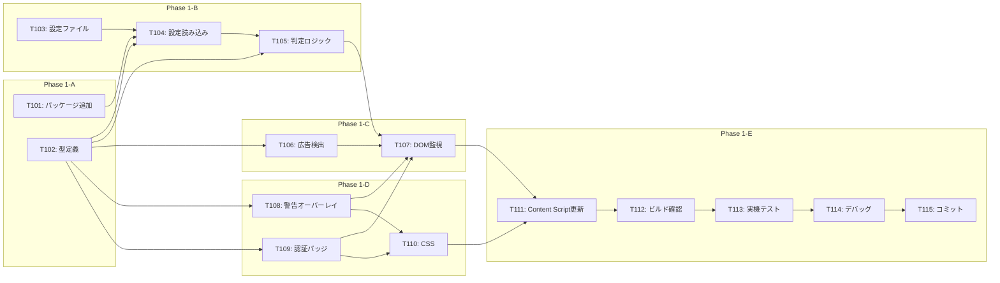

# タスクリスト - FakeAdAlertDemo Phase 1: Instagram対応（MVP）

## 1. 概要

Phase 1の設計書に基づくタスク分解。Instagramでの広告検出・判定・UI表示のMVPを完成させる。

### 前提条件
- Phase 0が完了していること

### 完了条件
- Instagramでフェイク広告に警告オーバーレイが表示される
- Instagramで認証済み広告に認証バッジが表示される
- 判定がホワイトリスト/ブラックリストに基づいて動作する

---

## 2. タスク一覧

### Phase 1-A: 基盤・型定義
- [x] T101: 追加依存パッケージのインストール
- [x] T102: 型定義ファイルの実装

### Phase 1-B: 設定・判定ロジック
- [x] T103: 設定ファイル（ad-verification.yml）作成
- [x] T104: 設定読み込み（config-loader.ts）実装
- [x] T105: 判定ロジック（verifier.ts）実装

### Phase 1-C: 広告検出
- [x] T106: 広告検出（detector.ts）実装
- [x] T107: DOM監視（observer.ts）実装

### Phase 1-D: UIコンポーネント
- [x] T108: 警告オーバーレイ（warning-overlay.ts）実装
- [x] T109: 認証バッジ（verified-badge.ts）実装
- [x] T110: Instagram用CSS実装

### Phase 1-E: 統合・テスト
- [x] T111: Content Script（instagram.ts）更新
- [x] T112: ビルド・型チェック
- [ ] T113: Instagram実機テスト
- [ ] T114: デバッグ・調整
- [ ] T115: コミット・プッシュ

---

## 3. タスク詳細

### T101: 追加依存パッケージのインストール
- **要件ID**: REQ-P1-004
- **設計書参照**: design.md §3
- **依存関係**: Phase 0完了
- **対象ファイル**: package.json
- **完了条件**:
  - [ ] js-yaml パッケージ追加
  - [ ] @types/js-yaml パッケージ追加
  - [ ] `pnpm install` 正常完了
- **コマンド**:
  ```bash
  pnpm add js-yaml
  pnpm add -D @types/js-yaml
  ```
- **並列実行**: T102と同時実行可能

---

### T102: 型定義ファイルの実装
- **要件ID**: 全REQ-P1-xxx
- **設計書参照**: design.md §4.1
- **依存関係**: なし
- **対象ファイル**: src/lib/types.ts
- **完了条件**:
  - [ ] VerificationResult 型定義
  - [ ] AdInfo インターフェース定義
  - [ ] VerificationInfo インターフェース定義
  - [ ] AdvertiserConfig インターフェース定義
  - [ ] AdVerificationConfig インターフェース定義
  - [ ] `pnpm typecheck` エラーなし
- **並列実行**: T101と同時実行可能

---

### T103: 設定ファイル（ad-verification.yml）作成
- **要件ID**: REQ-P1-012
- **設計書参照**: design.md §4.2
- **依存関係**: なし
- **対象ファイル**: config/ad-verification.yml
- **完了条件**:
  - [ ] whitelist セクション作成（5件以上）
  - [ ] blacklist セクション作成（4カテゴリ以上）
  - [ ] 各広告主に patterns 配列設定
  - [ ] YAML構文エラーなし
- **並列実行**: T101, T102と同時実行可能

---

### T104: 設定読み込み（config-loader.ts）実装
- **要件ID**: REQ-P1-004
- **設計書参照**: design.md §4.3
- **依存関係**: T101, T102, T103
- **対象ファイル**: src/lib/config-loader.ts
- **完了条件**:
  - [ ] loadConfig 関数実装
  - [ ] getConfig 関数実装（シングルトン）
  - [ ] YAML読み込み・パースが動作
  - [ ] エラーハンドリング実装
  - [ ] `pnpm typecheck` エラーなし
- **並列実行**: T105と同時実行可能

---

### T105: 判定ロジック（verifier.ts）実装
- **要件ID**: REQ-P1-005, REQ-P1-006, REQ-P1-007
- **設計書参照**: design.md §4.4
- **依存関係**: T102, T104
- **対象ファイル**: src/lib/verifier.ts
- **完了条件**:
  - [ ] verifyAdvertiser 関数実装
  - [ ] ホワイトリスト判定ロジック
  - [ ] ブラックリスト判定ロジック
  - [ ] デフォルト判定（unknown）ロジック
  - [ ] 大文字小文字を区別しないマッチング
  - [ ] `pnpm typecheck` エラーなし
- **並列実行**: T104と同時実行可能（T104完了後にテスト）

---

### T106: 広告検出（detector.ts）実装
- **要件ID**: REQ-P1-001, REQ-P1-003, REQ-P1-011
- **設計書参照**: design.md §4.5
- **依存関係**: T102
- **対象ファイル**: src/lib/detector.ts
- **完了条件**:
  - [ ] isAdElement 関数実装
  - [ ] extractAdInfo 関数実装
  - [ ] detectAds 関数実装
  - [ ] 処理済みマーカー（data属性）実装
  - [ ] 広告主名の取得ロジック
  - [ ] `pnpm typecheck` エラーなし
- **並列実行**: T104, T105と同時実行可能

---

### T107: DOM監視（observer.ts）実装
- **要件ID**: REQ-P1-002
- **設計書参照**: design.md §4.6
- **依存関係**: T105, T106, T108, T109
- **対象ファイル**: src/lib/observer.ts
- **完了条件**:
  - [ ] startObserver 関数実装
  - [ ] stopObserver 関数実装
  - [ ] processAds 関数実装
  - [ ] MutationObserver設定
  - [ ] requestAnimationFrameでデバウンス
  - [ ] `pnpm typecheck` エラーなし
- **並列実行**: 不可（依存タスク完了後）

---

### T108: 警告オーバーレイ（warning-overlay.ts）実装
- **要件ID**: REQ-P1-008
- **設計書参照**: design.md §4.7
- **依存関係**: T102
- **対象ファイル**: src/components/warning-overlay.ts
- **完了条件**:
  - [ ] showWarningOverlay 関数実装
  - [ ] オーバーレイHTML生成
  - [ ] 親要素のposition設定
  - [ ] 重複表示防止チェック
  - [ ] `pnpm typecheck` エラーなし
- **並列実行**: T109と同時実行可能

---

### T109: 認証バッジ（verified-badge.ts）実装
- **要件ID**: REQ-P1-009
- **設計書参照**: design.md §4.8
- **依存関係**: T102
- **対象ファイル**: src/components/verified-badge.ts
- **完了条件**:
  - [ ] showVerifiedBadge 関数実装
  - [ ] バッジHTML生成
  - [ ] ヘッダーへの挿入ロジック
  - [ ] 重複表示防止チェック
  - [ ] `pnpm typecheck` エラーなし
- **並列実行**: T108と同時実行可能

---

### T110: Instagram用CSS実装
- **要件ID**: REQ-P1-010
- **設計書参照**: design.md §5
- **依存関係**: T108, T109
- **対象ファイル**: src/content/styles/instagram.css
- **完了条件**:
  - [ ] 警告オーバーレイのスタイル実装
  - [ ] 認証バッジのスタイル実装
  - [ ] Instagramデザインとの調和
  - [ ] レスポンシブ対応
  - [ ] 赤系・緑系の配色設定
- **並列実行**: T108, T109と同時実行可能

---

### T111: Content Script（instagram.ts）更新
- **要件ID**: 全REQ-P1-xxx
- **設計書参照**: design.md §6
- **依存関係**: T107, T110
- **対象ファイル**: src/content/instagram.ts
- **完了条件**:
  - [ ] observer モジュールのインポート
  - [ ] CSS ファイルのインポート
  - [ ] init関数でstartObserver呼び出し
  - [ ] beforeunloadでstopObserver呼び出し
  - [ ] `pnpm typecheck` エラーなし
- **並列実行**: 不可（依存タスク完了後）

---

### T112: ビルド・型チェック
- **要件ID**: -
- **設計書参照**: -
- **依存関係**: T101〜T111
- **対象ファイル**: dist/
- **完了条件**:
  - [ ] `pnpm typecheck` エラーなし
  - [ ] `pnpm build` 正常完了
  - [ ] dist/ フォルダ生成
  - [ ] ビルドエラーなし
- **並列実行**: 不可（全実装完了後）

---

### T113: Instagram実機テスト
- **要件ID**: -
- **設計書参照**: -
- **依存関係**: T112
- **対象ファイル**: -
- **完了条件**:
  - [ ] Chrome拡張を再読み込み
  - [ ] Instagramを開く
  - [ ] フィードに広告が表示されるまでスクロール
  - [ ] 広告検出のコンソールログ確認
  - [ ] ホワイトリスト広告主で認証バッジ表示確認
  - [ ] ブラックリスト広告主で警告オーバーレイ確認
  - [ ] 未登録広告主で警告オーバーレイ確認
  - [ ] スクロールで新規広告が処理されること確認
- **並列実行**: 不可

---

### T114: デバッグ・調整
- **要件ID**: -
- **設計書参照**: -
- **依存関係**: T113
- **対象ファイル**: 各種
- **完了条件**:
  - [ ] セレクタの調整（必要に応じて）
  - [ ] UIの位置・サイズ調整（必要に応じて）
  - [ ] パターンマッチの調整（必要に応じて）
  - [ ] コンソールエラーなし
  - [ ] 意図通りの動作確認
- **並列実行**: 不可

---

### T115: コミット・プッシュ
- **要件ID**: -
- **設計書参照**: -
- **依存関係**: T114
- **対象ファイル**: -
- **完了条件**:
  - [ ] 全ファイルをステージング
  - [ ] コミットメッセージ（日本語）
  - [ ] GitHubにプッシュ
- **コミットメッセージ例**:
  ```
  feat: Phase 1完了 - Instagram広告検出・判定・UI表示のMVP実装

  - 広告検出ロジック実装（detector.ts）
  - 判定ロジック実装（verifier.ts）
  - 警告オーバーレイ・認証バッジUI実装
  - ad-verification.yml設定ファイル追加
  ```
- **並列実行**: 不可

---

## 4. 依存関係図



---

## 5. 並列実行計画

| フェーズ | 並列実行可能タスク | 備考 |
|---------|-------------------|------|
| 1 | T101, T102, T103 | 独立タスク |
| 2 | T104, T105, T106, T108, T109, T110 | 型定義完了後 |
| 3 | T107 | 検出・判定・UI完了後 |
| 4 | T111 | 監視・CSS完了後 |
| 5 | T112 | 全実装完了後 |
| 6 | T113 | ビルド完了後 |
| 7 | T114 | テスト完了後 |
| 8 | T115 | デバッグ完了後 |

---

## 6. 品質チェックリスト

- [x] すべてのタスクが要件IDと紐付いているか
- [x] 設計書にない機能のタスクは含まれていないか
- [x] 依存関係が明確に定義されているか
- [x] 完了条件が具体的で測定可能か
- [x] 並列実行の機会が最大化されているか
- [x] 実機テストが含まれているか
