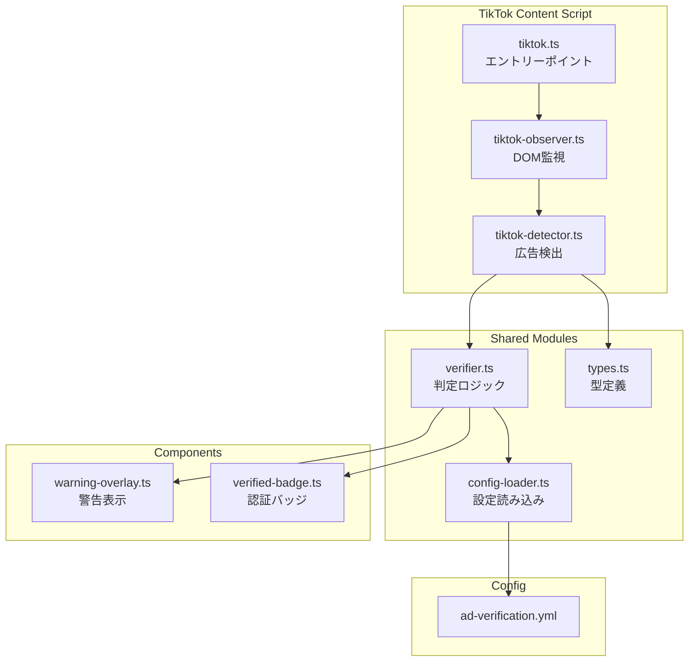
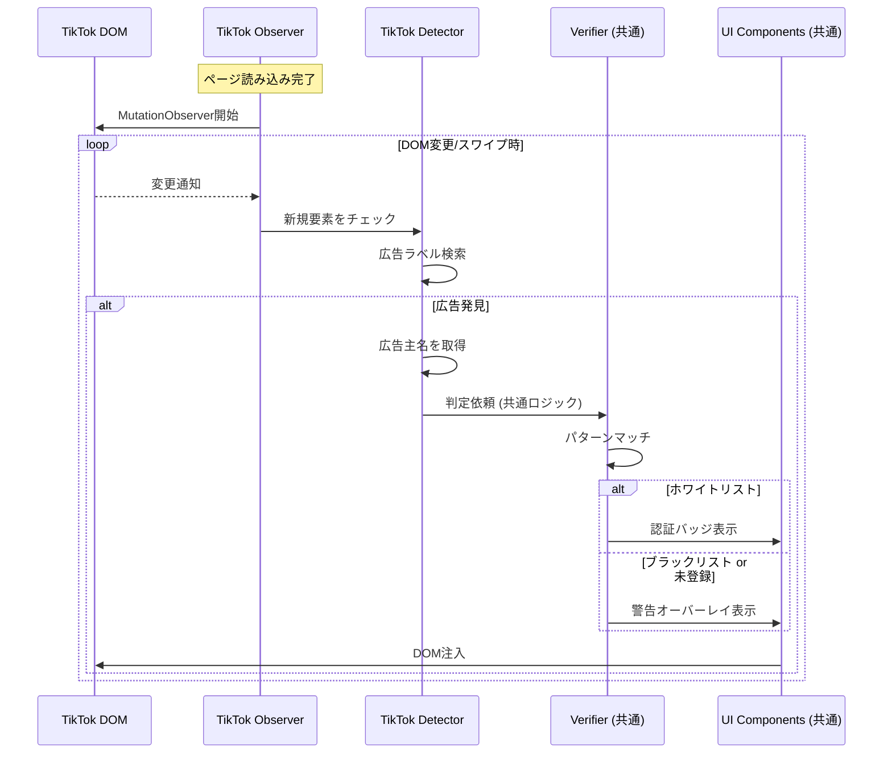

# 技術設計書 - FakeAdAlertDemo Phase 2: TikTok対応

## 1. 要件トレーサビリティマトリックス

| 要件ID | 要件内容 | 設計項目 | 既存資産 | 新規理由 |
|--------|---------|---------|---------|---------|
| REQ-P2-001 | TikTok広告検出 | tiktok-detector.ts | ❌新規 | TikTok固有のDOM |
| REQ-P2-002 | 動的コンテンツ監視 | tiktok-observer.ts | ❌新規 | TikTok固有の監視 |
| REQ-P2-003 | 広告主名取得 | tiktok-detector.ts | ❌新規 | TikTok固有のDOM |
| REQ-P2-004 | 警告オーバーレイ | warning-overlay.ts | ✅流用 | 共通コンポーネント |
| REQ-P2-005 | 認証バッジ | verified-badge.ts | ✅流用 | 共通コンポーネント |
| REQ-P2-006 | TikTokデザイン調和 | tiktok.css | ❌新規 | TikTok固有のスタイル |
| REQ-P2-007 | 重複表示防止 | ProcessedMarker | ✅流用 | Phase 1と同じ仕組み |
| REQ-P2-008 | マニフェスト更新 | manifest.json | ✅更新 | TikTok追加 |

### 流用モジュール（Phase 1から）

| モジュール | 用途 |
|-----------|------|
| src/lib/types.ts | 型定義 |
| src/lib/verifier.ts | 判定ロジック |
| src/lib/config-loader.ts | 設定読み込み |
| config/ad-verification.yml | 広告主リスト |
| src/components/warning-overlay.ts | 警告オーバーレイ（一部拡張） |
| src/components/verified-badge.ts | 認証バッジ（一部拡張） |

---

## 2. アーキテクチャ概要

### 2.1 モジュール構成図



### 2.2 処理フロー



---

## 3. モジュール設計

### 3.1 TikTok用広告検出（src/lib/tiktok-detector.ts）

> 📌 要件: REQ-P2-001, REQ-P2-003, REQ-P2-007

```typescript
import type { AdInfo } from './types';

// TikTok広告を示すセレクタ（変更される可能性あり）
const TIKTOK_SELECTORS = {
  // 動画コンテナ
  videoContainer: '[data-e2e="recommend-list-item-container"], .video-feed-item',
  // 広告ラベル
  adLabel: '[data-e2e="ad-label"], span:contains("広告"), span:contains("Sponsored"), span:contains("プロモーション")',
  // 広告主名
  advertiserName: '[data-e2e="video-author-uniqueid"], .author-uniqueId',
  // 動画要素
  videoElement: 'video',
  // ユーザー情報エリア
  userInfo: '[data-e2e="video-author-container"], .video-infos-container',
} as const;

// 処理済みマーカー
const PROCESSED_ATTR = 'data-fakead-tiktok-processed';

/**
 * 要素が広告かどうかを判定
 */
export const isTikTokAdElement = (element: HTMLElement): boolean => {
  const text = element.textContent || '';
  return (
    text.includes('広告') ||
    text.includes('Sponsored') ||
    text.includes('プロモーション') ||
    element.querySelector('[data-e2e="ad-label"]') !== null
  );
};

/**
 * TikTok広告要素から情報を抽出
 */
export const extractTikTokAdInfo = (videoContainer: HTMLElement): AdInfo | null => {
  // 処理済みチェック
  if (videoContainer.hasAttribute(PROCESSED_ATTR)) {
    return null;
  }

  // 広告ラベルを探す
  if (!isTikTokAdElement(videoContainer)) {
    return null;
  }

  // 広告主名を取得
  const authorElement = videoContainer.querySelector(
    TIKTOK_SELECTORS.advertiserName
  );
  const advertiserName = authorElement?.textContent?.trim()?.replace('@', '') || 'Unknown';

  // 動画要素を取得
  const videoElement = videoContainer.querySelector('video');

  // ユーザー情報エリアを取得
  const userInfoElement = videoContainer.querySelector(
    TIKTOK_SELECTORS.userInfo
  );

  // 処理済みマーク
  videoContainer.setAttribute(PROCESSED_ATTR, 'true');

  return {
    element: videoContainer,
    advertiserName,
    imageElement: videoElement?.parentElement as HTMLElement | undefined,
    headerElement: userInfoElement as HTMLElement | undefined,
  };
};

/**
 * ページ内の全TikTok広告を検出
 */
export const detectTikTokAds = (): AdInfo[] => {
  const videoContainers = document.querySelectorAll(
    TIKTOK_SELECTORS.videoContainer
  );
  const ads: AdInfo[] = [];

  videoContainers.forEach((container) => {
    const adInfo = extractTikTokAdInfo(container as HTMLElement);
    if (adInfo) {
      ads.push(adInfo);
    }
  });

  return ads;
};
```

### 3.2 TikTok用DOM監視（src/lib/tiktok-observer.ts）

> 📌 要件: REQ-P2-002

```typescript
import { detectTikTokAds } from './tiktok-detector';
import { verifyAdvertiser } from './verifier';
import { showWarningOverlay } from '../components/warning-overlay';
import { showVerifiedBadge } from '../components/verified-badge';

let observer: MutationObserver | null = null;

/**
 * 検出したTikTok広告を処理
 */
const processTikTokAds = (): void => {
  const ads = detectTikTokAds();

  ads.forEach((ad) => {
    const verification = verifyAdvertiser(ad.advertiserName);

    console.log(`[FakeAdAlertDemo] TikTok Ad detected: ${ad.advertiserName} -> ${verification.result}`);

    if (verification.result === 'verified') {
      showVerifiedBadge(ad, 'tiktok');
    } else {
      showWarningOverlay(ad, verification, 'tiktok');
    }
  });
};

/**
 * TikTok用MutationObserverを開始
 */
export const startTikTokObserver = (): void => {
  if (observer) {
    return;
  }

  // 初回スキャン
  processTikTokAds();

  // DOM変更を監視
  observer = new MutationObserver((mutations) => {
    const hasAddedNodes = mutations.some((m) => m.addedNodes.length > 0);
    if (hasAddedNodes) {
      requestAnimationFrame(() => {
        processTikTokAds();
      });
    }
  });

  observer.observe(document.body, {
    childList: true,
    subtree: true,
  });

  console.log('[FakeAdAlertDemo] TikTok Observer started');
};

/**
 * TikTok用MutationObserverを停止
 */
export const stopTikTokObserver = (): void => {
  if (observer) {
    observer.disconnect();
    observer = null;
    console.log('[FakeAdAlertDemo] TikTok Observer stopped');
  }
};
```

### 3.3 警告オーバーレイ拡張（src/components/warning-overlay.ts）

> 📌 要件: REQ-P2-004

```typescript
import type { AdInfo, VerificationInfo } from '../lib/types';

const OVERLAY_CLASS = 'fakead-warning-overlay';

type Platform = 'instagram' | 'tiktok';

/**
 * 警告オーバーレイを表示
 */
export const showWarningOverlay = (
  ad: AdInfo,
  verification: VerificationInfo,
  platform: Platform = 'instagram'
): void => {
  if (!ad.imageElement) {
    return;
  }

  // 既にオーバーレイがあれば何もしない
  if (ad.element.querySelector(`.${OVERLAY_CLASS}`)) {
    return;
  }

  // オーバーレイ要素を作成
  const overlay = document.createElement('div');
  overlay.className = `${OVERLAY_CLASS} ${OVERLAY_CLASS}--${platform}`;
  overlay.innerHTML = `
    <div class="fakead-warning-content">
      <span class="fakead-warning-icon">⚠️</span>
      <span class="fakead-warning-title">未認証広告</span>
      <span class="fakead-warning-subtitle">詐欺の可能性があります</span>
    </div>
  `;

  // 親要素をrelativeに
  const parent = ad.imageElement.parentElement;
  if (parent) {
    parent.style.position = 'relative';
    parent.appendChild(overlay);
  }
};
```

### 3.4 認証バッジ拡張（src/components/verified-badge.ts）

> 📌 要件: REQ-P2-005

```typescript
import type { AdInfo } from '../lib/types';

const BADGE_CLASS = 'fakead-verified-badge';

type Platform = 'instagram' | 'tiktok';

/**
 * 認証バッジを表示
 */
export const showVerifiedBadge = (
  ad: AdInfo,
  platform: Platform = 'instagram'
): void => {
  if (!ad.headerElement) {
    return;
  }

  // 既にバッジがあれば何もしない
  if (ad.element.querySelector(`.${BADGE_CLASS}`)) {
    return;
  }

  // バッジ要素を作成
  const badge = document.createElement('span');
  badge.className = `${BADGE_CLASS} ${BADGE_CLASS}--${platform}`;
  badge.innerHTML = `
    <span class="fakead-verified-icon">✅</span>
    <span class="fakead-verified-text">VeriCerts認証済み</span>
  `;

  // プラットフォームに応じた挿入位置
  if (platform === 'tiktok') {
    // TikTok: ユーザー名の横
    const authorElement = ad.headerElement.querySelector('[data-e2e="video-author-uniqueid"], .author-uniqueId');
    if (authorElement) {
      authorElement.parentElement?.appendChild(badge);
    } else {
      ad.headerElement.appendChild(badge);
    }
  } else {
    // Instagram: ヘッダーの名前横
    const nameContainer = ad.headerElement.querySelector('a, span');
    if (nameContainer) {
      nameContainer.parentElement?.appendChild(badge);
    }
  }
};
```

### 3.5 TikTok用Content Script（src/content/tiktok.ts）

> 📌 要件: REQ-P2-001〜007

```typescript
/**
 * TikTok Content Script
 * Phase 2: 広告検出・判定・UI表示
 */

import { startTikTokObserver, stopTikTokObserver } from '../lib/tiktok-observer';
import './styles/tiktok.css';

const SCRIPT_NAME = '[FakeAdAlertDemo]';

/**
 * 初期化処理
 */
const init = (): void => {
  console.log(`${SCRIPT_NAME} Initializing on TikTok...`);

  // DOM監視を開始
  startTikTokObserver();

  // ページ離脱時にクリーンアップ
  window.addEventListener('beforeunload', () => {
    stopTikTokObserver();
  });
};

/**
 * エントリーポイント
 */
const main = (): void => {
  console.log(`${SCRIPT_NAME} TikTok Content Script loaded`);

  if (document.readyState === 'loading') {
    document.addEventListener('DOMContentLoaded', init);
  } else {
    init();
  }
};

main();
```

---

## 4. CSS設計（src/content/styles/tiktok.css）

> 📌 要件: REQ-P2-006

```css
/*
 * FakeAdAlertDemo - TikTok用スタイル
 * TikTokのダークテーマに合わせたUI
 */

/* ==================== 警告オーバーレイ (TikTok) ==================== */

.fakead-warning-overlay--tiktok {
  position: absolute;
  top: 50%;
  left: 50%;
  transform: translate(-50%, -50%);
  width: 80%;
  max-width: 300px;
  background: rgba(239, 68, 68, 0.9);
  border-radius: 16px;
  padding: 24px;
  z-index: 1000;
  box-shadow: 0 4px 24px rgba(0, 0, 0, 0.5);
}

.fakead-warning-overlay--tiktok .fakead-warning-content {
  display: flex;
  flex-direction: column;
  align-items: center;
  gap: 8px;
  color: white;
  text-align: center;
}

.fakead-warning-overlay--tiktok .fakead-warning-icon {
  font-size: 48px;
  line-height: 1;
}

.fakead-warning-overlay--tiktok .fakead-warning-title {
  font-size: 20px;
  font-weight: 700;
  font-family: -apple-system, BlinkMacSystemFont, 'Segoe UI', Roboto, sans-serif;
}

.fakead-warning-overlay--tiktok .fakead-warning-subtitle {
  font-size: 14px;
  opacity: 0.9;
  font-family: -apple-system, BlinkMacSystemFont, 'Segoe UI', Roboto, sans-serif;
}

/* ==================== 認証バッジ (TikTok) ==================== */

.fakead-verified-badge--tiktok {
  display: inline-flex;
  align-items: center;
  gap: 4px;
  margin-left: 8px;
  padding: 4px 10px;
  background: rgba(34, 197, 94, 0.2);
  border: 1px solid rgba(34, 197, 94, 0.4);
  border-radius: 16px;
  font-size: 12px;
  color: #4ade80;
  font-family: -apple-system, BlinkMacSystemFont, 'Segoe UI', Roboto, sans-serif;
}

.fakead-verified-badge--tiktok .fakead-verified-icon {
  font-size: 14px;
  line-height: 1;
}

.fakead-verified-badge--tiktok .fakead-verified-text {
  font-weight: 600;
}

/* ==================== TikTok固有の調整 ==================== */

/* 右サイドのアクションボタンと干渉しない */
.fakead-warning-overlay--tiktok {
  margin-right: 60px;
}

/* ダークテーマ対応 */
@media (prefers-color-scheme: dark) {
  .fakead-verified-badge--tiktok {
    background: rgba(34, 197, 94, 0.25);
    border-color: rgba(34, 197, 94, 0.5);
  }
}
```

---

## 5. マニフェスト更新（manifest.json）

> 📌 要件: REQ-P2-008

```json
{
  "manifest_version": 3,
  "name": "FakeAdAlertDemo",
  "version": "0.2.0",
  "description": "SNS上のフェイク広告を検出して警告表示するデモ",
  "permissions": [
    "activeTab",
    "storage"
  ],
  "host_permissions": [
    "https://www.instagram.com/*",
    "https://www.tiktok.com/*",
    "https://www.youtube.com/*"
  ],
  "content_scripts": [
    {
      "matches": ["https://www.instagram.com/*"],
      "js": ["src/content/instagram.ts"],
      "css": ["src/content/styles/instagram.css"],
      "run_at": "document_idle"
    },
    {
      "matches": ["https://www.tiktok.com/*"],
      "js": ["src/content/tiktok.ts"],
      "css": ["src/content/styles/tiktok.css"],
      "run_at": "document_idle"
    }
  ],
  "background": {
    "service_worker": "src/background/index.ts",
    "type": "module"
  },
  "action": {
    "default_popup": "src/popup/index.html",
    "default_icon": {
      "16": "icons/icon16.png",
      "48": "icons/icon48.png",
      "128": "icons/icon128.png"
    }
  },
  "icons": {
    "16": "icons/icon16.png",
    "48": "icons/icon48.png",
    "128": "icons/icon128.png"
  }
}
```

---

## 6. ディレクトリ構成（Phase 2追加分）

```
fake-ad-alert-demo/
├── src/
│   ├── content/
│   │   ├── instagram.ts          # Phase 1
│   │   ├── tiktok.ts             # 新規
│   │   └── styles/
│   │       ├── instagram.css     # Phase 1
│   │       └── tiktok.css        # 新規
│   ├── lib/
│   │   ├── types.ts              # Phase 1 (流用)
│   │   ├── config-loader.ts      # Phase 1 (流用)
│   │   ├── verifier.ts           # Phase 1 (流用)
│   │   ├── detector.ts           # Phase 1 (Instagram用)
│   │   ├── observer.ts           # Phase 1 (Instagram用)
│   │   ├── tiktok-detector.ts    # 新規
│   │   └── tiktok-observer.ts    # 新規
│   └── components/
│       ├── warning-overlay.ts    # 更新 (platform対応)
│       └── verified-badge.ts     # 更新 (platform対応)
├── config/
│   └── ad-verification.yml       # Phase 1 (流用)
└── manifest.json                 # 更新
```

---

## 7. 技術的決定事項

| 決定項目 | 選択 | 理由 |
|---------|------|------|
| 検出ロジック | TikTok専用モジュール | DOM構造が大きく異なるため |
| 判定ロジック | 共通流用 | ロジックは同一 |
| UIコンポーネント | platform引数で分岐 | コード重複を避ける |
| スタイル | TikTok専用CSS | ダークテーマ、縦型UI対応 |
| オーバーレイ配置 | 中央配置 | フルスクリーン動画に適合 |
