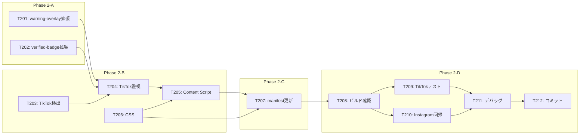

# タスクリスト - FakeAdAlertDemo Phase 2: TikTok対応

## 1. 概要

Phase 2の設計書に基づくタスク分解。TikTokでの広告検出・UI表示を実装し、Phase 1の共通ロジックを活用する。

### 前提条件
- Phase 0, Phase 1が完了していること

### 完了条件
- TikTokでフェイク広告に警告オーバーレイが表示される
- TikTokで認証済み広告に認証バッジが表示される
- Instagram対応に影響を与えない

---

## 2. タスク一覧

### Phase 2-A: 共通コンポーネント拡張
- [ ] T201: warning-overlay.ts の platform対応
- [ ] T202: verified-badge.ts の platform対応

### Phase 2-B: TikTok固有実装
- [ ] T203: TikTok広告検出（tiktok-detector.ts）
- [ ] T204: TikTok DOM監視（tiktok-observer.ts）
- [ ] T205: TikTok Content Script（tiktok.ts）
- [ ] T206: TikTok用CSS（tiktok.css）

### Phase 2-C: 設定・マニフェスト
- [ ] T207: manifest.json 更新（TikTok追加）

### Phase 2-D: テスト・統合
- [ ] T208: ビルド・型チェック
- [ ] T209: TikTok実機テスト
- [ ] T210: Instagram回帰テスト
- [ ] T211: デバッグ・調整
- [ ] T212: コミット・プッシュ

---

## 3. タスク詳細

### T201: warning-overlay.ts の platform対応
- **要件ID**: REQ-P2-004
- **設計書参照**: design.md §3.3
- **依存関係**: Phase 1完了
- **対象ファイル**: src/components/warning-overlay.ts
- **完了条件**:
  - [ ] Platform型を追加（'instagram' | 'tiktok'）
  - [ ] showWarningOverlay関数にplatform引数を追加
  - [ ] プラットフォーム別のクラス名を付与
  - [ ] 既存Instagram呼び出しにデフォルト値設定
  - [ ] `pnpm typecheck` エラーなし
- **並列実行**: T202と同時実行可能

---

### T202: verified-badge.ts の platform対応
- **要件ID**: REQ-P2-005
- **設計書参照**: design.md §3.4
- **依存関係**: Phase 1完了
- **対象ファイル**: src/components/verified-badge.ts
- **完了条件**:
  - [ ] Platform型をインポート
  - [ ] showVerifiedBadge関数にplatform引数を追加
  - [ ] プラットフォーム別の挿入ロジック分岐
  - [ ] プラットフォーム別のクラス名を付与
  - [ ] 既存Instagram呼び出しにデフォルト値設定
  - [ ] `pnpm typecheck` エラーなし
- **並列実行**: T201と同時実行可能

---

### T203: TikTok広告検出（tiktok-detector.ts）
- **要件ID**: REQ-P2-001, REQ-P2-003, REQ-P2-007
- **設計書参照**: design.md §3.1
- **依存関係**: Phase 1完了（types.ts）
- **対象ファイル**: src/lib/tiktok-detector.ts
- **完了条件**:
  - [ ] TIKTOK_SELECTORS定義
  - [ ] isTikTokAdElement関数実装
  - [ ] extractTikTokAdInfo関数実装
  - [ ] detectTikTokAds関数実装
  - [ ] 処理済みマーカー（data属性）実装
  - [ ] `pnpm typecheck` エラーなし
- **並列実行**: T201, T202, T206と同時実行可能

---

### T204: TikTok DOM監視（tiktok-observer.ts）
- **要件ID**: REQ-P2-002
- **設計書参照**: design.md §3.2
- **依存関係**: T201, T202, T203
- **対象ファイル**: src/lib/tiktok-observer.ts
- **完了条件**:
  - [ ] startTikTokObserver関数実装
  - [ ] stopTikTokObserver関数実装
  - [ ] processTikTokAds関数実装
  - [ ] MutationObserver設定
  - [ ] verifier, warning-overlay, verified-badge連携
  - [ ] `pnpm typecheck` エラーなし
- **並列実行**: 不可（T201〜T203完了後）

---

### T205: TikTok Content Script（tiktok.ts）
- **要件ID**: REQ-P2-001〜007
- **設計書参照**: design.md §3.5
- **依存関係**: T204, T206
- **対象ファイル**: src/content/tiktok.ts
- **完了条件**:
  - [ ] tiktok-observerのインポート
  - [ ] tiktok.cssのインポート
  - [ ] init関数でstartTikTokObserver呼び出し
  - [ ] beforeunloadでstopTikTokObserver呼び出し
  - [ ] `pnpm typecheck` エラーなし
- **並列実行**: 不可（T204, T206完了後）

---

### T206: TikTok用CSS（tiktok.css）
- **要件ID**: REQ-P2-006
- **設計書参照**: design.md §4
- **依存関係**: なし
- **対象ファイル**: src/content/styles/tiktok.css
- **完了条件**:
  - [ ] 警告オーバーレイスタイル（--tiktok）
  - [ ] 認証バッジスタイル（--tiktok）
  - [ ] ダークテーマ対応
  - [ ] 中央配置（縦型動画用）
  - [ ] アクションボタン干渉回避
- **並列実行**: T201〜T203と同時実行可能

---

### T207: manifest.json 更新（TikTok追加）
- **要件ID**: REQ-P2-008
- **設計書参照**: design.md §5
- **依存関係**: T205, T206
- **対象ファイル**: manifest.json
- **完了条件**:
  - [ ] content_scripts配列にTikTok設定追加
  - [ ] matches: ["https://www.tiktok.com/*"]
  - [ ] js: ["src/content/tiktok.ts"]
  - [ ] css: ["src/content/styles/tiktok.css"]
  - [ ] version を 0.2.0 に更新
- **並列実行**: 不可（T205, T206完了後）

---

### T208: ビルド・型チェック
- **要件ID**: -
- **設計書参照**: -
- **依存関係**: T201〜T207
- **対象ファイル**: dist/
- **完了条件**:
  - [ ] `pnpm typecheck` エラーなし
  - [ ] `pnpm build` 正常完了
  - [ ] dist/ にTikTok用ファイル含まれる
- **並列実行**: 不可（全実装完了後）

---

### T209: TikTok実機テスト
- **要件ID**: -
- **設計書参照**: -
- **依存関係**: T208
- **対象ファイル**: -
- **完了条件**:
  - [ ] Chrome拡張を再読み込み
  - [ ] TikTokを開く
  - [ ] フィードに広告が表示されるまでスクロール/スワイプ
  - [ ] 広告検出のコンソールログ確認
  - [ ] ホワイトリスト広告主で認証バッジ表示確認
  - [ ] ブラックリスト/未登録広告主で警告オーバーレイ確認
  - [ ] UIがTikTokのダークテーマと調和
  - [ ] アクションボタンと干渉しない
- **並列実行**: 不可

---

### T210: Instagram回帰テスト
- **要件ID**: -
- **設計書参照**: -
- **依存関係**: T208
- **対象ファイル**: -
- **完了条件**:
  - [ ] Instagramを開く
  - [ ] Phase 1と同様の動作確認
  - [ ] 警告オーバーレイが正常表示
  - [ ] 認証バッジが正常表示
  - [ ] コンソールエラーなし
  - [ ] Phase 2の変更によるデグレなし
- **並列実行**: T209と同時実行可能

---

### T211: デバッグ・調整
- **要件ID**: -
- **設計書参照**: -
- **依存関係**: T209, T210
- **対象ファイル**: 各種
- **完了条件**:
  - [ ] TikTokセレクタの調整（必要に応じて）
  - [ ] UIの位置・サイズ調整（必要に応じて）
  - [ ] Instagram側の影響確認・修正
  - [ ] コンソールエラーなし
- **並列実行**: 不可

---

### T212: コミット・プッシュ
- **要件ID**: -
- **設計書参照**: -
- **依存関係**: T211
- **対象ファイル**: -
- **完了条件**:
  - [ ] 全ファイルをステージング
  - [ ] コミットメッセージ（日本語）
  - [ ] GitHubにプッシュ
- **コミットメッセージ例**:
  ```
  feat: Phase 2完了 - TikTok広告検出・UI表示の実装

  - TikTok広告検出ロジック実装（tiktok-detector.ts）
  - TikTok用DOM監視実装（tiktok-observer.ts）
  - TikTok用Content Script・CSS追加
  - 共通コンポーネントをplatform対応に拡張
  - manifest.jsonにTikTok設定追加
  ```
- **並列実行**: 不可

---

## 4. 依存関係図



---

## 5. 並列実行計画

| フェーズ | 並列実行可能タスク | 備考 |
|---------|-------------------|------|
| 1 | T201, T202, T203, T206 | 独立タスク |
| 2 | T204 | 検出・コンポーネント完了後 |
| 3 | T205 | 監視・CSS完了後 |
| 4 | T207 | Content Script完了後 |
| 5 | T208 | 全実装完了後 |
| 6 | T209, T210 | ビルド完了後（並列可） |
| 7 | T211 | テスト完了後 |
| 8 | T212 | デバッグ完了後 |

---

## 6. 品質チェックリスト

- [x] すべてのタスクが要件IDと紐付いているか
- [x] Phase 1との依存関係が明確か
- [x] 回帰テストが含まれているか
- [x] 共通コンポーネントの後方互換性が考慮されているか
- [x] 並列実行の機会が最大化されているか
