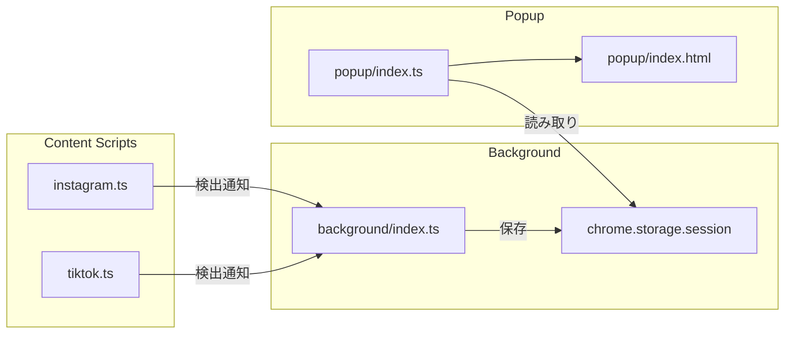
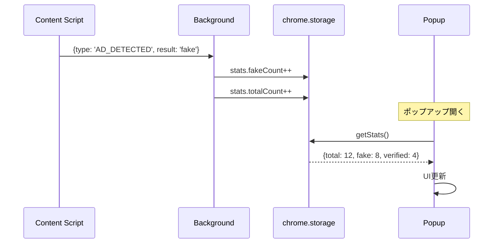

# 技術設計書 - FakeAdAlertDemo Phase 3: 仕上げ

## 1. 要件トレーサビリティマトリックス

| 要件ID | 要件内容 | 設計項目 | 既存資産 | 新規理由 |
|--------|---------|---------|---------|---------|
| REQ-P3-001 | ポップアップ基本レイアウト | popup/index.html, index.ts | ✅雛形あり | 実装追加 |
| REQ-P3-002 | 対応SNS表示 | popup/index.html | ✅雛形あり | 実装追加 |
| REQ-P3-003 | 統計情報表示 | stats.ts, chrome.storage | ❌新規 | 新機能 |
| REQ-P3-004 | デモ用説明テキスト | popup/index.html | ✅雛形あり | 実装追加 |
| REQ-P3-005 | 拡張機能アイコン | public/icons/ | ✅プレースホルダー | 差し替え |
| REQ-P3-006 | ポップアップ用ロゴ | public/images/ | ❌新規 | 新規作成 |
| REQ-P3-007 | ホワイトリスト調整 | ad-verification.yml | ✅既存 | 更新 |
| REQ-P3-008 | ブラックリスト調整 | ad-verification.yml | ✅既存 | 更新 |
| REQ-P3-009 | README.md | README.md | ❌新規 | 新規作成 |
| REQ-P3-010 | デモ手順書 | docs/demo-guide.md | ❌新規 | 新規作成 |

---

## 2. アーキテクチャ概要

### 2.1 統計情報の流れ



### 2.2 メッセージング



---

## 3. モジュール設計

### 3.1 統計管理（src/lib/stats.ts）

> 📌 要件: REQ-P3-003

```typescript
/**
 * 統計情報の型定義
 */
export interface AdStats {
  totalCount: number;
  fakeCount: number;
  verifiedCount: number;
  unknownCount: number;
}

const STORAGE_KEY = 'adStats';

/**
 * 初期統計
 */
const initialStats: AdStats = {
  totalCount: 0,
  fakeCount: 0,
  verifiedCount: 0,
  unknownCount: 0,
};

/**
 * 統計を取得
 */
export const getStats = async (): Promise<AdStats> => {
  const result = await chrome.storage.session.get(STORAGE_KEY);
  return result[STORAGE_KEY] || initialStats;
};

/**
 * 統計を更新
 */
export const incrementStat = async (
  type: 'fake' | 'verified' | 'unknown'
): Promise<void> => {
  const stats = await getStats();
  stats.totalCount++;

  switch (type) {
    case 'fake':
      stats.fakeCount++;
      break;
    case 'verified':
      stats.verifiedCount++;
      break;
    case 'unknown':
      stats.unknownCount++;
      break;
  }

  await chrome.storage.session.set({ [STORAGE_KEY]: stats });
};

/**
 * 統計をリセット
 */
export const resetStats = async (): Promise<void> => {
  await chrome.storage.session.set({ [STORAGE_KEY]: initialStats });
};
```

### 3.2 Background Script更新（src/background/index.ts）

> 📌 要件: REQ-P3-003

```typescript
/**
 * Background Script (Service Worker)
 * Phase 3: 統計管理機能を追加
 */

import { incrementStat, resetStats } from '../lib/stats';

const SCRIPT_NAME = '[FakeAdAlertDemo]';

// 拡張機能インストール時の処理
chrome.runtime.onInstalled.addListener((details) => {
  console.log(`${SCRIPT_NAME} Extension installed:`, details.reason);
  // 統計をリセット
  resetStats();
});

// Content Scriptからのメッセージを受信
chrome.runtime.onMessage.addListener((message, sender, sendResponse) => {
  console.log(`${SCRIPT_NAME} Message received:`, message);

  if (message.type === 'AD_DETECTED') {
    // 統計を更新
    incrementStat(message.result).then(() => {
      sendResponse({ status: 'ok' });
    });
    return true; // 非同期レスポンス
  }

  sendResponse({ status: 'unknown' });
  return true;
});

console.log(`${SCRIPT_NAME} Background Script loaded`);
```

### 3.3 Observer更新（統計通知追加）

> 📌 要件: REQ-P3-003

**src/lib/observer.ts の processAds 関数に追加:**

```typescript
// 判定後にBackgroundに通知
const notifyBackground = (result: VerificationResult): void => {
  chrome.runtime.sendMessage({
    type: 'AD_DETECTED',
    result: result === 'verified' ? 'verified' : result === 'fake' ? 'fake' : 'unknown',
  });
};

// processAds内で呼び出し
ads.forEach((ad) => {
  const verification = verifyAdvertiser(ad.advertiserName);
  // ... UI表示処理 ...
  notifyBackground(verification.result);
});
```

### 3.4 ポップアップHTML（src/popup/index.html）

> 📌 要件: REQ-P3-001, REQ-P3-002, REQ-P3-004

```html
<!DOCTYPE html>
<html lang="ja">
<head>
  <meta charset="UTF-8">
  <meta name="viewport" content="width=device-width, initial-scale=1.0">
  <title>FakeAdAlertDemo</title>
  <link rel="stylesheet" href="style.css">
</head>
<body>
  <div class="popup-container">
    <!-- ヘッダー -->
    <header class="popup-header">
      
      <h1 class="popup-title">FakeAdAlertDemo</h1>
    </header>

    <!-- ステータス -->
    <section class="popup-section">
      <div class="status-badge status-active">
        <span class="status-icon">✅</span>
        <span class="status-text">拡張機能は有効です</span>
      </div>
    </section>

    <!-- 対応SNS -->
    <section class="popup-section">
      <h2 class="section-title">対応SNS</h2>
      <ul class="sns-list">
        <li class="sns-item sns-active">
          <span class="sns-icon">📸</span>
          <span class="sns-name">Instagram</span>
          <span class="sns-status">✓</span>
        </li>
        <li class="sns-item sns-active">
          <span class="sns-icon">🎵</span>
          <span class="sns-name">TikTok</span>
          <span class="sns-status">✓</span>
        </li>
        <li class="sns-item sns-coming">
          <span class="sns-icon">📺</span>
          <span class="sns-name">YouTube</span>
          <span class="sns-status">coming soon</span>
        </li>
      </ul>
    </section>

    <!-- 統計 -->
    <section class="popup-section">
      <h2 class="section-title">このセッションの検出</h2>
      <div class="stats-grid">
        <div class="stat-item">
          <span class="stat-icon">🔍</span>
          <span class="stat-label">広告検出</span>
          <span class="stat-value" id="stat-total">0</span>
        </div>
        <div class="stat-item stat-danger">
          <span class="stat-icon">⚠️</span>
          <span class="stat-label">フェイク</span>
          <span class="stat-value" id="stat-fake">0</span>
        </div>
        <div class="stat-item stat-success">
          <span class="stat-icon">✅</span>
          <span class="stat-label">認証済み</span>
          <span class="stat-value" id="stat-verified">0</span>
        </div>
      </div>
    </section>

    <!-- デモ説明 -->
    <footer class="popup-footer">
      <p class="demo-notice">
        ⚠️ これはデモ用アプリです<br>
        VeriCerts認証のコンセプトデモンストレーション
      </p>
    </footer>
  </div>

  <script src="index.ts" type="module"></script>
</body>
</html>
```

### 3.5 ポップアップTypeScript（src/popup/index.ts）

> 📌 要件: REQ-P3-003

```typescript
/**
 * Popup Script
 */

import { getStats } from '../lib/stats';

const updateUI = async (): Promise<void> => {
  const stats = await getStats();

  const totalEl = document.getElementById('stat-total');
  const fakeEl = document.getElementById('stat-fake');
  const verifiedEl = document.getElementById('stat-verified');

  if (totalEl) totalEl.textContent = String(stats.totalCount);
  if (fakeEl) fakeEl.textContent = String(stats.fakeCount + stats.unknownCount);
  if (verifiedEl) verifiedEl.textContent = String(stats.verifiedCount);
};

// 初期化
document.addEventListener('DOMContentLoaded', () => {
  updateUI();
});
```

### 3.6 ポップアップCSS（src/popup/style.css）

> 📌 要件: REQ-P3-001, NFR-P3-001

```css
/*
 * FakeAdAlertDemo - Popup Styles
 */

* {
  margin: 0;
  padding: 0;
  box-sizing: border-box;
}

body {
  font-family: -apple-system, BlinkMacSystemFont, 'Segoe UI', Roboto, sans-serif;
  font-size: 14px;
  color: #1e293b;
  background: #ffffff;
}

.popup-container {
  width: 280px;
  padding: 16px;
}

/* ヘッダー */
.popup-header {
  display: flex;
  align-items: center;
  gap: 12px;
  padding-bottom: 12px;
  border-bottom: 1px solid #e2e8f0;
  margin-bottom: 12px;
}

.popup-logo {
  width: 32px;
  height: 32px;
}

.popup-title {
  font-size: 16px;
  font-weight: 600;
  color: #0ea5e9;
}

/* セクション */
.popup-section {
  margin-bottom: 16px;
}

.section-title {
  font-size: 12px;
  font-weight: 600;
  color: #64748b;
  text-transform: uppercase;
  letter-spacing: 0.5px;
  margin-bottom: 8px;
}

/* ステータス */
.status-badge {
  display: flex;
  align-items: center;
  gap: 8px;
  padding: 8px 12px;
  border-radius: 8px;
  font-size: 13px;
  font-weight: 500;
}

.status-active {
  background: #dcfce7;
  color: #166534;
}

/* SNSリスト */
.sns-list {
  list-style: none;
}

.sns-item {
  display: flex;
  align-items: center;
  gap: 8px;
  padding: 8px 0;
  border-bottom: 1px solid #f1f5f9;
}

.sns-item:last-child {
  border-bottom: none;
}

.sns-icon {
  font-size: 16px;
}

.sns-name {
  flex: 1;
  font-size: 13px;
}

.sns-status {
  font-size: 12px;
  color: #22c55e;
  font-weight: 500;
}

.sns-coming .sns-status {
  color: #94a3b8;
  font-style: italic;
}

/* 統計 */
.stats-grid {
  display: grid;
  grid-template-columns: repeat(3, 1fr);
  gap: 8px;
}

.stat-item {
  text-align: center;
  padding: 12px 8px;
  background: #f8fafc;
  border-radius: 8px;
}

.stat-icon {
  display: block;
  font-size: 20px;
  margin-bottom: 4px;
}

.stat-label {
  display: block;
  font-size: 10px;
  color: #64748b;
  margin-bottom: 4px;
}

.stat-value {
  display: block;
  font-size: 18px;
  font-weight: 700;
  color: #1e293b;
}

.stat-danger .stat-value {
  color: #ef4444;
}

.stat-success .stat-value {
  color: #22c55e;
}

/* フッター */
.popup-footer {
  padding-top: 12px;
  border-top: 1px solid #e2e8f0;
}

.demo-notice {
  font-size: 11px;
  color: #94a3b8;
  text-align: center;
  line-height: 1.5;
}
```

---

## 4. アイコン設計

> 📌 要件: REQ-P3-005, REQ-P3-006

### 4.1 アイコンデザイン仕様

| サイズ | ファイル名 | 用途 |
|--------|-----------|------|
| 16x16 | icon16.png | ツールバー（小） |
| 48x48 | icon48.png | 拡張機能一覧 |
| 128x128 | icon128.png | Chrome Web Store |

### 4.2 デザインコンセプト

- **モチーフ**: シールド（🛡️）+ チェックマーク
- **カラー**: VeriCertsブルー (#0ea5e9) をベース
- **スタイル**: フラットデザイン、角丸

### 4.3 作成方法（提案）

1. **Figma/Canva**: シンプルなベクターアイコン作成
2. **絵文字ベース**: 🛡️ を加工して使用
3. **フリー素材**: Shield系アイコンをカスタマイズ

---

## 5. デモ用データ設計（ad-verification.yml更新）

> 📌 要件: REQ-P3-007, REQ-P3-008

```yaml
# 広告認証設定ファイル
# FakeAdAlertDemo デモ用 - Phase 3 調整版

whitelist:
  # === 日本の大手企業 ===
  - name: "トヨタ自動車"
    patterns: ["toyota", "トヨタ", "TOYOTA", "toyota_jp"]
  - name: "ソニー"
    patterns: ["sony", "Sony", "ソニー", "sony_jp"]
  - name: "ユニクロ"
    patterns: ["uniqlo", "UNIQLO", "ユニクロ", "uniqlo_jp"]
  - name: "楽天"
    patterns: ["rakuten", "Rakuten", "楽天"]
  - name: "ソフトバンク"
    patterns: ["softbank", "SoftBank", "ソフトバンク"]

  # === グローバル企業 ===
  - name: "Apple"
    patterns: ["apple", "Apple", "apple_jp"]
  - name: "Nike"
    patterns: ["nike", "Nike", "ナイキ"]
  - name: "Adidas"
    patterns: ["adidas", "Adidas", "アディダス"]
  - name: "Coca-Cola"
    patterns: ["cocacola", "coca-cola", "コカコーラ", "コカ・コーラ"]
  - name: "McDonald's"
    patterns: ["mcdonalds", "McDonald", "マクドナルド", "マック"]

  # === デモ用ダミー ===
  - name: "VeriCerts公式"
    patterns: ["vericerts", "VeriCerts", "ベリサーツ"]

blacklist:
  # === 投資詐欺系 ===
  - name: "投資詐欺パターン"
    patterns:
      - "今すぐ100万円"
      - "誰でも簡単に稼げる"
      - "副業で月収100万"
      - "投資で10倍"
      - "元本保証"
      - "必ず儲かる"
      - "ノーリスク"
      - "億り人"

  # === なりすまし系 ===
  - name: "有名人なりすまし"
    patterns:
      - "前澤友作"
      - "堀江貴文"
      - "ホリエモン"
      - "孫正義"
      - "イーロン・マスク"
      - "Elon Musk"
      - "与沢翼"

  # === 情報商材系 ===
  - name: "情報商材パターン"
    patterns:
      - "限定公開"
      - "今だけ無料"
      - "残りわずか"
      - "秘密の方法"
      - "稼ぐ方法を教えます"
      - "LINE登録で"
      - "公式LINE"

  # === 怪しい美容・健康系 ===
  - name: "誇大広告パターン"
    patterns:
      - "たった1週間で"
      - "驚きの効果"
      - "医者も驚く"
      - "芸能人も愛用"
      - "モデル御用達"
      - "痩せすぎ注意"

  # === 緊急系 ===
  - name: "緊急・焦らせ系"
    patterns:
      - "本日限り"
      - "緊急"
      - "あと◯名"
      - "先着"
      - "今すぐクリック"
```

---

## 6. ディレクトリ構成（Phase 3追加分）

```
fake-ad-alert-demo/
├── src/
│   ├── popup/
│   │   ├── index.html        # 実装
│   │   ├── index.ts          # 実装
│   │   └── style.css         # 実装
│   ├── lib/
│   │   └── stats.ts          # 新規
│   └── background/
│       └── index.ts          # 更新（統計対応）
├── public/
│   └── icons/
│       ├── icon16.png        # 差し替え
│       ├── icon48.png        # 差し替え
│       └── icon128.png       # 差し替え
├── config/
│   └── ad-verification.yml   # 更新
├── docs/
│   └── demo-guide.md         # 新規
└── README.md                 # 新規
```

---

## 7. 技術的決定事項

| 決定項目 | 選択 | 理由 |
|---------|------|------|
| 統計ストレージ | chrome.storage.session | セッション単位でリセット、シンプル |
| メッセージング | chrome.runtime.sendMessage | 標準API、シンプル |
| ポップアップ幅 | 280px | コンパクトで情報が見やすい |
| アイコン作成 | シンプルなフラットデザイン | 作成容易、視認性良好 |
