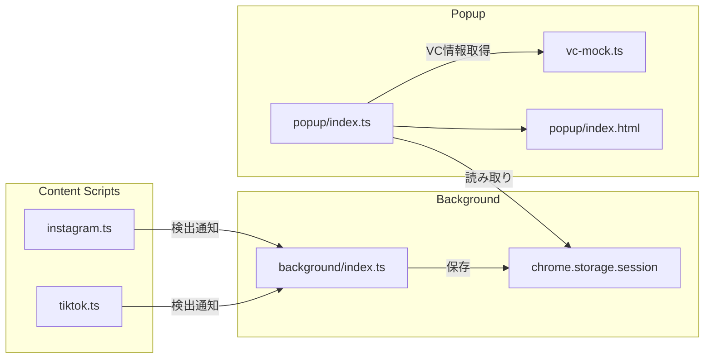
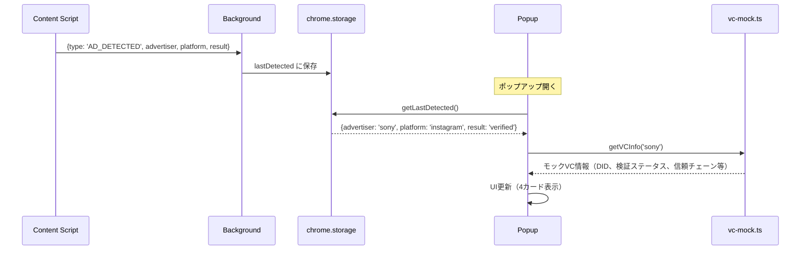

# 技術設計書 - FakeAdAlertDemo Phase 3: 仕上げ

## 1. 要件トレーサビリティマトリックス

| 要件ID | 要件内容 | 設計項目 | 既存資産 | 新規理由 |
|--------|---------|---------|---------|---------|
| REQ-P3-001 | ポップアップ基本レイアウト | popup/index.html, index.ts | 雛形あり | ダークテーマで実装 |
| REQ-P3-002 | 対応SNS・ステータス表示 | popup/index.html | 雛形あり | 実装追加 |
| REQ-P3-003 | VC検証情報表示 | popup/index.ts, vc-mock.ts | 新規 | メイン新機能 |
| REQ-P3-004 | デモ用説明テキスト | popup/index.html | 雛形あり | 実装追加 |
| REQ-P3-005 | 拡張機能アイコン | public/icons/ | プレースホルダー | 差し替え |
| REQ-P3-006 | ホワイトリスト調整（モックVC付き） | ad-verification.yml, vc-mock.ts | 既存 | 更新+新規 |
| REQ-P3-007 | ブラックリスト調整 | ad-verification.yml | 既存 | 更新 |
| REQ-P3-008 | README.md更新 | README.md | 既存 | 更新 |
| REQ-P3-009 | デモ手順書 | docs/demo-guide.md | 新規 | 新規作成 |

---

## 2. アーキテクチャ概要

### 2.1 検出情報の流れ



### 2.2 メッセージング



---

## 3. モジュール設計

### 3.1 型定義（src/lib/vc-types.ts）

> 📌 要件: REQ-P3-003（share-verifierのlib/types.tsと一致させる）

```typescript
/**
 * 広告主情報
 */
export interface AdvertiserInfo {
  name: string;
  advertiserDid: string;
  category: string;
  platform: string;
}

/**
 * 検証ステータス（5項目）
 */
export interface VerificationStatus {
  issuerSignature: boolean;
  expiration: boolean;
  revocationStatus: boolean;
  trustRegistry: boolean;
  blockchain: boolean;
}

/**
 * 信頼チェーンのエンティティ
 */
export interface TrustChainEntity {
  name: string;
  role: string;
  did?: string;
}

/**
 * 信頼チェーン（3階層）
 */
export interface TrustChain {
  root: TrustChainEntity;
  intermediate: TrustChainEntity;
  subject: TrustChainEntity;
}

/**
 * ブロックチェーン証明
 */
export interface BlockchainProof {
  network: string;
  transactionHash: string;
  contractAddress: string;
}

/**
 * VC情報（メイン構造体）
 */
export interface VCInfo {
  advertiserInfo: AdvertiserInfo;
  verificationStatus: VerificationStatus;
  trustChain: TrustChain;
  blockchainProof: BlockchainProof;
  vcId: string;
  issuedAt: string;
  expiresAt: string;
}

/**
 * 検出結果（storageに保存する情報）
 */
export interface DetectedAdInfo {
  advertiserName: string;
  platform: 'instagram' | 'tiktok';
  result: 'verified' | 'fake' | 'unknown';
  matchedPattern?: string;
  listType?: string;
  detectedAt: string;
}
```

### 3.2 モックVC情報（src/lib/vc-mock.ts）

> 📌 要件: REQ-P3-003, REQ-P3-006

```typescript
/**
 * ホワイトリスト企業のモックVC情報
 * share-verifierのdata/patterns.jsonと同等のデータ構造
 */

import type { VCInfo } from './vc-types';

// 共通の信頼チェーン（消費者庁 → トラスト広告社 → 広告主）
const createTrustChain = (subjectName: string, subjectDid: string) => ({
  root: {
    name: '消費者庁',
    role: '信頼の基点',
    did: 'did:web:caa.go.jp',
  },
  intermediate: {
    name: 'トラスト広告社',
    role: '認定広告審査機関',
    did: 'did:web:trust-ad.co.jp',
  },
  subject: {
    name: subjectName,
    role: '広告主',
    did: subjectDid,
  },
});

// 共通のブロックチェーン証明
const createBlockchainProof = (txHash: string) => ({
  network: 'Sepolia',
  transactionHash: txHash,
  contractAddress: '0xa67515e219ee1072e65A14b5A3439951b4b6d3D1',
});

// 企業別モックVC情報マッピング
const vcDatabase: Record<string, VCInfo> = {
  // トヨタ自動車
  toyota: {
    advertiserInfo: {
      name: 'トヨタ自動車株式会社',
      advertiserDid: 'did:web:toyota.co.jp',
      category: '自動車広告',
      platform: '',  // 検出時に動的設定
    },
    verificationStatus: {
      issuerSignature: true,
      expiration: true,
      revocationStatus: true,
      trustRegistry: true,
      blockchain: true,
    },
    trustChain: createTrustChain('トヨタ自動車', 'did:web:toyota.co.jp'),
    blockchainProof: createBlockchainProof('0x8f2e...（省略）...3a1b'),
    vcId: 'urn:uuid:toyota-ad-001',
    issuedAt: '2025-01-15T00:00:00Z',
    expiresAt: '2026-01-15T00:00:00Z',
  },
  // ソニー
  sony: { ... },
  // ユニクロ
  uniqlo: { ... },
  // ... 他の企業
};

/**
 * 広告主名からモックVC情報を取得
 */
export const getVCInfo = (advertiserName: string): VCInfo | null => {
  const lowerName = advertiserName.toLowerCase();
  for (const [key, vcInfo] of Object.entries(vcDatabase)) {
    if (lowerName.includes(key)) {
      return vcInfo;
    }
  }
  return null;
};
```

### 3.3 Background Script更新（src/background/index.ts）

> 📌 要件: REQ-P3-003

```typescript
/**
 * Background Script (Service Worker)
 * Phase 3: 検出情報の保存
 */

import type { DetectedAdInfo } from '../lib/vc-types';

const SCRIPT_NAME = '[FakeAdAlertDemo]';
const STORAGE_KEY = 'lastDetectedAd';

// 拡張機能インストール時の処理
chrome.runtime.onInstalled.addListener((details) => {
  console.log(`${SCRIPT_NAME} Extension installed:`, details.reason);
  chrome.storage.session.remove(STORAGE_KEY);
});

// Content Scriptからのメッセージを受信
chrome.runtime.onMessage.addListener((message, sender, sendResponse) => {
  console.log(`${SCRIPT_NAME} Message received:`, message);

  if (message.type === 'AD_DETECTED') {
    const adInfo: DetectedAdInfo = {
      advertiserName: message.advertiserName,
      platform: message.platform,
      result: message.result,
      matchedPattern: message.matchedPattern,
      listType: message.listType,
      detectedAt: new Date().toISOString(),
    };

    chrome.storage.session.set({ [STORAGE_KEY]: adInfo }).then(() => {
      sendResponse({ status: 'ok' });
    });
    return true;
  }

  sendResponse({ status: 'unknown' });
  return true;
});

console.log(`${SCRIPT_NAME} Background Script loaded`);
```

### 3.4 Observer更新（検出通知追加）

> 📌 要件: REQ-P3-003

**src/lib/observer.ts, src/lib/tiktok-observer.ts に追加:**

```typescript
/**
 * Backgroundに検出情報を通知
 */
const notifyBackground = (
  advertiserName: string,
  platform: 'instagram' | 'tiktok',
  result: 'verified' | 'fake' | 'unknown',
  matchedPattern?: string,
  listType?: string
): void => {
  chrome.runtime.sendMessage({
    type: 'AD_DETECTED',
    advertiserName,
    platform,
    result,
    matchedPattern,
    listType,
  }).catch(() => {
    // ポップアップが閉じている等でエラーが出ることがあるが無視
  });
};
```

### 3.5 ポップアップHTML（src/popup/index.html）

> 📌 要件: REQ-P3-001, REQ-P3-002, REQ-P3-004

```html
<!DOCTYPE html>
<html lang="ja">
<head>
  <meta charset="UTF-8">
  <meta name="viewport" content="width=device-width, initial-scale=1.0">
  <title>FakeAdAlertDemo</title>
  <link rel="stylesheet" href="style.css">
</head>
<body>
  <div class="popup-container">
    <!-- ヘッダー -->
    <header class="popup-header">
      
      <div>
        <h1 class="popup-title">FakeAdAlertDemo</h1>
        <p class="popup-subtitle">VC Ad Verifier</p>
      </div>
    </header>

    <!-- ステータス -->
    <section class="popup-section">
      <div class="status-badge status-active">
        <span>✅</span>
        <span>拡張機能は有効</span>
      </div>
      <div class="sns-row">
        <span class="sns-tag sns-active">📸 Instagram ✓</span>
        <span class="sns-tag sns-active">🎵 TikTok ✓</span>
      </div>
    </section>

    <!-- VC検証情報エリア -->
    <section id="vc-content" class="popup-section">
      <!-- JSで動的に生成 -->
    </section>

    <!-- フッター -->
    <footer class="popup-footer">
      <p class="demo-notice">
        ⚠️ これはデモ用アプリです<br>
        VeriCerts認証のコンセプトデモンストレーション
      </p>
    </footer>
  </div>

  <script type="module" src="index.ts"></script>
</body>
</html>
```

### 3.6 ポップアップTypeScript（src/popup/index.ts）

> 📌 要件: REQ-P3-003

```typescript
/**
 * Popup Script
 * 検出情報の読み取りとVC情報の表示
 */

import type { DetectedAdInfo, VCInfo } from '../lib/vc-types';
import { getVCInfo } from '../lib/vc-mock';

const STORAGE_KEY = 'lastDetectedAd';

/**
 * 展開可能カードのHTML生成
 */
const createExpandableCard = (
  icon: string,
  title: string,
  content: string,
  defaultExpanded = false
): string => {
  return `
    <div class="card ${defaultExpanded ? 'card-expanded' : ''}">
      <div class="card-header" onclick="this.parentElement.classList.toggle('card-expanded')">
        <span class="card-icon">${icon}</span>
        <span class="card-title">${title}</span>
        <span class="card-chevron">▼</span>
      </div>
      <div class="card-content">
        ${content}
      </div>
    </div>
  `;
};

/**
 * InfoRow生成
 */
const createInfoRow = (
  label: string,
  value: string,
  options?: { isCode?: boolean; isValid?: boolean }
): string => {
  let valueHtml = value;
  if (options?.isCode) {
    valueHtml = `<span class="code-value">${value}</span>`;
  }
  if (options?.isValid !== undefined) {
    const icon = options.isValid ? '✓' : '✗';
    const cls = options.isValid ? 'valid' : 'invalid';
    valueHtml = `<span class="status-${cls}">${icon}</span>`;
  }
  return `
    <div class="info-row">
      <span class="info-label">${label}</span>
      <span class="info-value">${valueHtml}</span>
    </div>
  `;
};

/**
 * 認証済み広告のUI生成
 */
const renderVerifiedAd = (detected: DetectedAdInfo, vcInfo: VCInfo): string => {
  // 広告情報カード
  const advertiserCard = createExpandableCard('📋', '広告情報', `
    ${createInfoRow('広告主', vcInfo.advertiserInfo.name)}
    ${createInfoRow('広告主DID', vcInfo.advertiserInfo.advertiserDid, { isCode: true })}
    ${createInfoRow('カテゴリ', vcInfo.advertiserInfo.category)}
    ${createInfoRow('プラットフォーム', detected.platform === 'instagram' ? 'Instagram' : 'TikTok')}
  `, true);

  // 検証ステータスカード
  const statusCard = createExpandableCard('✓', '検証ステータス', `
    ${createInfoRow('発行者の署名', '', { isValid: vcInfo.verificationStatus.issuerSignature })}
    ${createInfoRow('有効期限', '', { isValid: vcInfo.verificationStatus.expiration })}
    ${createInfoRow('失効状態', '', { isValid: vcInfo.verificationStatus.revocationStatus })}
    ${createInfoRow('トラストレジストリ', '', { isValid: vcInfo.verificationStatus.trustRegistry })}
    ${createInfoRow('ブロックチェーン', '', { isValid: vcInfo.verificationStatus.blockchain })}
  `);

  // 信頼チェーンカード
  const trustChainCard = createExpandableCard('🔗', '信頼チェーン', `
    <div class="trust-chain">
      <div class="trust-entity trust-root">
        <div class="trust-name">${vcInfo.trustChain.root.name}</div>
        <div class="trust-role">${vcInfo.trustChain.root.role}</div>
        ${vcInfo.trustChain.root.did ? `<div class="trust-did">${vcInfo.trustChain.root.did}</div>` : ''}
      </div>
      <div class="trust-arrow">↓</div>
      <div class="trust-entity trust-intermediate">
        <div class="trust-name">${vcInfo.trustChain.intermediate.name}</div>
        <div class="trust-role">${vcInfo.trustChain.intermediate.role}</div>
        ${vcInfo.trustChain.intermediate.did ? `<div class="trust-did">${vcInfo.trustChain.intermediate.did}</div>` : ''}
      </div>
      <div class="trust-arrow">↓</div>
      <div class="trust-entity trust-subject">
        <div class="trust-name">${vcInfo.trustChain.subject.name}</div>
        <div class="trust-role">${vcInfo.trustChain.subject.role}</div>
        ${vcInfo.trustChain.subject.did ? `<div class="trust-did">${vcInfo.trustChain.subject.did}</div>` : ''}
      </div>
    </div>
  `);

  // ブロックチェーン証明カード
  const blockchainCard = createExpandableCard('⛓️', 'ブロックチェーン証明', `
    ${createInfoRow('Network', vcInfo.blockchainProof.network)}
    ${createInfoRow('TxHash', vcInfo.blockchainProof.transactionHash, { isCode: true })}
    ${createInfoRow('Contract', vcInfo.blockchainProof.contractAddress, { isCode: true })}
  `);

  return `
    <div class="result-header result-success">
      <span class="result-icon">✅</span>
      <span class="result-text">検証完了 - 証明書は有効です</span>
    </div>
    ${advertiserCard}
    ${statusCard}
    ${trustChainCard}
    ${blockchainCard}
  `;
};

/**
 * フェイク広告のUI生成
 */
const renderFakeAd = (detected: DetectedAdInfo): string => { ... };

/**
 * 未検出時のUI生成
 */
const renderNoDetection = (): string => { ... };

/**
 * メインUI更新
 */
const updateUI = async (): Promise<void> => {
  const result = await chrome.storage.session.get(STORAGE_KEY);
  const detected = result[STORAGE_KEY] as DetectedAdInfo | undefined;
  const container = document.getElementById('vc-content');
  if (!container) return;

  if (!detected) {
    container.innerHTML = renderNoDetection();
    return;
  }

  if (detected.result === 'verified') {
    const vcInfo = getVCInfo(detected.advertiserName);
    if (vcInfo) {
      container.innerHTML = renderVerifiedAd(detected, vcInfo);
      return;
    }
  }

  if (detected.result === 'fake') {
    container.innerHTML = renderFakeAd(detected);
    return;
  }

  container.innerHTML = renderNoDetection();
};

// 初期化
document.addEventListener('DOMContentLoaded', updateUI);
```

### 3.7 ポップアップCSS（src/popup/style.css）

> 📌 要件: REQ-P3-001, NFR-P3-001, NFR-P3-003

ダークテーマ + グラスモーフィズム。share-verifierのスタイルと統一。

**主要スタイル方針:**
- 背景: `#0f0f23`
- カード: `background: rgba(255,255,255,0.1); border: 1px solid rgba(255,255,255,0.2); border-radius: 16px;`
- テキスト: `color: #ffffff;` / ラベル: `color: rgba(255,255,255,0.6);`
- コード値: `color: #00d4ff; font-family: monospace;`
- 展開/折りたたみ: `max-height` + `transition`
- 成功グラデーション: `linear-gradient(135deg, #059669, #0891b2)`
- 危険グラデーション: `linear-gradient(135deg, #ff6b9d, #ff4757)`

---

## 4. アイコン設計

> 📌 要件: REQ-P3-005

### 4.1 アイコンデザイン仕様

| サイズ | ファイル名 | 用途 |
|--------|-----------|------|
| 16x16 | icon16.png | ツールバー（小） |
| 48x48 | icon48.png | 拡張機能一覧 |
| 128x128 | icon128.png | Chrome Web Store |

### 4.2 デザインコンセプト

- **モチーフ**: シールド + チェックマーク
- **カラー**: VeriCertsブルー (#0ea5e9) をベース
- **スタイル**: フラットデザイン、角丸

---

## 5. デモ用データ設計（ad-verification.yml更新）

> 📌 要件: REQ-P3-006, REQ-P3-007

既存のad-verification.ymlを拡充。ホワイトリスト企業の追加とブラックリストパターンの追加。
モックVC情報（DID、信頼チェーン等）はvc-mock.tsで管理する。

### ホワイトリスト追加企業

| 企業名 | パターン | DID |
|--------|---------|-----|
| トヨタ自動車 | toyota | did:web:toyota.co.jp |
| ソニー | sony | did:web:sony.co.jp |
| ユニクロ | uniqlo | did:web:uniqlo.co.jp |
| 楽天 | rakuten | did:web:rakuten.co.jp |
| Apple | apple | did:web:apple.com |
| Nike | nike | did:web:nike.com |
| Adidas | adidas | did:web:adidas.com |
| Coca-Cola | cocacola | did:web:coca-cola.com |
| McDonald's | mcdonalds | did:web:mcdonalds.com |

### ブラックリスト追加パターン

- 投資詐欺系: 「元本保証」「必ず儲かる」「ノーリスク」「億り人」
- なりすまし系: 「Elon Musk」「与沢翼」
- 情報商材系: 「稼ぐ方法を教えます」「LINE登録で」「公式LINE」
- 誇大広告系: 「芸能人も愛用」「モデル御用達」「痩せすぎ注意」
- 緊急系: 「本日限り」「緊急」「あと◯名」「先着」「今すぐクリック」

---

## 6. ディレクトリ構成（Phase 3追加・変更分）

```
fake-ad-alert-demo/
├── src/
│   ├── popup/
│   │   ├── index.html        # 実装（ダークテーマ）
│   │   ├── index.ts          # 実装（VC情報表示）
│   │   └── style.css         # 実装（グラスモーフィズム）
│   ├── lib/
│   │   ├── vc-types.ts       # 新規（VC型定義）
│   │   └── vc-mock.ts        # 新規（モックVC情報）
│   └── background/
│       └── index.ts          # 更新（検出情報保存）
├── public/
│   └── icons/
│       ├── icon16.png        # 差し替え
│       ├── icon48.png        # 差し替え
│       └── icon128.png       # 差し替え
├── config/
│   └── ad-verification.yml   # 更新
├── docs/
│   └── demo-guide.md         # 新規
└── README.md                 # 更新
```

---

## 7. 技術的決定事項

| 決定項目 | 選択 | 理由 |
|---------|------|------|
| VC情報ストレージ | chrome.storage.session | セッション単位、直近検出のみ保存 |
| メッセージング | chrome.runtime.sendMessage | 標準API、シンプル |
| モックデータ管理 | vc-mock.ts (TypeScript) | 型安全、IDE補完、share-verifierと構造統一 |
| テーマ | ダーク (#0f0f23) | share-verifierと統一、2026年UIトレンド |
| カードUI | 展開可能カード（Vanilla JS） | share-verifierと統一、ライブラリ不要 |
| ポップアップ幅 | 360px | 4カード構成でDID等のコード値を表示するため280pxから拡張 |
| アイコン作成 | シンプルなフラットデザイン | 作成容易、視認性良好 |
