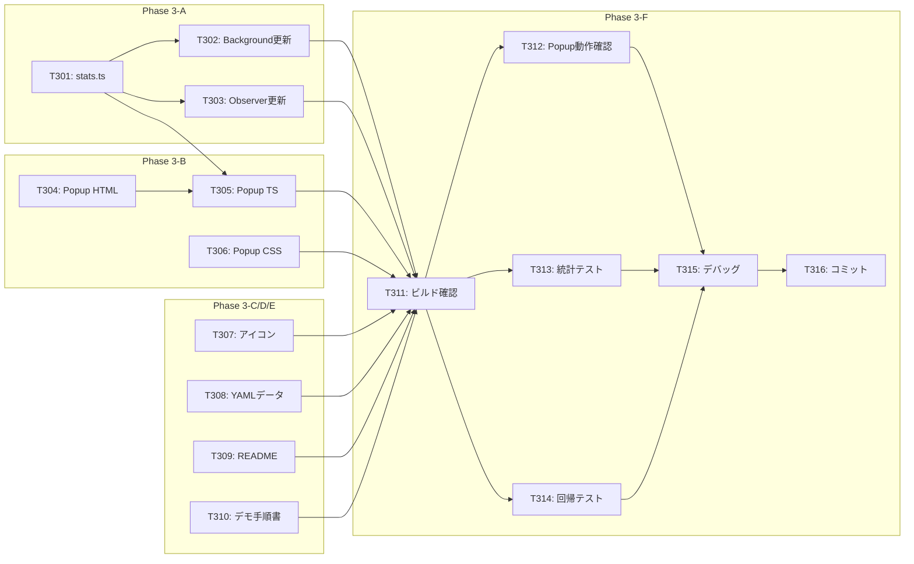

# タスクリスト - FakeAdAlertDemo Phase 3: 仕上げ

## 1. 概要

Phase 3の設計書に基づくタスク分解。デモ実施に必要な仕上げ作業を行い、営業デモとして完成した状態にする。

### 前提条件
- Phase 0, 1, 2が完了していること

### 完了条件
- ポップアップUIが動作する
- アイコンが適切に表示される
- デモ用データが調整済み
- README、デモ手順書が完成
- 営業デモ実施可能な状態

---

## 2. タスク一覧

### Phase 3-A: 統計機能
- [ ] T301: 統計管理モジュール（stats.ts）作成
- [ ] T302: Background Script更新（統計対応）
- [ ] T303: Observer更新（統計通知追加）

### Phase 3-B: ポップアップUI
- [ ] T304: ポップアップHTML実装
- [ ] T305: ポップアップTypeScript実装
- [ ] T306: ポップアップCSS実装

### Phase 3-C: アイコン
- [ ] T307: 拡張機能アイコン作成（16, 48, 128px）

### Phase 3-D: デモ用データ
- [ ] T308: ad-verification.yml 調整

### Phase 3-E: ドキュメント
- [ ] T309: README.md 作成
- [ ] T310: デモ手順書（docs/demo-guide.md）作成

### Phase 3-F: テスト・統合
- [ ] T311: ビルド・型チェック
- [ ] T312: ポップアップ動作確認
- [ ] T313: 統計機能テスト
- [ ] T314: Instagram/TikTok回帰テスト
- [ ] T315: デバッグ・調整
- [ ] T316: コミット・プッシュ

---

## 3. タスク詳細

### T301: 統計管理モジュール（stats.ts）作成
- **要件ID**: REQ-P3-003
- **設計書参照**: design.md §3.1
- **依存関係**: Phase 2完了
- **対象ファイル**: src/lib/stats.ts
- **完了条件**:
  - [ ] AdStats インターフェース定義
  - [ ] getStats 関数実装
  - [ ] incrementStat 関数実装
  - [ ] resetStats 関数実装
  - [ ] chrome.storage.session 使用
  - [ ] `pnpm typecheck` エラーなし
- **並列実行**: T307, T308と同時実行可能

---

### T302: Background Script更新（統計対応）
- **要件ID**: REQ-P3-003
- **設計書参照**: design.md §3.2
- **依存関係**: T301
- **対象ファイル**: src/background/index.ts
- **完了条件**:
  - [ ] stats.ts インポート
  - [ ] AD_DETECTED メッセージハンドリング
  - [ ] incrementStat 呼び出し
  - [ ] onInstalled で resetStats 呼び出し
  - [ ] `pnpm typecheck` エラーなし
- **並列実行**: T303と同時実行可能

---

### T303: Observer更新（統計通知追加）
- **要件ID**: REQ-P3-003
- **設計書参照**: design.md §3.3
- **依存関係**: T301
- **対象ファイル**: src/lib/observer.ts, src/lib/tiktok-observer.ts
- **完了条件**:
  - [ ] notifyBackground 関数実装
  - [ ] processAds 内で notifyBackground 呼び出し
  - [ ] Instagram用 observer.ts 更新
  - [ ] TikTok用 tiktok-observer.ts 更新
  - [ ] `pnpm typecheck` エラーなし
- **並列実行**: T302と同時実行可能

---

### T304: ポップアップHTML実装
- **要件ID**: REQ-P3-001, REQ-P3-002, REQ-P3-004
- **設計書参照**: design.md §3.4
- **依存関係**: Phase 0（雛形あり）
- **対象ファイル**: src/popup/index.html
- **完了条件**:
  - [ ] ヘッダー（ロゴ、タイトル）
  - [ ] ステータスバッジ
  - [ ] 対応SNSリスト
  - [ ] 統計表示エリア
  - [ ] デモ説明フッター
  - [ ] index.ts, style.css の読み込み
- **並列実行**: T305, T306と同時実行可能

---

### T305: ポップアップTypeScript実装
- **要件ID**: REQ-P3-003
- **設計書参照**: design.md §3.5
- **依存関係**: T301, T304
- **対象ファイル**: src/popup/index.ts
- **完了条件**:
  - [ ] getStats インポート
  - [ ] updateUI 関数実装
  - [ ] DOMContentLoaded で updateUI 呼び出し
  - [ ] 統計値のDOM更新
  - [ ] `pnpm typecheck` エラーなし
- **並列実行**: 不可（T301, T304完了後）

---

### T306: ポップアップCSS実装
- **要件ID**: REQ-P3-001, NFR-P3-001
- **設計書参照**: design.md §3.6
- **依存関係**: なし
- **対象ファイル**: src/popup/style.css
- **完了条件**:
  - [ ] ポップアップコンテナ（280px幅）
  - [ ] ヘッダースタイル
  - [ ] ステータスバッジスタイル
  - [ ] SNSリストスタイル
  - [ ] 統計グリッドスタイル
  - [ ] フッタースタイル
  - [ ] VeriCertsカラースキーム適用
- **並列実行**: T304, T305と同時実行可能

---

### T307: 拡張機能アイコン作成
- **要件ID**: REQ-P3-005, REQ-P3-006
- **設計書参照**: design.md §4
- **依存関係**: なし
- **対象ファイル**: public/icons/icon16.png, icon48.png, icon128.png
- **完了条件**:
  - [ ] 16x16 PNG作成
  - [ ] 48x48 PNG作成
  - [ ] 128x128 PNG作成
  - [ ] シールド/チェックマークモチーフ
  - [ ] VeriCertsブルー（#0ea5e9）使用
  - [ ] プレースホルダーを差し替え
- **作成方法**: Figma/Canva/絵文字ベース
- **並列実行**: 全タスクと同時実行可能

---

### T308: ad-verification.yml 調整
- **要件ID**: REQ-P3-007, REQ-P3-008
- **設計書参照**: design.md §5
- **依存関係**: なし
- **対象ファイル**: config/ad-verification.yml
- **完了条件**:
  - [ ] 日本の大手企業をホワイトリストに追加
  - [ ] グローバル企業をホワイトリストに追加
  - [ ] 投資詐欺パターンをブラックリストに追加
  - [ ] なりすましパターンをブラックリストに追加
  - [ ] 情報商材パターンをブラックリストに追加
  - [ ] 誇大広告パターンをブラックリストに追加
  - [ ] YAML構文エラーなし
- **並列実行**: 全タスクと同時実行可能

---

### T309: README.md 作成
- **要件ID**: REQ-P3-009
- **設計書参照**: -
- **依存関係**: なし
- **対象ファイル**: README.md
- **完了条件**:
  - [ ] プロジェクト概要
  - [ ] スクリーンショット（オプション）
  - [ ] インストール方法
  - [ ] 使い方
  - [ ] 対応SNS一覧
  - [ ] 技術スタック
  - [ ] デモ用の注意事項
- **並列実行**: 全タスクと同時実行可能

---

### T310: デモ手順書作成
- **要件ID**: REQ-P3-010
- **設計書参照**: -
- **依存関係**: なし
- **対象ファイル**: docs/demo-guide.md
- **完了条件**:
  - [ ] デモ準備手順
  - [ ] Chrome拡張のインストール手順
  - [ ] Instagram でのデモ手順
  - [ ] TikTok でのデモ手順
  - [ ] トラブルシューティング
  - [ ] よくある質問（FAQ）
- **並列実行**: 全タスクと同時実行可能

---

### T311: ビルド・型チェック
- **要件ID**: -
- **設計書参照**: -
- **依存関係**: T301〜T310
- **対象ファイル**: dist/
- **完了条件**:
  - [ ] `pnpm typecheck` エラーなし
  - [ ] `pnpm build` 正常完了
  - [ ] dist/ にポップアップファイル含まれる
  - [ ] dist/ にアイコンファイル含まれる
- **並列実行**: 不可（全実装完了後）

---

### T312: ポップアップ動作確認
- **要件ID**: -
- **設計書参照**: -
- **依存関係**: T311
- **対象ファイル**: -
- **完了条件**:
  - [ ] Chrome拡張を再読み込み
  - [ ] ツールバーアイコンをクリック
  - [ ] ポップアップが表示される
  - [ ] レイアウトが正しい
  - [ ] 対応SNS一覧が表示される
  - [ ] デモ説明が表示される
- **並列実行**: T313と同時実行可能

---

### T313: 統計機能テスト
- **要件ID**: -
- **設計書参照**: -
- **依存関係**: T311
- **対象ファイル**: -
- **完了条件**:
  - [ ] Instagram で広告を検出
  - [ ] ポップアップを開く
  - [ ] 統計値が更新されている
  - [ ] TikTok で広告を検出
  - [ ] 統計値が累積される
  - [ ] 拡張機能再読み込みで統計リセット
- **並列実行**: T312と同時実行可能

---

### T314: Instagram/TikTok回帰テスト
- **要件ID**: -
- **設計書参照**: -
- **依存関係**: T311
- **対象ファイル**: -
- **完了条件**:
  - [ ] Instagram で警告オーバーレイ表示確認
  - [ ] Instagram で認証バッジ表示確認
  - [ ] TikTok で警告オーバーレイ表示確認
  - [ ] TikTok で認証バッジ表示確認
  - [ ] Phase 2までの機能にデグレなし
- **並列実行**: T312, T313と同時実行可能

---

### T315: デバッグ・調整
- **要件ID**: -
- **設計書参照**: -
- **依存関係**: T312, T313, T314
- **対象ファイル**: 各種
- **完了条件**:
  - [ ] ポップアップのUI調整（必要に応じて）
  - [ ] 統計機能の修正（必要に応じて）
  - [ ] アイコンの調整（必要に応じて）
  - [ ] コンソールエラーなし
- **並列実行**: 不可

---

### T316: コミット・プッシュ
- **要件ID**: -
- **設計書参照**: -
- **依存関係**: T315
- **対象ファイル**: -
- **完了条件**:
  - [ ] 全ファイルをステージング
  - [ ] コミットメッセージ（日本語）
  - [ ] GitHubにプッシュ
- **コミットメッセージ例**:
  ```
  feat: Phase 3完了 - 仕上げ（ポップアップUI、アイコン、ドキュメント）

  - ポップアップUI実装（統計表示、対応SNS一覧）
  - 統計機能実装（chrome.storage.session）
  - 拡張機能アイコン作成
  - ad-verification.yml デモ用データ調整
  - README.md、デモ手順書作成
  ```
- **並列実行**: 不可

---

## 4. 依存関係図



---

## 5. 並列実行計画

| フェーズ | 並列実行可能タスク | 備考 |
|---------|-------------------|------|
| 1 | T301, T304, T306, T307, T308, T309, T310 | 独立タスク多数 |
| 2 | T302, T303 | stats.ts完了後 |
| 3 | T305 | stats.ts, HTML完了後 |
| 4 | T311 | 全実装完了後 |
| 5 | T312, T313, T314 | ビルド完了後（並列可） |
| 6 | T315 | テスト完了後 |
| 7 | T316 | デバッグ完了後 |

---

## 6. 品質チェックリスト

- [x] すべてのタスクが要件IDと紐付いているか
- [x] ドキュメント作成タスクが含まれているか
- [x] 回帰テストが含まれているか
- [x] デモ実施可能な状態になるか
- [x] 並列実行の機会が最大化されているか
