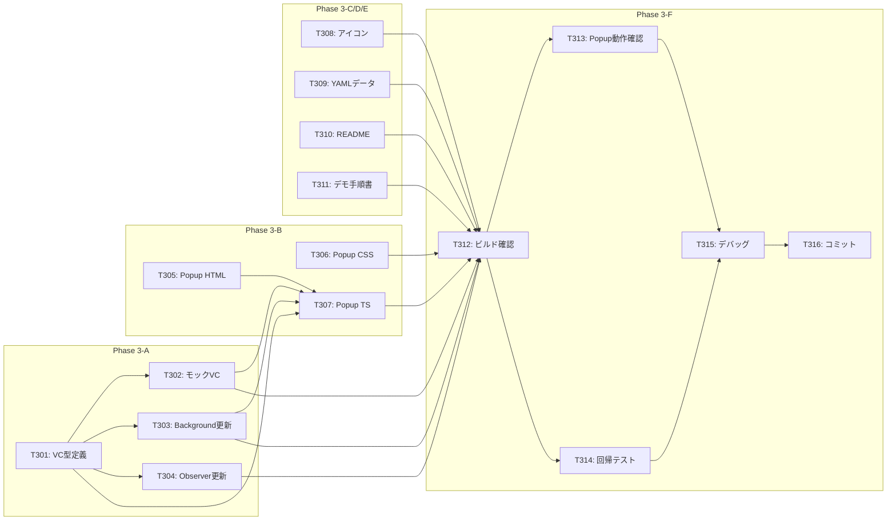

# タスクリスト - FakeAdAlertDemo Phase 3: 仕上げ

## 1. 概要

Phase 3の設計書に基づくタスク分解。ポップアップUIでDID/VC検証情報を表示し、share-verifierと統一された営業デモを完成させる。

### 前提条件
- Phase 0, 1, 2が完了していること

### 完了条件
- ポップアップUIでVC検証情報が表示される（ダークテーマ + グラスモーフィズム）
- share-verifierと同じ4カード構成（広告情報、検証ステータス、信頼チェーン、ブロックチェーン証明）
- アイコンが適切に表示される
- デモ用データ（モックVC情報付き）が調整済み
- README、デモ手順書が完成
- 営業デモ実施可能な状態

### 変更履歴
- 統計機能（旧T301-T303, T313）を削除
- VC検証情報表示機能に置き換え（T301-T303を新内容に差し替え）
- ダークテーマ + グラスモーフィズム採用
- share-verifierとの統一を要件に追加

---

## 2. タスク一覧

### Phase 3-A: VC情報基盤
- [x] T301: VC型定義（vc-types.ts）作成
- [x] T302: モックVC情報（vc-mock.ts）作成
- [x] T303: Background Script更新（検出情報保存）
- [x] T304: Observer更新（検出通知追加）

### Phase 3-B: ポップアップUI
- [x] T305: ポップアップHTML実装（ダークテーマ）
- [x] T306: ポップアップCSS実装（グラスモーフィズム）
- [x] T307: ポップアップTypeScript実装（VC情報表示）

### Phase 3-C: アイコン
- [x] T308: 拡張機能アイコン作成（16, 48, 128px）

### Phase 3-D: デモ用データ
- [x] T309: ad-verification.yml 調整（ホワイトリスト/ブラックリスト拡充）

### Phase 3-E: ドキュメント
- [x] T310: README.md 更新
- [x] T311: デモ手順書（docs/demo-guide.md）作成

### Phase 3-F: テスト・統合
- [x] T312: ビルド・型チェック
- [ ] T313: ポップアップ動作確認（認証済み/フェイク/未検出の3状態）※ブラウザで手動確認
- [ ] T314: Instagram/TikTok回帰テスト ※ブラウザで手動確認
- [ ] T315: デバッグ・調整
- [x] T316: コミット・プッシュ → PR #9 作成済み

---

## 3. タスク詳細

### T301: VC型定義（vc-types.ts）作成
- **要件ID**: REQ-P3-003
- **設計書参照**: design.md §3.1
- **依存関係**: なし
- **対象ファイル**: src/lib/vc-types.ts（新規）
- **完了条件**:
  - [ ] AdvertiserInfo インターフェース定義
  - [ ] VerificationStatus インターフェース定義（5項目）
  - [ ] TrustChainEntity, TrustChain インターフェース定義
  - [ ] BlockchainProof インターフェース定義
  - [ ] VCInfo インターフェース定義
  - [ ] DetectedAdInfo インターフェース定義
  - [ ] share-verifierのlib/types.tsと構造一致
  - [ ] `pnpm typecheck` エラーなし
- **並列実行**: T308, T309と同時実行可能

---

### T302: モックVC情報（vc-mock.ts）作成
- **要件ID**: REQ-P3-003, REQ-P3-006
- **設計書参照**: design.md §3.2
- **依存関係**: T301
- **対象ファイル**: src/lib/vc-mock.ts（新規）
- **完了条件**:
  - [ ] 共通の信頼チェーン生成関数（消費者庁 → トラスト広告社 → 広告主）
  - [ ] 共通のブロックチェーン証明生成関数
  - [ ] 各ホワイトリスト企業のモックVC情報（トヨタ、ソニー、ユニクロ等）
  - [ ] getVCInfo 関数実装（広告主名からVC情報を取得）
  - [ ] share-verifierのdata/patterns.jsonと同等のデータ品質
  - [ ] `pnpm typecheck` エラーなし
- **並列実行**: T303, T304と同時実行可能（T301完了後）

---

### T303: Background Script更新（検出情報保存）
- **要件ID**: REQ-P3-003
- **設計書参照**: design.md §3.3
- **依存関係**: T301
- **対象ファイル**: src/background/index.ts
- **完了条件**:
  - [ ] vc-types.ts からDetectedAdInfo型インポート
  - [ ] AD_DETECTED メッセージハンドリング
  - [ ] chrome.storage.session に検出情報保存
  - [ ] onInstalled でストレージクリア
  - [ ] `pnpm typecheck` エラーなし
- **並列実行**: T302, T304と同時実行可能（T301完了後）

---

### T304: Observer更新（検出通知追加）
- **要件ID**: REQ-P3-003
- **設計書参照**: design.md §3.4
- **依存関係**: T301
- **対象ファイル**: src/lib/observer.ts, src/lib/tiktok-observer.ts
- **完了条件**:
  - [ ] notifyBackground 関数実装
  - [ ] Instagram observer で検出時に通知送信
  - [ ] TikTok observer で検出時に通知送信
  - [ ] プロフィールページ検出時も通知
  - [ ] 動画ページ検出時も通知
  - [ ] `pnpm typecheck` エラーなし
- **並列実行**: T302, T303と同時実行可能（T301完了後）

---

### T305: ポップアップHTML実装（ダークテーマ）
- **要件ID**: REQ-P3-001, REQ-P3-002, REQ-P3-004
- **設計書参照**: design.md §3.5
- **依存関係**: なし
- **対象ファイル**: src/popup/index.html
- **完了条件**:
  - [ ] ヘッダー（ロゴ、タイトル、サブタイトル）
  - [ ] ステータスバッジ + 対応SNSタグ
  - [ ] VC検証情報コンテナ（id="vc-content"）
  - [ ] デモ説明フッター
  - [ ] index.ts, style.css の読み込み
- **並列実行**: T306と同時実行可能

---

### T306: ポップアップCSS実装（グラスモーフィズム）
- **要件ID**: REQ-P3-001, NFR-P3-001, NFR-P3-003
- **設計書参照**: design.md §3.7
- **依存関係**: なし
- **対象ファイル**: src/popup/style.css
- **完了条件**:
  - [ ] ダークテーマ背景（#0f0f23）
  - [ ] グラスモーフィズムカード（rgba(255,255,255,0.1)）
  - [ ] 展開可能カードのスタイル（展開/折りたたみアニメーション）
  - [ ] InfoRow（ラベル + 値）スタイル
  - [ ] 信頼チェーンの階層表示スタイル
  - [ ] 検証ステータスの✓/✗表示
  - [ ] コード値（DID/Hash）のmonospaceスタイル
  - [ ] 成功/危険のグラデーションヘッダー
  - [ ] share-verifierとカラースキーム統一
- **並列実行**: T305と同時実行可能

---

### T307: ポップアップTypeScript実装（VC情報表示）
- **要件ID**: REQ-P3-003
- **設計書参照**: design.md §3.6
- **依存関係**: T301, T302, T303, T305
- **対象ファイル**: src/popup/index.ts
- **完了条件**:
  - [ ] chrome.storage.session から検出情報読み取り
  - [ ] getVCInfo でモックVC情報取得
  - [ ] 展開可能カード生成関数
  - [ ] InfoRow生成関数
  - [ ] 認証済み広告UI（4カード表示）
  - [ ] フェイク広告UI（警告表示）
  - [ ] 未検出UI（案内メッセージ）
  - [ ] `pnpm typecheck` エラーなし
- **並列実行**: 不可（依存タスク完了後）

---

### T308: 拡張機能アイコン作成
- **要件ID**: REQ-P3-005
- **設計書参照**: design.md §4
- **依存関係**: なし
- **対象ファイル**: public/icons/icon16.png, icon48.png, icon128.png
- **完了条件**:
  - [ ] 16x16 PNG作成
  - [ ] 48x48 PNG作成
  - [ ] 128x128 PNG作成
  - [ ] シールド/チェックマークモチーフ
  - [ ] VeriCertsブルー（#0ea5e9）使用
  - [ ] プレースホルダーを差し替え
- **並列実行**: 全タスクと同時実行可能

---

### T309: ad-verification.yml 調整
- **要件ID**: REQ-P3-006, REQ-P3-007
- **設計書参照**: design.md §5
- **依存関係**: なし
- **対象ファイル**: config/ad-verification.yml
- **完了条件**:
  - [ ] 日本の大手企業をホワイトリストに追加（楽天、ソフトバンク等）
  - [ ] グローバル企業をホワイトリストに追加（Adidas、Coca-Cola等）
  - [ ] 投資詐欺/なりすまし/情報商材/誇大広告/緊急パターンをブラックリストに追加
  - [ ] YAML構文エラーなし
- **並列実行**: 全タスクと同時実行可能

---

### T310: README.md 更新
- **要件ID**: REQ-P3-008
- **依存関係**: なし
- **対象ファイル**: README.md
- **完了条件**:
  - [ ] Phase 1, 2完了を反映（ロードマップ更新）
  - [ ] 対応SNS一覧更新（Instagram ✓, TikTok ✓）
  - [ ] ポップアップUIの説明追加
  - [ ] デモ実施ガイドへのリンク
- **並列実行**: 全タスクと同時実行可能

---

### T311: デモ手順書作成
- **要件ID**: REQ-P3-009
- **依存関係**: なし
- **対象ファイル**: docs/demo-guide.md
- **完了条件**:
  - [ ] デモ準備手順
  - [ ] Chrome拡張のインストール手順
  - [ ] Instagram でのデモ手順
  - [ ] TikTok でのデモ手順
  - [ ] ポップアップの操作手順
  - [ ] トラブルシューティング
- **並列実行**: 全タスクと同時実行可能

---

### T312: ビルド・型チェック
- **依存関係**: T301〜T311
- **完了条件**:
  - [ ] `pnpm typecheck` エラーなし
  - [ ] `pnpm build` 正常完了
  - [ ] dist/ にポップアップファイル含まれる
  - [ ] dist/ にアイコンファイル含まれる
- **並列実行**: 不可（全実装完了後）

---

### T313: ポップアップ動作確認
- **依存関係**: T312
- **完了条件**:
  - [ ] Chrome拡張を再読み込み
  - [ ] ポップアップが表示される（ダークテーマ）
  - [ ] 未検出状態の表示確認
  - [ ] Instagram で認証済み広告検出 → ポップアップに4カード表示
  - [ ] TikTok でフェイク広告検出 → ポップアップに警告表示
  - [ ] 展開/折りたたみが動作する
  - [ ] 信頼チェーンの階層表示が正しい
- **並列実行**: T314と同時実行可能

---

### T314: Instagram/TikTok回帰テスト
- **依存関係**: T312
- **完了条件**:
  - [ ] Instagram で警告オーバーレイ表示確認
  - [ ] Instagram で認証バッジ表示確認
  - [ ] TikTok で警告オーバーレイ表示確認
  - [ ] TikTok で認証バッジ表示確認
  - [ ] Phase 2までの機能にデグレなし
- **並列実行**: T313と同時実行可能

---

### T315: デバッグ・調整
- **依存関係**: T313, T314
- **完了条件**:
  - [ ] ポップアップのUI調整（必要に応じて）
  - [ ] VC情報の表示調整（必要に応じて）
  - [ ] アイコンの調整（必要に応じて）
  - [ ] コンソールエラーなし
- **並列実行**: 不可

---

### T316: コミット・プッシュ
- **依存関係**: T315
- **完了条件**:
  - [ ] 全ファイルをステージング
  - [ ] コミットメッセージ（日本語）
  - [ ] GitHubにプッシュ
- **コミットメッセージ例**:
  ```
  feat: Phase 3完了 - 仕上げ（VC検証情報ポップアップ、アイコン、ドキュメント）

  - ポップアップUI実装（ダークテーマ + グラスモーフィズム）
  - VC検証情報表示（4カード: 広告情報、検証ステータス、信頼チェーン、ブロックチェーン証明）
  - share-verifierと統一されたUI/データ構造
  - 拡張機能アイコン作成
  - ad-verification.yml デモ用データ調整
  - README.md更新、デモ手順書作成
  ```

---

## 4. 依存関係図



---

## 5. 並列実行計画

| フェーズ | 並列実行可能タスク | 備考 |
|---------|-------------------|------|
| 1 | T301, T305, T306, T308, T309, T310, T311 | 独立タスク多数 |
| 2 | T302, T303, T304 | VC型定義完了後 |
| 3 | T307 | VC基盤 + HTML完了後 |
| 4 | T312 | 全実装完了後 |
| 5 | T313, T314 | ビルド完了後（並列可） |
| 6 | T315 | テスト完了後 |
| 7 | T316 | デバッグ完了後 |

---

## 6. 品質チェックリスト

- [x] すべてのタスクが要件IDと紐付いているか
- [x] share-verifierとの一貫性が考慮されているか
- [x] ドキュメント作成タスクが含まれているか
- [x] 回帰テストが含まれているか
- [x] デモ実施可能な状態になるか
- [x] 並列実行の機会が最大化されているか
