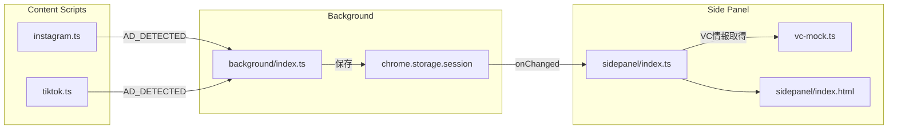
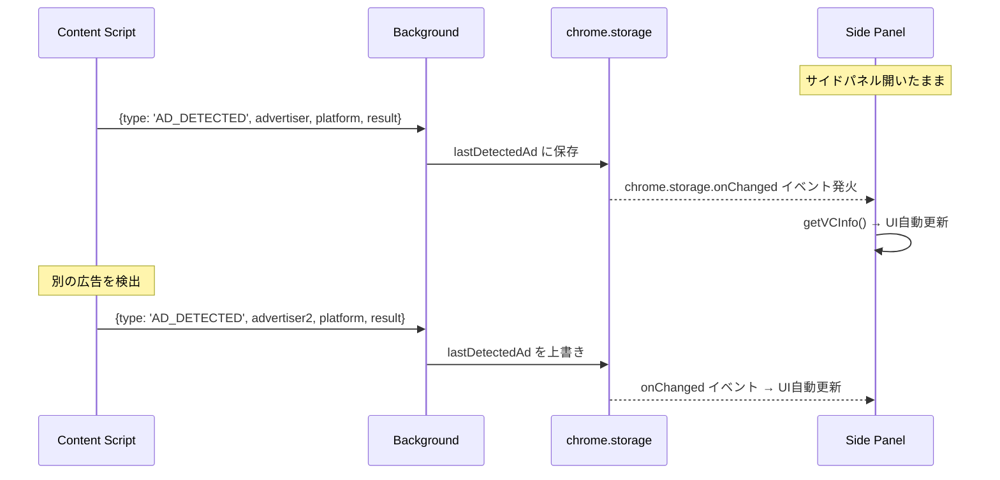

# 技術設計書 - FakeAdAlertDemo Phase 4: サイドパネル化

## 1. 要件トレーサビリティマトリックス

| 要件ID | 要件内容 | 設計項目 | 既存資産 | 変更理由 |
|--------|---------|---------|---------|---------|
| REQ-P4-001 | サイドパネル基本動作 | manifest.json, background/index.ts | 既存manifest, BG | Side Panel API対応 |
| REQ-P4-002 | サイドパネルUIレイアウト | sidepanel/index.html, style.css | popup/index.html, style.css | ファイル移行 |
| REQ-P4-003 | 検出情報のリアルタイム反映 | sidepanel/index.ts | popup/index.ts | onChanged監視追加 |
| REQ-P4-004 | 検出履歴の表示（直近1件） | sidepanel/index.ts | popup/index.ts | 同等機能を継承 |
| REQ-P4-005 | ポップアップからサイドパネルへの完全移行 | manifest.json, src/sidepanel/ | src/popup/ | ディレクトリ移行 |

---

## 2. アーキテクチャ概要

### 2.1 Phase 3 → Phase 4 の変更点

```
Phase 3:
  Content Script → Background → chrome.storage.session → Popup (手動で開く)

Phase 4:
  Content Script → Background → chrome.storage.session → Side Panel (常時表示・自動更新)
```

### 2.2 検出情報の流れ（Phase 4）



### 2.3 メッセージング（リアルタイム更新）



**Phase 3との違い:**
- ポップアップ: 開くたびに `chrome.storage.session.get()` で読み取り
- サイドパネル: `chrome.storage.onChanged` で常時監視 → リアルタイム自動更新

---

## 3. モジュール設計

### 3.1 manifest.json 変更

> 📌 要件: REQ-P4-001, REQ-P4-005

```json
{
  "manifest_version": 3,
  "name": "FakeAdAlertDemo",
  "version": "0.4.0",
  "permissions": [
    "activeTab",
    "storage",
    "sidePanel"
  ],
  "side_panel": {
    "default_path": "src/sidepanel/index.html"
  },
  "action": {
    "default_icon": {
      "16": "icons/icon16.png",
      "48": "icons/icon48.png",
      "128": "icons/icon128.png"
    }
  }
}
```

**変更点:**
- `permissions` に `"sidePanel"` を追加
- `side_panel.default_path` を追加（サイドパネルのHTMLパス）
- `action.default_popup` を **削除**（ポップアップ廃止）
- `action.default_icon` はそのまま維持

### 3.2 Background Script 変更（src/background/index.ts）

> 📌 要件: REQ-P4-001

```typescript
/**
 * Background Script (Service Worker)
 * Phase 4: サイドパネル対応
 */

import type { DetectedAdInfo } from '../lib/vc-types';

export {};

const SCRIPT_NAME = '[FakeAdAlertDemo]';
const STORAGE_KEY = 'lastDetectedAd';

// 拡張機能インストール時の処理
chrome.runtime.onInstalled.addListener((details) => {
  console.log(`${SCRIPT_NAME} Extension installed:`, details.reason);
  chrome.storage.session.remove(STORAGE_KEY);
});

// ★ Phase 4追加: ツールバーアイコンクリックでサイドパネルを開く
chrome.sidePanel.setPanelBehavior({ openPanelOnActionClick: true });

// Content Scriptからのメッセージを受信
chrome.runtime.onMessage.addListener((message, sender, sendResponse) => {
  // ... 既存のAD_DETECTED処理（変更なし）
});
```

**追加行（1行のみ）:**
```typescript
chrome.sidePanel.setPanelBehavior({ openPanelOnActionClick: true });
```
これにより、ツールバーアイコンクリック時にサイドパネルが開く。

### 3.3 サイドパネルHTML（src/sidepanel/index.html）

> 📌 要件: REQ-P4-002

Phase 3の `src/popup/index.html` をベースに移行。変更点は最小限。

```html
<!DOCTYPE html>
<html lang="ja">
<head>
  <meta charset="UTF-8">
  <meta name="viewport" content="width=device-width, initial-scale=1.0">
  <title>FakeAdAlertDemo</title>
  <link rel="stylesheet" href="style.css">
</head>
<body>
  <div class="panel-container">
    <!-- ヘッダー -->
    <header class="panel-header">
      
      <div>
        <h1 class="panel-title">FakeAdAlertDemo</h1>
        <p class="panel-subtitle">VC Ad Verifier</p>
      </div>
    </header>

    <!-- ステータス -->
    <section class="panel-section">
      <div class="status-badge status-active">
        <span class="status-icon">&#x2705;</span>
        <span>拡張機能は有効</span>
      </div>
      <div class="sns-row">
        <span class="sns-tag sns-active">&#x1F4F8; Instagram &#x2713;</span>
        <span class="sns-tag sns-active">&#x1F3B5; TikTok &#x2713;</span>
      </div>
    </section>

    <!-- VC検証情報エリア -->
    <section id="vc-content" class="panel-section">
      <!-- JSで動的に生成 -->
    </section>

    <!-- フッター -->
    <footer class="panel-footer">
      <p class="demo-notice">
        &#x26A0;&#xFE0F; これはデモ用アプリです
      </p>
    </footer>
  </div>

  <script type="module" src="index.ts"></script>
</body>
</html>
```

**変更点:**
- CSSクラス名を `popup-*` → `panel-*` にリネーム（任意、内部一貫性のため）
- `width: 360px` 固定をCSS側で解除（サイドパネルはリサイズ可能）
- HTML構造はPhase 3と同一

### 3.4 サイドパネルCSS（src/sidepanel/style.css）

> 📌 要件: REQ-P4-002, NFR-P4-003

Phase 3の `src/popup/style.css` をベースに移行。

**変更点:**
- `.popup-container { width: 360px; }` → `.panel-container { width: 100%; min-width: 280px; }` に変更
- CSSクラス名を `popup-*` → `panel-*` に一括リネーム
- その他のスタイル（ダークテーマ、グラスモーフィズム、カード等）は全て継承

### 3.5 サイドパネルTypeScript（src/sidepanel/index.ts）

> 📌 要件: REQ-P4-003, REQ-P4-004

Phase 3の `src/popup/index.ts` をベースに、**リアルタイム更新機能**を追加。

```typescript
/**
 * Side Panel Script - FakeAdAlertDemo
 * Phase 4: リアルタイム更新対応
 */

import type { DetectedAdInfo, VCInfo } from '../lib/vc-types';
import { getVCInfo } from '../lib/vc-mock';

const STORAGE_KEY = 'lastDetectedAd';

// --- UI生成関数群（Phase 3から移行、変更なし） ---
// createExpandableCard, createInfoRow, platformLabel,
// renderVerifiedAd, renderFakeAd, renderNoDetection,
// setupCardListeners

/**
 * メインUI更新
 */
const updateUI = async (): Promise<void> => {
  const result = await chrome.storage.session.get(STORAGE_KEY);
  const detected = result[STORAGE_KEY] as DetectedAdInfo | undefined;
  const container = document.getElementById('vc-content');
  if (!container) return;

  if (!detected) {
    container.innerHTML = renderNoDetection();
    return;
  }

  if (detected.result === 'verified') {
    const vcInfo = getVCInfo(detected.advertiserName);
    if (vcInfo) {
      container.innerHTML = renderVerifiedAd(detected, vcInfo);
      setupCardListeners();
      return;
    }
  }

  if (detected.result === 'fake') {
    container.innerHTML = renderFakeAd(detected);
    return;
  }

  container.innerHTML = renderNoDetection();
};

/**
 * ★ Phase 4追加: chrome.storage.onChanged でリアルタイム更新
 */
chrome.storage.onChanged.addListener((changes, areaName) => {
  if (areaName === 'session' && changes[STORAGE_KEY]) {
    console.log('[FakeAdAlertDemo] Storage changed, updating UI...');
    updateUI();
  }
});

// 初期化（サイドパネルが開いた時点でのUI更新）
document.addEventListener('DOMContentLoaded', updateUI);
```

**Phase 3からの追加コード（実質的な変更）:**
```typescript
chrome.storage.onChanged.addListener((changes, areaName) => {
  if (areaName === 'session' && changes[STORAGE_KEY]) {
    updateUI();
  }
});
```

これだけで、Content Scriptが広告を検出するたびにサイドパネルが自動更新される。

---

## 4. Vite ビルド設定変更

> 📌 要件: REQ-P4-005

```typescript
// vite.config.ts の変更部分
export default defineConfig({
  build: {
    rollupOptions: {
      input: {
        sidepanel: resolve(__dirname, 'src/sidepanel/index.html'),  // popup → sidepanel
        background: resolve(__dirname, 'src/background/index.ts'),
        instagram: resolve(__dirname, 'src/content/instagram.ts'),
        tiktok: resolve(__dirname, 'src/content/tiktok.ts'),
      },
    },
  },
});
```

**変更点:**
- `popup` エントリを `sidepanel` エントリに差し替え

---

## 5. ディレクトリ構成（Phase 4変更分）

```
fake-ad-alert-demo/
├── src/
│   ├── sidepanel/              # 新規（popup/から移行）
│   │   ├── index.html          # popup/index.html ベース
│   │   ├── index.ts            # popup/index.ts + onChanged追加
│   │   └── style.css           # popup/style.css ベース（幅可変化）
│   ├── popup/                  # 削除
│   │   ├── index.html          # → sidepanel/に移行
│   │   ├── index.ts            # → sidepanel/に移行
│   │   └── style.css           # → sidepanel/に移行
│   ├── background/
│   │   └── index.ts            # 更新（setPanelBehavior追加）
│   ├── lib/
│   │   ├── vc-types.ts         # 変更なし
│   │   └── vc-mock.ts          # 変更なし
│   ├── content/                # 変更なし
│   └── components/             # 変更なし
├── manifest.json               # 更新（sidePanel追加、popup削除）
└── vite.config.ts              # 更新（エントリポイント変更）
```

---

## 6. Chrome Side Panel API 仕様メモ

### 6.1 API概要

- **chrome.sidePanel.setPanelBehavior()**: ツールバーアイコンクリック時の動作を設定
- **chrome.sidePanel.open()**: プログラム的にサイドパネルを開く（今回は不使用）
- **chrome.sidePanel.setOptions()**: タブごとのパネル切り替え（今回は不使用）

### 6.2 要件

| 項目 | 値 |
|------|-----|
| 最小Chrome | 114 |
| Manifest | V3必須 |
| Permission | `"sidePanel"` |
| パネルHTML | `side_panel.default_path` で指定 |

### 6.3 サイドパネルの特性

| 特性 | 詳細 |
|------|------|
| 表示位置 | ブラウザ右側固定 |
| 幅 | ユーザーがドラッグでリサイズ可能（Chrome標準） |
| ページ遷移 | パネルは開いたまま（ポップアップとの最大の違い） |
| タブ切替 | パネルは開いたまま |
| ライフサイクル | 開いている間はDOMが維持される |

---

## 7. 技術的決定事項

| 決定項目 | 選択 | 理由 |
|---------|------|------|
| リアルタイム更新方式 | chrome.storage.onChanged | シンプル、既存のstorage.session利用で追加API不要 |
| CSSクラス名 | popup-* → panel-* | 内部一貫性のため。任意だがわかりやすい |
| サイドパネル幅 | width: 100% | Chrome側でリサイズ可能なのでCSSでの固定幅は不要 |
| ポップアップ廃止 | 完全移行 | 並行運用は不要（デモ用のため） |
| setPanelBehavior | openPanelOnActionClick: true | アイコンクリック → サイドパネル開閉が最も直感的 |
| メッセージング | 変更なし | Content Script → Background → storage の既存フローを維持 |

---

## 8. 影響範囲分析

### 8.1 変更ファイル

| ファイル | 変更内容 | リスク |
|---------|---------|-------|
| manifest.json | sidePanel追加、popup削除 | 低（明確な変更） |
| src/background/index.ts | setPanelBehavior 1行追加 | 低 |
| vite.config.ts | エントリポイント差し替え | 低 |

### 8.2 新規ファイル

| ファイル | 元ファイル | 変更量 |
|---------|-----------|--------|
| src/sidepanel/index.html | src/popup/index.html | クラス名リネームのみ |
| src/sidepanel/style.css | src/popup/style.css | 幅指定変更 + クラス名リネーム |
| src/sidepanel/index.ts | src/popup/index.ts | onChanged リスナー追加（5行） |

### 8.3 削除ファイル

| ファイル | 理由 |
|---------|------|
| src/popup/index.html | sidepanelに移行 |
| src/popup/index.ts | sidepanelに移行 |
| src/popup/style.css | sidepanelに移行 |

### 8.4 影響なし

- src/content/ （Content Scripts全般 - 変更不要）
- src/components/ （UIコンポーネント全般 - 変更不要）
- src/lib/ （vc-types.ts, vc-mock.ts, detector.ts, verifier.ts等 - 変更不要）
- config/ （ad-verification.yml - 変更不要）
- public/ （アイコン - 変更不要）
