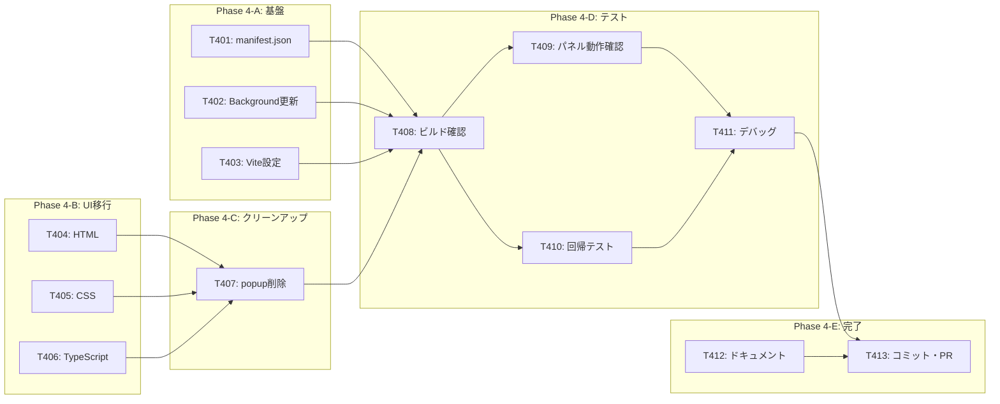

# タスクリスト - FakeAdAlertDemo Phase 4: サイドパネル化

## 1. 概要

Phase 4の設計書に基づくタスク分解。ポップアップUIをChrome Side Panelに移行し、リアルタイム更新機能を追加する。

### 前提条件
- Phase 0〜3が完了していること
- Chrome 114以上

### 完了条件
- ツールバーアイコンクリックでサイドパネルが開く
- サイドパネルがページ遷移しても開いたままになる
- 広告検出時にサイドパネルの表示がリアルタイムに更新される
- Phase 3のポップアップと同等の情報（4カード構成）が表示される
- Instagram/TikTok での既存バッジ・オーバーレイ機能にデグレなし

---

## 2. タスク一覧

### Phase 4-A: サイドパネル基盤
- [x] T401: manifest.json 更新（sidePanel権限追加、popup削除）
- [x] T402: Background Script 更新（setPanelBehavior追加）
- [x] T403: Vite ビルド設定更新（@crxjs/vite-pluginがmanifest.jsonから自動検出するため変更不要）

### Phase 4-B: サイドパネルUI移行
- [x] T404: サイドパネルHTML作成（popup/index.htmlから移行）
- [x] T405: サイドパネルCSS作成（popup/style.cssから移行、幅可変化）
- [x] T406: サイドパネルTypeScript作成（popup/index.tsから移行 + onChanged追加）

### Phase 4-C: クリーンアップ
- [x] T407: ポップアップファイル削除（src/popup/）

### Phase 4-D: ビルド・テスト
- [x] T408: ビルド・型チェック
- [ ] T409: サイドパネル動作確認（開閉、表示、リアルタイム更新）※ブラウザで手動確認
- [ ] T410: Instagram/TikTok 回帰テスト ※ブラウザで手動確認
- [ ] T411: デバッグ・調整

### Phase 4-E: 完了
- [x] T412: ドキュメント更新（README、デモ手順書）
- [ ] T413: コミット・プッシュ・PR作成

---

## 3. タスク詳細

### T401: manifest.json 更新
- **要件ID**: REQ-P4-001, REQ-P4-005
- **設計書参照**: design.md §3.1
- **依存関係**: なし
- **対象ファイル**: manifest.json
- **完了条件**:
  - [ ] `permissions` に `"sidePanel"` を追加
  - [ ] `side_panel.default_path` を `"src/sidepanel/index.html"` に設定
  - [ ] `action.default_popup` を削除
  - [ ] `version` を `"0.4.0"` に更新
  - [ ] `action.default_icon` は維持
- **並列実行**: T402, T403, T404, T405と同時実行可能

---

### T402: Background Script 更新
- **要件ID**: REQ-P4-001
- **設計書参照**: design.md §3.2
- **依存関係**: なし
- **対象ファイル**: src/background/index.ts
- **完了条件**:
  - [ ] `chrome.sidePanel.setPanelBehavior({ openPanelOnActionClick: true })` を追加
  - [ ] 既存のAD_DETECTED処理は変更なし
  - [ ] `pnpm typecheck` エラーなし
- **並列実行**: T401, T403, T404, T405と同時実行可能

---

### T403: Vite ビルド設定更新
- **要件ID**: REQ-P4-005
- **設計書参照**: design.md §4
- **依存関係**: なし
- **対象ファイル**: vite.config.ts
- **完了条件**:
  - [ ] `popup` エントリを `sidepanel` エントリに差し替え
  - [ ] パスを `src/sidepanel/index.html` に更新
  - [ ] `pnpm build` で正常にビルドされる
- **並列実行**: T401, T402, T404, T405と同時実行可能

---

### T404: サイドパネルHTML作成
- **要件ID**: REQ-P4-002
- **設計書参照**: design.md §3.3
- **依存関係**: なし
- **対象ファイル**: src/sidepanel/index.html（新規）
- **元ファイル**: src/popup/index.html
- **完了条件**:
  - [ ] popup/index.html をベースに作成
  - [ ] CSSクラス名を `popup-*` → `panel-*` にリネーム
  - [ ] ヘッダー、ステータス、VC検証情報エリア、フッターの構造を維持
  - [ ] style.css, index.ts の読み込みパスが正しい
- **並列実行**: T401, T402, T403, T405と同時実行可能

---

### T405: サイドパネルCSS作成
- **要件ID**: REQ-P4-002, NFR-P4-003
- **設計書参照**: design.md §3.4
- **依存関係**: なし
- **対象ファイル**: src/sidepanel/style.css（新規）
- **元ファイル**: src/popup/style.css
- **完了条件**:
  - [ ] popup/style.css をベースに作成
  - [ ] `.popup-container { width: 360px; }` → `.panel-container { width: 100%; min-width: 280px; }` に変更
  - [ ] CSSクラス名を `popup-*` → `panel-*` に一括リネーム
  - [ ] ダークテーマ + グラスモーフィズムの全スタイルを維持
  - [ ] 展開可能カード、信頼チェーン、コード値等のスタイルを維持
- **並列実行**: T401, T402, T403, T404と同時実行可能

---

### T406: サイドパネルTypeScript作成
- **要件ID**: REQ-P4-003, REQ-P4-004
- **設計書参照**: design.md §3.5
- **依存関係**: T404（HTML構造確定後）
- **対象ファイル**: src/sidepanel/index.ts（新規）
- **元ファイル**: src/popup/index.ts
- **完了条件**:
  - [ ] popup/index.ts をベースに作成
  - [ ] `chrome.storage.onChanged` リスナーを追加（リアルタイム更新）
  - [ ] `areaName === 'session'` かつ `changes[STORAGE_KEY]` で条件フィルタ
  - [ ] UI生成関数群（createExpandableCard, renderVerifiedAd等）を維持
  - [ ] DOMContentLoaded での初期表示を維持
  - [ ] `pnpm typecheck` エラーなし
- **並列実行**: T401, T402, T403と同時実行可能（実質的にはT404との依存なし）

---

### T407: ポップアップファイル削除
- **要件ID**: REQ-P4-005
- **依存関係**: T404, T405, T406（サイドパネルファイル作成完了後）
- **対象ファイル**: src/popup/（ディレクトリごと削除）
- **完了条件**:
  - [ ] src/popup/index.html を削除
  - [ ] src/popup/index.ts を削除
  - [ ] src/popup/style.css を削除
  - [ ] src/popup/ ディレクトリを削除
- **並列実行**: 不可（サイドパネルファイル作成完了後）

---

### T408: ビルド・型チェック
- **依存関係**: T401〜T407
- **完了条件**:
  - [ ] `pnpm typecheck` エラーなし
  - [ ] `pnpm build` 正常完了
  - [ ] dist/ にサイドパネルファイルが含まれる
  - [ ] dist/ にポップアップファイルが含まれない
  - [ ] dist/ にContent Scripts, Background, アイコンが含まれる
- **並列実行**: 不可（全実装完了後）

---

### T409: サイドパネル動作確認
- **依存関係**: T408
- **完了条件**:
  - [ ] Chrome拡張を再読み込み
  - [ ] ツールバーアイコンクリックでサイドパネルが開く
  - [ ] サイドパネルがブラウザ右側に固定表示される
  - [ ] ダークテーマ + グラスモーフィズムが正しく表示される
  - [ ] 未検出状態の表示確認
  - [ ] Instagram で認証済み広告検出 → サイドパネルにリアルタイム反映
  - [ ] 4カード展開/折りたたみが動作する
  - [ ] ページ遷移してもサイドパネルが閉じない
  - [ ] タブ切り替えてもサイドパネルが閉じない
  - [ ] 新しい広告検出時にサイドパネルが自動更新される
- **並列実行**: T410と同時実行可能

---

### T410: Instagram/TikTok 回帰テスト
- **依存関係**: T408
- **完了条件**:
  - [ ] Instagram で警告オーバーレイ表示確認
  - [ ] Instagram で認証バッジ表示確認
  - [ ] TikTok で警告オーバーレイ表示確認
  - [ ] TikTok で認証バッジ表示確認
  - [ ] Phase 3までの機能にデグレなし
- **並列実行**: T409と同時実行可能

---

### T411: デバッグ・調整
- **依存関係**: T409, T410
- **完了条件**:
  - [ ] サイドパネルのUI調整（必要に応じて）
  - [ ] リアルタイム更新の動作調整（必要に応じて）
  - [ ] コンソールエラーなし
- **並列実行**: 不可

---

### T412: ドキュメント更新
- **依存関係**: なし（並列で事前作業可能）
- **対象ファイル**: README.md, docs/demo-guide.md
- **完了条件**:
  - [ ] README.md のロードマップにPhase 4完了を反映
  - [ ] docs/demo-guide.md のポップアップ手順をサイドパネル手順に更新
  - [ ] サイドパネルの説明（常時表示、リアルタイム更新）を追加
- **並列実行**: 他のタスクと同時実行可能

---

### T413: コミット・プッシュ・PR作成
- **依存関係**: T408〜T412
- **完了条件**:
  - [ ] 全ファイルをステージング
  - [ ] コミットメッセージ（日本語）
  - [ ] GitHubにプッシュ
  - [ ] PR作成（developまたはmainへ）
- **コミットメッセージ例**:
  ```
  feat: Phase 4完了 - サイドパネル化（リアルタイム更新対応）

  - ポップアップUIをChrome Side Panelに移行
  - chrome.storage.onChanged によるリアルタイム自動更新
  - ページ遷移・タブ切替でもパネルが閉じない
  - ダークテーマ + グラスモーフィズムデザイン継承
  - ポップアップファイル（src/popup/）を削除
  - manifest.json にsidePanel権限追加
  ```

---

## 4. 依存関係図



---

## 5. 並列実行計画

| フェーズ | 並列実行可能タスク | 備考 |
|---------|-------------------|------|
| 1 | T401, T402, T403, T404, T405, T406, T412 | ほぼ全タスクが独立 |
| 2 | T407 | サイドパネルファイル作成完了後 |
| 3 | T408 | 全実装完了後 |
| 4 | T409, T410 | ビルド完了後（並列可） |
| 5 | T411 | テスト完了後 |
| 6 | T413 | 全タスク完了後 |

**見積もり**: Phase 3と比較して、変更量は極めて小さい。実質的な新規コードは `chrome.storage.onChanged` リスナー（5行）と `chrome.sidePanel.setPanelBehavior`（1行）のみ。残りはファイル移行とリネーム。

---

## 6. 品質チェックリスト

- [x] すべてのタスクが要件IDと紐付いているか
- [x] Phase 3の機能が全て維持されるか
- [x] リアルタイム更新のテスト項目が含まれているか
- [x] 回帰テストが含まれているか
- [x] ポップアップ削除のクリーンアップが含まれているか
- [x] デモ手順書の更新が含まれているか
- [x] 並列実行の機会が最大化されているか
