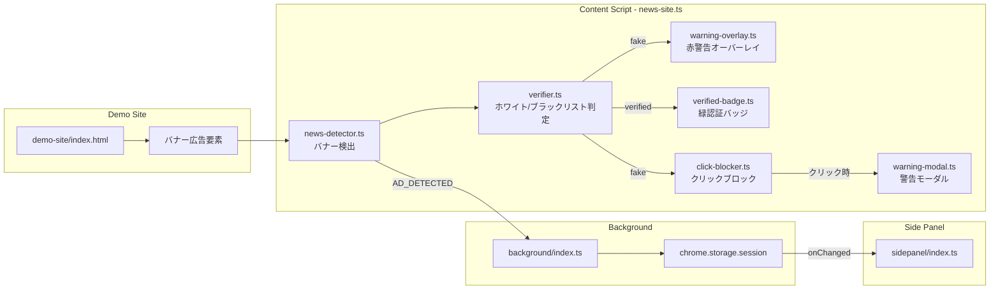
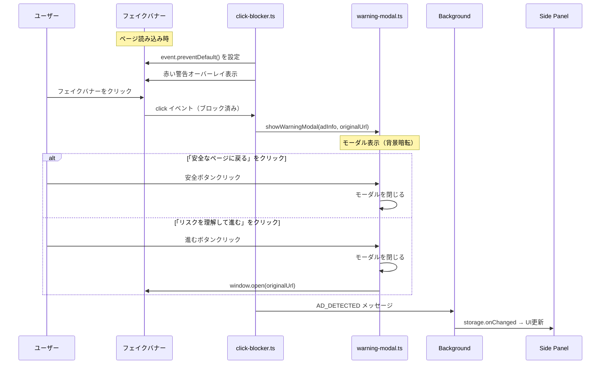

# 技術設計書 - FakeAdAlertDemo Phase 5: デモ用フェイクニュースサイト

## 1. 要件トレーサビリティマトリックス

| 要件ID | 要件内容 | 設計項目 | 既存資産 | 変更理由 |
|--------|---------|---------|---------|---------|
| REQ-P5-001 | デモページ基本構成 | demo-site/index.html, demo-site/style.css | なし（新規） | デモシナリオ追加 |
| REQ-P5-002 | バナー広告配置 | demo-site/index.html 内のバナーHTML | config/ad-verification.yml | 既存リストと連動 |
| REQ-P5-003 | デモサイト用Content Script | src/content/news-site.ts, src/lib/news-detector.ts | verifier.ts, types.ts | 新プラットフォーム対応 |
| REQ-P5-004 | クリックブロック | src/components/click-blocker.ts | なし（新規機能） | SNSデモとの差別化 |
| REQ-P5-005 | カスタム警告モーダル | src/components/warning-modal.ts, src/content/news-site.css | sidepanel/style.css（デザイン参照） | ダークテーマ統一 |
| REQ-P5-006 | 認証済みバナーの緑バッジ | src/components/verified-badge.ts（拡張） | verified-badge.ts | news-site対応追加 |

---

## 2. アーキテクチャ概要

### 2.1 Phase 4 → Phase 5 の追加要素

```
Phase 4（既存）:
  Instagram/TikTok → Content Script → verifier → overlay/badge → Background → Side Panel

Phase 5（追加）:
  デモニュースサイト → Content Script → verifier → overlay/badge + クリックブロック → Background → Side Panel
                                                      ↓（フェイク広告クリック時）
                                                   警告モーダル表示
```

### 2.2 全体データフロー（Phase 5）



### 2.3 クリックブロックのシーケンス



---

## 3. モジュール設計

### 3.1 デモサイト（demo-site/）

> 📌 要件: REQ-P5-001, REQ-P5-002

#### 3.1.1 ディレクトリ構成

```
demo-site/
├── index.html          # ニュースメディア風1ページ
├── style.css           # デモサイトのスタイル
└── images/             # バナー広告画像（SVGまたはCSS生成）
    ├── banner-invest.svg     # 投資詐欺系バナー
    ├── banner-fake-sony.svg  # なりすまし系バナー
    ├── banner-info.svg       # 情報商材系バナー
    ├── banner-toyota.svg     # 認証済みバナー（トヨタ風）
    └── banner-sony.svg       # 認証済みバナー（ソニー風）
```

#### 3.1.2 HTMLのバナー広告構造

Content Scriptが検出できるよう、統一的なdata属性を付与する。

```html
<!-- フェイクバナー -->
<div class="ad-banner" data-ad-slot="sidebar-1" data-advertiser="月収100万投資塾">
  <a href="https://fake-invest-scam.example.com/" target="_blank" rel="noopener">
    
  </a>
  <span class="ad-label">広告</span>
</div>

<!-- 認証済みバナー -->
<div class="ad-banner" data-ad-slot="sidebar-2" data-advertiser="トヨタ自動車">
  <a href="https://toyota.jp/" target="_blank" rel="noopener">
    
  </a>
  <span class="ad-label">広告</span>
</div>
```

**検出のキーポイント:**
- `data-ad-slot`: Content Scriptがバナーを識別するセレクタ
- `data-advertiser`: 広告主名（verifierに渡す値）
- `<a>` タグ: クリックブロックの対象

#### 3.1.3 バナー広告一覧

| # | 位置 | タイプ | data-advertiser | 判定結果 | マッチパターン |
|---|------|--------|----------------|---------|--------------|
| 1 | サイドバー上 | 投資詐欺系 | `月収100万投資塾` | fake | `100万円` (blacklist) |
| 2 | サイドバー中 | 認証済み | `トヨタ自動車` | verified | `トヨタ` (whitelist) |
| 3 | サイドバー下 | なりすまし系 | `ソニー株式会社(公式)` | fake | 既存パターン非マッチ→unknown→警告表示 |
| 4 | 記事間横長 | 情報商材系 | `LINE無料講座で月収アップ` | fake | `LINE無料` or `月収` (blacklist) |
| 5 | サイドバー最下 | 認証済み | `ソニーグループ` | verified | `ソニー` (whitelist) |

**注意:** バナー3のなりすまし系は「ソニー株式会社(公式)」という微妙に異なる名前にする。ホワイトリストの「ソニー」パターンにマッチするため、`verifier.ts`のブラックリストに**なりすまし検出用パターン**を追加する。

#### 3.1.4 なりすまし対策のconfig更新

`config/ad-verification.yml` のブラックリストに追加:

```yaml
blacklist:
  # ... 既存エントリ ...
  - name: "なりすまし系"
    patterns:
      - "(公式)"      # 括弧付き公式はなりすましの特徴
      - "公式サイト限定"
      - "特別キャンペーン中"
```

**判定順序の重要性:** `verifier.ts`は**ホワイトリスト → ブラックリスト**の順で判定する。なりすまし系は「ソニー」を含むためホワイトリストにマッチしてしまう。

**対策案:** バナー3の`data-advertiser`を「ソニー」を含まない名前にするか、ブラックリストを先にチェックする特別ロジックを追加する。

→ **採用案:** `data-advertiser`を`"S0NY公式ストア"`（ゼロ混じりのなりすまし名）にする。これならホワイトリストの「ソニー」「sony」にマッチせず、ブラックリストの「公式」パターンで検出される。

### 3.2 ニュースサイト用Content Script（src/content/news-site.ts）

> 📌 要件: REQ-P5-003

```typescript
/**
 * Content Script - デモニュースサイト
 * Phase 5: バナー広告検出 + クリックブロック
 */

import { detectNewsBanners } from '../lib/news-detector';
import { verifyAdvertiser } from '../lib/verifier';
import { showWarningOverlay } from '../components/warning-overlay';
import { showVerifiedBadge } from '../components/verified-badge';
import { setupClickBlocker } from '../components/click-blocker';
import type { VerificationInfo } from '../lib/types';

const SCRIPT_NAME = '[FakeAdAlertDemo:NewsPage]';

/**
 * バナー広告を検出・判定・UI表示
 */
const processNewsBanners = (): void => {
  const banners = detectNewsBanners();
  console.log(`${SCRIPT_NAME} Detected ${banners.length} banners`);

  banners.forEach((banner) => {
    const verification = verifyAdvertiser(banner.advertiserName);
    console.log(`${SCRIPT_NAME} ${banner.advertiserName}: ${verification.result}`);

    if (verification.result === 'verified') {
      showVerifiedBadge(banner, 'news-site');
    } else {
      // fake または unknown → 警告表示 + クリックブロック
      showWarningOverlay(banner, verification, 'news-site');
      setupClickBlocker(banner, verification);
    }

    notifyBackground(banner.advertiserName, verification);
  });
};

/**
 * Background Scriptに通知
 */
const notifyBackground = (
  advertiserName: string,
  verification: VerificationInfo
): void => {
  chrome.runtime.sendMessage({
    type: 'AD_DETECTED',
    advertiserName,
    platform: 'news-site',
    result: verification.result,
    matchedPattern: verification.matchedPattern,
    listType: verification.listType,
  });
};

// 初期化
const init = (): void => {
  console.log(`${SCRIPT_NAME} Content script loaded`);
  processNewsBanners();
};

if (document.readyState === 'loading') {
  document.addEventListener('DOMContentLoaded', init);
} else {
  init();
}
```

### 3.3 ニュースバナー検出（src/lib/news-detector.ts）

> 📌 要件: REQ-P5-003

```typescript
/**
 * デモニュースサイトのバナー広告検出
 * Phase 5
 */

import type { AdInfo } from './types';

const PROCESSED_ATTR = 'data-fakead-processed';
const BANNER_SELECTOR = '.ad-banner[data-ad-slot]';

/**
 * ページ内の全バナー広告を検出
 */
export const detectNewsBanners = (): AdInfo[] => {
  const banners = document.querySelectorAll<HTMLElement>(BANNER_SELECTOR);
  const results: AdInfo[] = [];

  banners.forEach((banner) => {
    if (banner.getAttribute(PROCESSED_ATTR)) return;

    const advertiserName = banner.getAttribute('data-advertiser');
    if (!advertiserName) return;

    const imgElement = banner.querySelector<HTMLElement>('img');
    const linkElement = banner.querySelector<HTMLAnchorElement>('a');

    banner.setAttribute(PROCESSED_ATTR, 'true');

    results.push({
      element: banner,
      advertiserName,
      imageElement: imgElement ?? undefined,
      headerElement: linkElement ?? undefined,  // <a>タグをheaderElementとして利用
    });
  });

  return results;
};
```

### 3.4 クリックブロッカー（src/components/click-blocker.ts）

> 📌 要件: REQ-P5-004

```typescript
/**
 * クリックブロッカー - フェイクバナーのクリックを阻止
 * Phase 5
 */

import type { AdInfo, VerificationInfo } from '../lib/types';
import { showWarningModal } from './warning-modal';

/**
 * フェイクバナーにクリックブロックを設定
 */
export const setupClickBlocker = (
  ad: AdInfo,
  verification: VerificationInfo
): void => {
  // バナー内の<a>タグを取得
  const linkElement = ad.element.querySelector<HTMLAnchorElement>('a');
  if (!linkElement) return;

  const originalUrl = linkElement.href;

  // クリックイベントをキャプチャフェーズで阻止
  linkElement.addEventListener('click', (event: MouseEvent) => {
    event.preventDefault();
    event.stopPropagation();

    // 警告モーダルを表示
    showWarningModal({
      advertiserName: ad.advertiserName,
      matchedPattern: verification.matchedPattern,
      listType: verification.listType,
      originalUrl,
    });
  }, true);  // capture: true で最優先

  // pointer-events を維持（オーバーレイの上からでもクリック検知）
  linkElement.style.pointerEvents = 'auto';
  linkElement.style.cursor = 'pointer';
  linkElement.style.position = 'relative';
  linkElement.style.zIndex = '10';
};
```

### 3.5 警告モーダル（src/components/warning-modal.ts）

> 📌 要件: REQ-P5-005

```typescript
/**
 * 警告モーダル - フェイクバナークリック時の確認ダイアログ
 * Phase 5: ダークテーマ + グラスモーフィズム
 */

interface WarningModalOptions {
  advertiserName: string;
  matchedPattern?: string;
  listType?: string;
  originalUrl: string;
}

const MODAL_CLASS = 'fakead-warning-modal';

/**
 * 警告モーダルを表示
 */
export const showWarningModal = (options: WarningModalOptions): void => {
  // 既存モーダルがあれば削除
  const existing = document.querySelector(`.${MODAL_CLASS}-backdrop`);
  if (existing) existing.remove();

  const backdrop = document.createElement('div');
  backdrop.className = `${MODAL_CLASS}-backdrop`;

  const listTypeLabel = options.listType === 'blacklist'
    ? 'ブラックリスト'
    : '未認証';

  backdrop.innerHTML = `
    <div class="${MODAL_CLASS}">
      <div class="${MODAL_CLASS}__icon">⚠️</div>
      <h2 class="${MODAL_CLASS}__title">この広告はVC未認証です</h2>
      <p class="${MODAL_CLASS}__description">
        この広告にはVerifiable Credentialによる認証がありません。<br>
        詐欺サイトに誘導される可能性があります。
      </p>
      <div class="${MODAL_CLASS}__details">
        <div class="${MODAL_CLASS}__detail-row">
          <span class="${MODAL_CLASS}__detail-label">広告主</span>
          <span class="${MODAL_CLASS}__detail-value">${options.advertiserName}</span>
        </div>
        <div class="${MODAL_CLASS}__detail-row">
          <span class="${MODAL_CLASS}__detail-label">判定</span>
          <span class="${MODAL_CLASS}__detail-value">${listTypeLabel}</span>
        </div>
        ${options.matchedPattern ? `
        <div class="${MODAL_CLASS}__detail-row">
          <span class="${MODAL_CLASS}__detail-label">マッチパターン</span>
          <span class="${MODAL_CLASS}__detail-value">${options.matchedPattern}</span>
        </div>
        ` : ''}
      </div>
      <div class="${MODAL_CLASS}__actions">
        <button class="${MODAL_CLASS}__btn-safe" data-action="safe">
          🛡️ 安全なページに戻る
        </button>
        <button class="${MODAL_CLASS}__btn-proceed" data-action="proceed">
          リスクを理解して進む →
        </button>
      </div>
    </div>
  `;

  document.body.appendChild(backdrop);

  // ボタンイベント
  const safeBtn = backdrop.querySelector('[data-action="safe"]');
  const proceedBtn = backdrop.querySelector('[data-action="proceed"]');

  safeBtn?.addEventListener('click', () => {
    backdrop.remove();
  });

  proceedBtn?.addEventListener('click', () => {
    backdrop.remove();
    window.open(options.originalUrl, '_blank');
  });

  // 背景クリックでもモーダルを閉じる
  backdrop.addEventListener('click', (e) => {
    if (e.target === backdrop) {
      backdrop.remove();
    }
  });
};
```

### 3.6 警告モーダルCSS（src/content/news-site.css）

> 📌 要件: REQ-P5-005, NFR-P5-003

```css
/* ==================== 警告モーダル ==================== */
.fakead-warning-modal-backdrop {
  position: fixed;
  top: 0;
  left: 0;
  width: 100%;
  height: 100%;
  background: rgba(0, 0, 0, 0.7);
  display: flex;
  align-items: center;
  justify-content: center;
  z-index: 999999;
  animation: fadeIn 0.2s ease;
}

.fakead-warning-modal {
  background: rgba(15, 15, 35, 0.95);
  backdrop-filter: blur(20px);
  -webkit-backdrop-filter: blur(20px);
  border: 1px solid rgba(255, 255, 255, 0.15);
  border-radius: 16px;
  padding: 32px;
  max-width: 420px;
  width: 90%;
  text-align: center;
  color: #ffffff;
  font-family: -apple-system, BlinkMacSystemFont, 'Segoe UI', Roboto, sans-serif;
  box-shadow: 0 20px 60px rgba(0, 0, 0, 0.5);
}

.fakead-warning-modal__icon {
  font-size: 48px;
  margin-bottom: 12px;
}

.fakead-warning-modal__title {
  font-size: 20px;
  font-weight: 700;
  margin-bottom: 12px;
  color: #f87171;
}

.fakead-warning-modal__description {
  font-size: 14px;
  line-height: 1.6;
  color: rgba(255, 255, 255, 0.7);
  margin-bottom: 20px;
}

.fakead-warning-modal__details {
  background: rgba(255, 255, 255, 0.05);
  border-radius: 10px;
  padding: 12px 16px;
  margin-bottom: 24px;
  text-align: left;
}

.fakead-warning-modal__detail-row {
  display: flex;
  justify-content: space-between;
  padding: 6px 0;
  font-size: 13px;
  border-bottom: 1px solid rgba(255, 255, 255, 0.05);
}

.fakead-warning-modal__detail-row:last-child {
  border-bottom: none;
}

.fakead-warning-modal__detail-label {
  color: rgba(255, 255, 255, 0.5);
}

.fakead-warning-modal__detail-value {
  color: rgba(255, 255, 255, 0.9);
  font-weight: 500;
}

.fakead-warning-modal__actions {
  display: flex;
  flex-direction: column;
  gap: 10px;
}

.fakead-warning-modal__btn-safe {
  width: 100%;
  padding: 12px 24px;
  border: none;
  border-radius: 10px;
  font-size: 15px;
  font-weight: 600;
  cursor: pointer;
  background: linear-gradient(135deg, #10b981, #059669);
  color: #ffffff;
  transition: opacity 0.15s ease;
}

.fakead-warning-modal__btn-safe:hover {
  opacity: 0.9;
}

.fakead-warning-modal__btn-proceed {
  width: 100%;
  padding: 10px 24px;
  border: 1px solid rgba(255, 255, 255, 0.15);
  border-radius: 10px;
  font-size: 13px;
  font-weight: 400;
  cursor: pointer;
  background: rgba(255, 255, 255, 0.05);
  color: rgba(255, 255, 255, 0.5);
  transition: all 0.15s ease;
}

.fakead-warning-modal__btn-proceed:hover {
  background: rgba(255, 255, 255, 0.1);
  color: rgba(255, 255, 255, 0.7);
}

/* ==================== バナー警告オーバーレイ（ニュースサイト用） ==================== */
.fakead-warning-overlay--news-site {
  position: absolute;
  top: 0;
  left: 0;
  width: 100%;
  height: 100%;
  background: rgba(239, 68, 68, 0.3);
  display: flex;
  align-items: center;
  justify-content: center;
  border: 2px solid rgba(239, 68, 68, 0.6);
  border-radius: 4px;
  z-index: 5;
  pointer-events: none;  /* クリックはリンク要素で受ける */
}

/* ==================== 認証バッジ（ニュースサイト用） ==================== */
.fakead-verified-badge--news-site {
  position: absolute;
  top: 6px;
  left: 6px;
  display: inline-flex;
  align-items: center;
  gap: 4px;
  padding: 4px 10px;
  background: rgba(16, 185, 129, 0.9);
  color: #ffffff;
  font-size: 12px;
  font-weight: 600;
  border-radius: 4px;
  z-index: 5;
  pointer-events: none;
}

@keyframes fadeIn {
  from { opacity: 0; }
  to { opacity: 1; }
}
```

### 3.7 manifest.json 変更

> 📌 要件: CON-P5-002

```json
{
  "version": "0.5.0",
  "content_scripts": [
    {
      "matches": ["https://www.instagram.com/*"],
      "js": ["src/content/instagram.ts"],
      "run_at": "document_idle"
    },
    {
      "matches": ["https://www.tiktok.com/*"],
      "js": ["src/content/tiktok.ts"],
      "run_at": "document_idle"
    },
    {
      "matches": [
        "http://localhost:*/*",
        "https://*.netlify.app/*"
      ],
      "js": ["src/content/news-site.ts"],
      "css": ["src/content/news-site.css"],
      "run_at": "document_idle"
    }
  ],
  "host_permissions": [
    "https://www.instagram.com/*",
    "https://www.tiktok.com/*",
    "https://www.youtube.com/*",
    "http://localhost:*/*",
    "https://*.netlify.app/*"
  ]
}
```

**変更点:**
- `version` を `"0.5.0"` に更新
- `content_scripts` にニュースサイト用エントリを追加
- `host_permissions` に `localhost`, `netlify.app`, `vercel.app` を追加
- CSSファイルも `content_scripts.css` で注入

### 3.8 Platform型の拡張（src/lib/types.ts）

> 📌 要件: REQ-P5-003

```typescript
// 変更前
export type Platform = 'instagram' | 'tiktok';

// 変更後
export type Platform = 'instagram' | 'tiktok' | 'news-site';
```

### 3.9 DetectedAdInfo型の拡張（src/lib/vc-types.ts）

```typescript
// 変更前
export interface DetectedAdInfo {
  advertiserName: string;
  platform: 'instagram' | 'tiktok';
  // ...
}

// 変更後
export interface DetectedAdInfo {
  advertiserName: string;
  platform: 'instagram' | 'tiktok' | 'news-site';
  // ...
}
```

### 3.10 サイドパネルUI更新（src/sidepanel/index.ts）

> 📌 要件: REQ-P5-006（サイドパネル反映）

```typescript
// platformLabel関数の拡張
const platformLabel = (platform: string): string => {
  switch (platform) {
    case 'instagram': return 'Instagram';
    case 'tiktok': return 'TikTok';
    case 'news-site': return 'ニュースサイト';
    default: return platform;
  }
};
```

`index.html` のSNSタグにニュースサイト表示を追加:

```html
<div class="sns-row">
  <span class="sns-tag sns-active">📸 Instagram ✓</span>
  <span class="sns-tag sns-active">🎵 TikTok ✓</span>
  <span class="sns-tag sns-active">📰 News ✓</span>
</div>
```

### 3.11 verified-badge.ts の拡張

`showVerifiedBadge` にnews-site対応を追加:

```typescript
export const showVerifiedBadge = (
  ad: AdInfo,
  platform: Platform = 'instagram'
): void => {
  // ... 既存のバッジ生成コード ...

  if (platform === 'news-site') {
    insertBadgeForNewsSite(ad, badge);
  } else if (platform === 'tiktok') {
    insertBadgeForTikTok(ad, badge);
  } else {
    insertBadgeForInstagram(ad, badge);
  }
};

/**
 * ニュースサイト用バッジ挿入
 */
const insertBadgeForNewsSite = (ad: AdInfo, badge: HTMLElement): void => {
  // バナーコンテナの左上に配置
  ad.element.style.position = 'relative';
  badge.style.position = 'absolute';
  badge.style.top = '6px';
  badge.style.left = '6px';
  badge.style.zIndex = '5';
  ad.element.appendChild(badge);
};
```

### 3.12 warning-overlay.ts の拡張

news-siteプラットフォーム向けに親要素の設定を調整:

```typescript
export const showWarningOverlay = (
  ad: AdInfo,
  verification: VerificationInfo,
  platform: Platform = 'instagram'
): void => {
  // ... 既存のオーバーレイ生成コード ...

  if (platform === 'news-site') {
    // ニュースサイト: バナーコンテナ自体をrelativeに
    ad.element.style.position = 'relative';
    ad.element.appendChild(overlay);
  } else {
    // SNS: imageElementの親をrelativeに
    const parent = ad.imageElement?.parentElement;
    if (parent) {
      parent.style.position = 'relative';
      parent.appendChild(overlay);
    }
  }
};
```

---

## 4. デモサイト設計

### 4.1 ページレイアウト

```
┌─────────────────────────────────────────────────────────────┐
│  header.news-header                                          │
│  ┌─────────────────────────────────────────────────────────┐│
│  │  h1.news-logo: 📰 デイリーニュース Japan                  ││
│  │  nav.news-nav: ホーム | 政治 | 経済 | テクノロジー | スポーツ ││
│  └─────────────────────────────────────────────────────────┘│
├─────────────────────────────┬───────────────────────────────┤
│  main.news-content          │  aside.news-sidebar           │
│  ┌─────────────────────────┐│  ┌───────────────────────────┐│
│  │ article.news-article    ││  │ .ad-banner[sidebar-1]     ││
│  │   .article-main         ││  │   投資詐欺系バナー          ││
│  │   「AIが変える...」      ││  │   (FAKE)                  ││
│  └─────────────────────────┘│  └───────────────────────────┘│
│                              │  ┌───────────────────────────┐│
│  ┌─────────────────────────┐│  │ .ad-banner[sidebar-2]     ││
│  │ article.news-article    ││  │   トヨタ自動車バナー        ││
│  │   .article-sub          ││  │   (VERIFIED)              ││
│  │   「新型EVの...」        ││  └───────────────────────────┘│
│  └─────────────────────────┘│  ┌───────────────────────────┐│
│                              │  │ .ad-banner[sidebar-3]     ││
│  ┌─────────────────────────┐│  │   なりすまし系バナー        ││
│  │ .ad-banner[inline-1]    ││  │   (FAKE)                  ││
│  │   情報商材系バナー（横長）  ││  └───────────────────────────┘│
│  │   (FAKE)                ││  ┌───────────────────────────┐│
│  └─────────────────────────┘│  │ .ad-banner[sidebar-4]     ││
│                              │  │   ソニーバナー              ││
│  ┌─────────────────────────┐│  │   (VERIFIED)              ││
│  │ article.news-article    ││  └───────────────────────────┘│
│  │   .article-sub          ││                               │
│  │   「2026年経済展望...」   ││                               │
│  └─────────────────────────┘│                               │
├─────────────────────────────┴───────────────────────────────┤
│  footer.news-footer                                          │
│  © 2026 デイリーニュース Japan（デモ用サイト）                   │
└─────────────────────────────────────────────────────────────┘
```

### 4.2 記事コンテンツ（架空）

| # | カテゴリ | 見出し | 概要 |
|---|---------|-------|------|
| 1 | テクノロジー（メイン記事） | AIが変える未来の働き方 — 2026年最新動向レポート | AI活用による働き方の変化を解説する架空記事 |
| 2 | 経済（サブ記事） | 新型EVの販売台数が前年比150%増、国内メーカーの戦略とは | EV市場の成長を報じる架空記事 |
| 3 | 経済（サブ記事） | 2026年後半の経済展望 — 日銀の金融政策と為替の行方 | 経済見通しの架空分析記事 |

### 4.3 デザインガイドライン

**ニュースサイトのスタイル:**
- フォント: Noto Sans JP / sans-serif系
- 背景: 白（#ffffff）に薄いグレー（#f5f5f5）のセクション区切り
- テキスト: 黒（#333）ベース、リンクは青（#1a73e8）
- サイドバー幅: 300px
- メインコンテンツ最大幅: 1200px

**バナー広告のスタイル:**
- 標準サイズ: 300x250（サイドバー）、728x90（記事間横長）
- 背景: 各バナーのテーマカラー
- 「広告」ラベル: 右上に小さく灰色表示
- SVGで作成（外部画像依存なし）

---

## 5. ディレクトリ構成（Phase 5変更分）

```
fake-ad-alert-demo/
├── netlify.toml                    # 新規: Netlifyデプロイ設定
├── demo-site/                      # 新規: デモ用フェイクニュースサイト（純粋HTML+CSS、ビルド不要）
│   ├── index.html                  # ニュースメディア風ページ
│   ├── style.css                   # デモサイトCSS
│   └── images/                     # バナー広告画像（SVG）
│       ├── banner-invest.svg
│       ├── banner-fake-sony.svg
│       ├── banner-info.svg
│       ├── banner-toyota.svg
│       └── banner-sony.svg
├── src/
│   ├── content/
│   │   ├── instagram.ts            # 変更なし
│   │   ├── tiktok.ts               # 変更なし
│   │   ├── news-site.ts            # 新規: デモサイト用Content Script
│   │   └── news-site.css           # 新規: モーダル・オーバーレイCSS
│   ├── components/
│   │   ├── warning-overlay.ts      # 更新: news-site対応追加
│   │   ├── verified-badge.ts       # 更新: news-site対応追加
│   │   ├── click-blocker.ts        # 新規: クリックブロック
│   │   └── warning-modal.ts        # 新規: 警告モーダル
│   ├── lib/
│   │   ├── news-detector.ts        # 新規: バナー検出ロジック
│   │   ├── types.ts                # 更新: Platform型拡張
│   │   ├── vc-types.ts             # 更新: DetectedAdInfo拡張
│   │   ├── verifier.ts             # 変更なし（既存ロジックで対応）
│   │   └── vc-mock.ts              # 変更なし
│   ├── sidepanel/
│   │   ├── index.html              # 更新: News タグ追加
│   │   └── index.ts                # 更新: platformLabel拡張
│   └── background/
│       └── index.ts                # 変更なし（汎用メッセージ処理）
├── config/
│   └── ad-verification.yml         # 更新: なりすまし検出パターン追加
└── manifest.json                   # 更新: v0.5.0, news-site content script追加
```

---

## 6. 技術的決定事項

| 決定項目 | 選択 | 理由 |
|---------|------|------|
| デモサイトのホスティング | demo-site/をNetlifyにデプロイ | 無料枠で十分、静的HTMLのためビルド不要 |
| デモサイトの技術選定 | 純粋なHTML + CSS + SVG（フレームワーク・ビルドツール不使用） | ビルドステップ不要、Netlifyがそのまま配信 |
| バナー検出方法 | `data-ad-slot` + `data-advertiser` 属性 | 確実な検出が可能（デモ用なのでDOM構造を自分で制御） |
| クリックブロック方式 | `addEventListener('click', ..., true)` キャプチャフェーズ | `preventDefault()` + `stopPropagation()` で確実にブロック |
| 警告モーダル描画 | Content Scriptからページ内にDOM注入 | Shadow DOMは過剰、CSSクラスのプレフィックスで名前衝突回避 |
| モーダルCSS | content_scripts.cssとして注入 | @crxjs/vite-pluginがmanifest.jsonから自動処理 |
| バナー画像 | SVGで自作 | 外部リソース不要、高速表示、カスタマイズ容易 |
| なりすまし検出 | data-advertiserに偽名を設定 | verifier.tsの判定ロジック変更なしで対応 |
| Platform型拡張 | `'news-site'` を追加 | 既存の `'instagram' \| 'tiktok'` に合わせたUnion型拡張 |
| background/index.ts | 変更なし | AD_DETECTEDメッセージ処理はプラットフォーム非依存 |
| Content Script URL | localhost + netlify.app | ローカル開発・Netlifyデプロイ両方に対応 |

---

## 7. 影響範囲分析

### 7.1 新規ファイル

| ファイル | 内容 | リスク |
|---------|------|-------|
| demo-site/index.html | デモニュースページ | なし（独立） |
| demo-site/style.css | デモサイトCSS | なし（独立） |
| demo-site/images/*.svg | バナー画像 | なし（独立） |
| src/content/news-site.ts | Content Script | 低（独立モジュール） |
| src/content/news-site.css | モーダル・オーバーレイCSS | 低（プレフィックス付き） |
| src/components/click-blocker.ts | クリックブロック | 低（新機能） |
| src/components/warning-modal.ts | 警告モーダル | 低（新機能） |
| src/lib/news-detector.ts | バナー検出 | 低（独立モジュール） |

### 7.2 更新ファイル

| ファイル | 変更内容 | リスク |
|---------|---------|-------|
| manifest.json | version更新、content_scripts/host_permissions追加 | 低（追加のみ） |
| src/lib/types.ts | Platform型に `'news-site'` 追加 | 低（Union型拡張） |
| src/lib/vc-types.ts | DetectedAdInfo.platformに `'news-site'` 追加 | 低（Union型拡張） |
| src/components/warning-overlay.ts | news-site分岐追加 | 低（else分岐追加） |
| src/components/verified-badge.ts | news-site分岐追加 | 低（else分岐追加） |
| src/sidepanel/index.html | SNSタグ追加 | 低（HTML追加） |
| src/sidepanel/index.ts | platformLabel拡張 | 低（case追加） |
| config/ad-verification.yml | なりすまし検出パターン追加 | 低（追加のみ） |

### 7.3 影響なし

- src/content/instagram.ts — 変更不要
- src/content/tiktok.ts — 変更不要
- src/lib/verifier.ts — 変更不要（既存のロジックで対応）
- src/lib/vc-mock.ts — 変更不要
- src/lib/detector.ts — 変更不要
- src/lib/tiktok-detector.ts — 変更不要
- src/background/index.ts — 変更不要（汎用メッセージ処理）
- vite.config.ts — 変更不要（@crxjs/vite-pluginがmanifest.jsonから自動検出）

### 7.4 デグレリスク評価

| 既存機能 | リスク | 理由 |
|---------|-------|------|
| Instagram検出 | なし | Content Script分離、共通コンポーネントは分岐追加のみ |
| TikTok検出 | なし | 同上 |
| サイドパネル | 低 | platformLabel拡張は後方互換 |
| 警告オーバーレイ | 低 | news-site分岐は既存パスに影響なし |
| 認証バッジ | 低 | 同上 |
