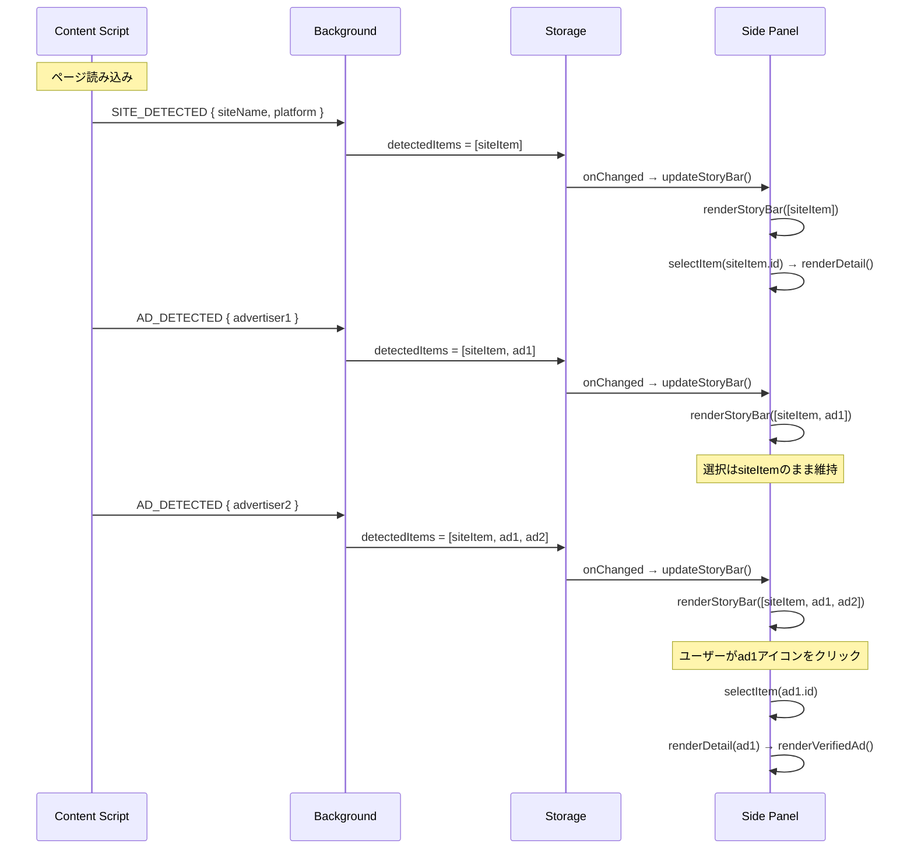

# 技術設計書 - FakeAdAlertDemo Phase 6: VCギャラリー サイドパネル

## 1. 要件トレーサビリティマトリックス

| 要件ID | 要件内容 | 設計項目 | 既存資産 | 変更理由 |
|--------|---------|---------|---------|---------|
| REQ-P6-001 | サイトVC情報追加 | src/lib/vc-mock.ts | vc-mock.ts（企業VCパターン流用） | サイト認証機能追加 |
| REQ-P6-002 | サイトVCの自動検出 | src/content/news-site.ts | news-site.ts（SITE_DETECTED追加） | サイトVC通知 |
| REQ-P6-003 | ストレージ構造の変更 | src/lib/vc-types.ts | DetectedAdInfo型 | マルチVC対応 |
| REQ-P6-004 | Background Script変更 | src/background/index.ts | 既存メッセージ処理 | 配列管理に変更 |
| REQ-P6-005 | ストーリーバーUI | src/sidepanel/index.ts, style.css | サイドパネルUI全体 | リデザイン |
| REQ-P6-006 | 並び順 | src/sidepanel/index.ts | なし | 新規ロジック |
| REQ-P6-007 | インタラクション | src/sidepanel/index.ts, style.css | カード展開アニメーション | 選択UI追加 |
| REQ-P6-008 | 認証済みVC詳細 | src/sidepanel/index.ts | renderVerifiedAd() | 再利用・拡張 |
| REQ-P6-009 | サイトVC詳細 | src/sidepanel/index.ts | renderVerifiedAd()ベース | ヘッダー変更 |
| REQ-P6-010 | フェイク詳細 | src/sidepanel/index.ts | renderFakeAd() | 再利用 |
| REQ-P6-011 | スクロール | src/sidepanel/style.css | panel-container | レイアウト変更 |
| REQ-P6-012 | Instagram/TikTok互換 | src/background/index.ts | AD_DETECTEDハンドラ | 後方互換維持 |
| REQ-P6-013 | 未検出時表示 | src/sidepanel/index.ts | renderNoDetection() | 再利用 |

---

## 2. アーキテクチャ概要

### 2.1 Phase 5 → Phase 6 の変更要素

```
Phase 5（既存）:
  Content Script → AD_DETECTED → Background → lastDetectedAd（単一） → Side Panel（1件表示）

Phase 6（変更後）:
  Content Script → SITE_DETECTED + AD_DETECTED（複数）
                       ↓
  Background → detectedItems[]（配列管理）
                       ↓
  Side Panel → ストーリーバー（全アイテム） + 詳細エリア（選択中1件）
```

### 2.2 全体データフロー（Phase 6）

```mermaid
graph LR
    subgraph Content Script - news-site.ts
        INIT[ページ読み込み]
        SITE[SITE_DETECTED<br>サイトVC通知]
        AD1[AD_DETECTED<br>バナー1]
        AD2[AD_DETECTED<br>バナー2]
        ADN[AD_DETECTED<br>バナーN]
    end

    subgraph Background Script
        BG[メッセージハンドラ]
        ARR[detectedItems[]<br>配列管理]
        STORE[chrome.storage.session]
    end

    subgraph Side Panel
        SB[ストーリーバー<br>全アイコン表示]
        DET[詳細エリア<br>選択中VC表示]
        MOCK[vc-mock.ts<br>VCInfo取得]
    end

    INIT --> SITE
    INIT --> AD1
    INIT --> AD2
    INIT --> ADN

    SITE -->|SITE_DETECTED| BG
    AD1 -->|AD_DETECTED| BG
    AD2 -->|AD_DETECTED| BG
    ADN -->|AD_DETECTED| BG

    BG --> ARR
    ARR --> STORE
    STORE -->|onChanged| SB
    SB -->|選択| DET
    DET --> MOCK
```

### 2.3 サイドパネル内部のレンダリングフロー



---

## 3. モジュール設計

### 3.1 型定義の変更（src/lib/vc-types.ts）

> 要件: REQ-P6-003

```typescript
/**
 * 検出アイテム（Phase 6: マルチVC対応）
 * サイトVCと広告VCを統一的に扱う
 */
export interface DetectedItem {
  /** 一意のID（"site-{timestamp}" or "ad-{index}-{timestamp}"） */
  id: string;
  /** アイテムの種類 */
  type: 'site' | 'ad';
  /** 広告主名 or サイト名 */
  advertiserName: string;
  /** プラットフォーム */
  platform: 'instagram' | 'tiktok' | 'news-site';
  /** 判定結果 */
  result: 'verified' | 'fake' | 'unknown';
  /** マッチしたパターン */
  matchedPattern?: string;
  /** リストタイプ */
  listType?: string;
  /** 検出日時 */
  detectedAt: string;
}
```

**既存の`DetectedAdInfo`は維持する**（Instagram/TikTok Content Scriptとの互換性のため）。Background Scriptが`DetectedAdInfo`を受信後、内部で`DetectedItem`に変換する。

### 3.2 サイトVCモックデータ追加（src/lib/vc-mock.ts）

> 要件: REQ-P6-001

```typescript
// 既存の vcDatabase に追加

// デイリーニュース Japan（サイトVC）
'daily-news-japan': {
  advertiserInfo: {
    name: 'デイリーニュース Japan',
    advertiserDid: 'did:web:daily-news-japan.example',
    category: 'ニュースメディア',
    platform: 'news-site',
  },
  verificationStatus: allVerified(),
  trustChain: {
    root: {
      name: '総務省',
      role: '信頼の基点',
      did: 'did:web:soumu.go.jp',
    },
    intermediate: {
      name: '日本新聞協会',
      role: '認定メディア審査機関',
      did: 'did:web:pressnet.or.jp',
    },
    subject: {
      name: 'デイリーニュース Japan',
      role: 'メディア発行者',
      did: 'did:web:daily-news-japan.example',
    },
  },
  blockchainProof: createBlockchainProof(
    '0x4d5e6f7a8b9c0d1e2f3a4b5c6d7e8f9a0b1c2d3e4f5a6b7c8d9e0f1a2b3c4d5e'
  ),
  vcId: 'urn:uuid:daily-news-japan-site-001',
  issuedAt: '2025-06-01T00:00:00Z',
  expiresAt: '2026-06-01T00:00:00Z',
},
```

**`getVCInfo()`の変更**: サイト名でも検索できるよう、既存の名前マッチングロジックをそのまま利用する。`'daily-news-japan'`というキーがあるため、`'デイリーニュース Japan'.toLowerCase()` は `'daily'` を含み、`'daily-news-japan'` キーとマッチする。

→ **注意**: 既存の検索ロジックは `lowerName.includes(key)` なので、`'デイリーニュース japan'` は `'daily-news-japan'` を含まない。サイト名はカタカナなので、**別のルックアップキーを追加**する必要がある。

**対策**: `getVCInfo()` に完全一致のフォールバックマップを追加するか、`getSiteVCInfo(siteName)` 関数を別途追加する。

→ **採用案**: `getSiteVCInfo()` 関数を新規追加。サイト名→VCInfoの直接マッピング。

```typescript
/**
 * サイトVC用のマッピング
 */
const siteVcDatabase: Record<string, VCInfo> = {
  'デイリーニュース Japan': vcDatabase['daily-news-japan'],
};

/**
 * サイト名からモックVC情報を取得
 */
export const getSiteVCInfo = (siteName: string): VCInfo | null => {
  return siteVcDatabase[siteName] ?? null;
};
```

### 3.3 Content Script変更（src/content/news-site.ts）

> 要件: REQ-P6-002

**変更内容**: ページ読み込み時に`SITE_DETECTED`メッセージを送信する処理を追加。

```typescript
// 追加する関数
const notifySiteDetected = (): void => {
  chrome.runtime.sendMessage({
    type: 'SITE_DETECTED',
    siteName: 'デイリーニュース Japan',
    platform: 'news-site',
  });
};

// init()の先頭で呼び出し
const init = (): void => {
  console.log(`${SCRIPT_NAME} Content script loaded`);
  notifySiteDetected();  // ← 追加
  processNewsBanners();
};
```

**変更はこの2点のみ**。既存のバナー検出・表示ロジックは一切変更しない。

### 3.4 Background Script変更（src/background/index.ts）

> 要件: REQ-P6-004, REQ-P6-012

**主要変更**: ストレージモデルを単一→配列に変更。

```typescript
const STORAGE_KEY = 'detectedItems';  // 変更: 'lastDetectedAd' → 'detectedItems'

/**
 * DetectedItem配列を取得
 */
const getDetectedItems = async (): Promise<DetectedItem[]> => {
  const result = await chrome.storage.session.get(STORAGE_KEY);
  return (result[STORAGE_KEY] as DetectedItem[]) ?? [];
};

/**
 * DetectedItem配列を保存
 */
const setDetectedItems = async (items: DetectedItem[]): Promise<void> => {
  await chrome.storage.session.set({ [STORAGE_KEY]: items });
};

// メッセージハンドラ
chrome.runtime.onMessage.addListener((message, sender, sendResponse) => {
  if (message.type === 'SITE_DETECTED') {
    handleSiteDetected(message).then(() => sendResponse({ status: 'ok' }));
    return true;
  }

  if (message.type === 'AD_DETECTED') {
    handleAdDetected(message).then(() => sendResponse({ status: 'ok' }));
    return true;
  }

  sendResponse({ status: 'unknown' });
  return true;
});

/**
 * SITE_DETECTED ハンドラ
 */
const handleSiteDetected = async (message: any): Promise<void> => {
  const items = await getDetectedItems();

  // 既にサイトVCがあれば何もしない
  if (items.some(item => item.type === 'site')) return;

  const siteItem: DetectedItem = {
    id: `site-${Date.now()}`,
    type: 'site',
    advertiserName: message.siteName,
    platform: message.platform,
    result: 'verified',
    detectedAt: new Date().toISOString(),
  };

  await setDetectedItems([siteItem, ...items]);
};

/**
 * AD_DETECTED ハンドラ
 */
const handleAdDetected = async (message: any): Promise<void> => {
  const items = await getDetectedItems();

  // 同じ広告主名の重複チェック
  if (items.some(item => item.type === 'ad' && item.advertiserName === message.advertiserName)) {
    return;
  }

  const adItem: DetectedItem = {
    id: `ad-${items.length}-${Date.now()}`,
    type: 'ad',
    advertiserName: message.advertiserName,
    platform: message.platform,
    result: message.result,
    matchedPattern: message.matchedPattern,
    listType: message.listType,
    detectedAt: new Date().toISOString(),
  };

  await setDetectedItems([...items, adItem]);
};
```

**タブ遷移時のクリア**: `chrome.tabs.onUpdated` でページ遷移を検知し配列をクリアする。

```typescript
chrome.tabs.onUpdated.addListener((tabId, changeInfo) => {
  if (changeInfo.status === 'loading') {
    // ページ遷移開始時にクリア
    chrome.storage.session.remove(STORAGE_KEY);
  }
});
```

### 3.5 サイドパネルHTML変更（src/sidepanel/index.html）

> 要件: REQ-P6-005

```html
<!-- VC検証情報エリア：ストーリーバー + 詳細 -->
<section id="story-bar" class="story-bar-section">
  <!-- JSで動的に生成: ストーリーバーのアイコン一覧 -->
</section>

<section id="vc-detail" class="panel-section vc-detail-section">
  <!-- JSで動的に生成: 選択中VCの詳細 -->
</section>
```

**変更点**:
- 既存の `<section id="vc-content">` を2つのセクションに分割
- `#story-bar`: ストーリーバーアイコン用（sticky）
- `#vc-detail`: 選択中VCの詳細表示用（スクロール可能）

### 3.6 サイドパネルTypeScript変更（src/sidepanel/index.ts）

> 要件: REQ-P6-005〜REQ-P6-013

**大幅リライト**。主要な関数:

```typescript
import type { DetectedItem, VCInfo } from '../lib/vc-types';
import { getVCInfo, getSiteVCInfo } from '../lib/vc-mock';

const STORAGE_KEY = 'detectedItems';
let selectedItemId: string | null = null;

/**
 * ストーリーバーのレンダリング
 */
const renderStoryBar = (items: DetectedItem[]): void => {
  const container = document.getElementById('story-bar');
  if (!container || items.length === 0) {
    if (container) container.innerHTML = '';
    return;
  }

  container.innerHTML = `
    <div class="story-bar">
      ${items.map(item => renderStoryIcon(item)).join('')}
    </div>
  `;

  // クリックイベント設定
  container.querySelectorAll('.story-icon').forEach(icon => {
    icon.addEventListener('click', () => {
      const id = (icon as HTMLElement).dataset.itemId;
      if (id) selectItem(id, items);
    });
  });
};

/**
 * ストーリーアイコン1つのHTML生成
 */
const renderStoryIcon = (item: DetectedItem): string => {
  const ringClass = item.type === 'site'
    ? 'ring-site'
    : item.result === 'verified'
      ? 'ring-verified'
      : 'ring-fake';

  const isSelected = item.id === selectedItemId;
  const selectedClass = isSelected ? 'story-icon--selected' : '';

  // 頭文字を取得（最大2文字）
  const initial = getInitial(item.advertiserName);

  // ラベル（最大6文字 + 省略）
  const label = item.advertiserName.length > 6
    ? item.advertiserName.substring(0, 6)
    : item.advertiserName;

  return `
    <div class="story-icon ${ringClass} ${selectedClass}" data-item-id="${item.id}">
      <div class="story-icon__circle">
        <span class="story-icon__initial">${initial}</span>
      </div>
      <span class="story-icon__label">${label}</span>
    </div>
  `;
};

/**
 * アイテム選択
 */
const selectItem = (itemId: string, items: DetectedItem[]): void => {
  selectedItemId = itemId;
  renderStoryBar(items);  // 選択状態を更新
  const item = items.find(i => i.id === itemId);
  if (item) renderDetail(item);
};

/**
 * 詳細エリアのレンダリング
 */
const renderDetail = (item: DetectedItem): void => {
  const container = document.getElementById('vc-detail');
  if (!container) return;

  if (item.type === 'site') {
    const vcInfo = getSiteVCInfo(item.advertiserName);
    if (vcInfo) {
      container.innerHTML = renderSiteVC(item, vcInfo);
    }
  } else if (item.result === 'verified') {
    const vcInfo = getVCInfo(item.advertiserName);
    if (vcInfo) {
      container.innerHTML = renderVerifiedAd(item, vcInfo);
    }
  } else {
    container.innerHTML = renderFakeAd(item);
  }

  setupCardListeners();
};
```

**既存関数の再利用**:
- `renderVerifiedAd()`: 引数の型を`DetectedItem`に変更、ロジックはほぼ同等
- `renderFakeAd()`: 同上
- `renderNoDetection()`: 変更なし
- `createExpandableCard()`: 変更なし
- `createInfoRow()`: 変更なし
- `setupCardListeners()`: 変更なし

**新規関数**:
- `renderStoryBar()`: ストーリーバー全体のレンダリング
- `renderStoryIcon()`: 個別アイコンのHTML生成
- `selectItem()`: アイテム選択ハンドラ
- `renderDetail()`: 選択中アイテムの詳細レンダリング
- `renderSiteVC()`: サイトVC用の詳細表示（`renderVerifiedAd`ベース、ヘッダーのみ異なる）
- `getInitial()`: 広告主名から頭文字を抽出

### 3.7 サイドパネルCSS追加（src/sidepanel/style.css）

> 要件: REQ-P6-005, REQ-P6-007, REQ-P6-011, NFR-P6-002

**追加するCSSセクション**:

```css
/* ==================== ストーリーバー ==================== */
.story-bar-section {
  position: sticky;
  top: 0;
  z-index: 10;
  background: rgba(15, 15, 35, 0.95);
  backdrop-filter: blur(8px);
  -webkit-backdrop-filter: blur(8px);
  padding: 12px 0;
  border-bottom: 1px solid rgba(255, 255, 255, 0.1);
}

.story-bar {
  display: flex;
  gap: 12px;
  overflow-x: auto;
  padding: 0 4px;
  scrollbar-width: none;         /* Firefox */
  -ms-overflow-style: none;      /* IE/Edge */
}

.story-bar::-webkit-scrollbar {
  display: none;                 /* Chrome/Safari */
}

/* ストーリーアイコン */
.story-icon {
  display: flex;
  flex-direction: column;
  align-items: center;
  gap: 4px;
  cursor: pointer;
  flex-shrink: 0;
  transition: transform 0.15s ease;
}

.story-icon:hover {
  transform: scale(1.05);
}

.story-icon__circle {
  width: 48px;
  height: 48px;
  border-radius: 50%;
  display: flex;
  align-items: center;
  justify-content: center;
  background: #1a1a2e;
  border: 2px solid transparent;
  transition: border-width 0.2s ease-out, box-shadow 0.2s ease-out;
}

.story-icon__initial {
  font-size: 14px;
  font-weight: 700;
  color: rgba(255, 255, 255, 0.9);
  line-height: 1;
}

.story-icon__label {
  font-size: 10px;
  color: rgba(255, 255, 255, 0.6);
  max-width: 56px;
  text-align: center;
  overflow: hidden;
  text-overflow: ellipsis;
  white-space: nowrap;
}

/* リングカラー */
.ring-site .story-icon__circle {
  border-color: #3b82f6;
}

.ring-verified .story-icon__circle {
  border-color: #10b981;
}

.ring-fake .story-icon__circle {
  border-color: #ef4444;
}

/* 選択状態 */
.story-icon--selected .story-icon__circle {
  border-width: 3px;
}

.story-icon--selected.ring-site .story-icon__circle {
  box-shadow: 0 0 8px rgba(59, 130, 246, 0.4);
}

.story-icon--selected.ring-verified .story-icon__circle {
  box-shadow: 0 0 8px rgba(16, 185, 129, 0.4);
}

.story-icon--selected.ring-fake .story-icon__circle {
  box-shadow: 0 0 8px rgba(239, 68, 68, 0.4);
}

/* 非選択状態の透明化 */
.story-icon:not(.story-icon--selected) .story-icon__circle {
  opacity: 0.7;
}

.story-icon:not(.story-icon--selected) .story-icon__label {
  opacity: 0.5;
}

/* ==================== 詳細エリア ==================== */
.vc-detail-section {
  flex: 1;
  overflow-y: auto;
}

/* ==================== サイトVCヘッダー ==================== */
.result-site {
  background: linear-gradient(135deg, rgba(59, 130, 246, 0.3), rgba(37, 99, 235, 0.3));
  border: 1px solid rgba(59, 130, 246, 0.4);
  color: #60a5fa;
}

/* ==================== 詳細切り替えアニメーション ==================== */
#vc-detail {
  animation: fadeInDetail 0.15s ease;
}

@keyframes fadeInDetail {
  from { opacity: 0; }
  to { opacity: 1; }
}
```

**既存CSSの変更**:
- `.panel-container`: `overflow-y: auto` を追加、`height: 100vh`を設定（スクロール対応）
- `body`: `overflow: hidden` を追加（パネルコンテナがスクロールを管理）

### 3.8 サイトVCヘッダーの表示差分

> 要件: REQ-P6-009

```typescript
/**
 * サイトVC用の詳細表示
 */
const renderSiteVC = (item: DetectedItem, vcInfo: VCInfo): string => {
  // ヘッダーのみ異なる（サイトVC固有のヘッダー）
  const header = `
    <div class="result-header result-site">
      <span class="result-icon">&#x1F3E2;</span>
      <span class="result-text">サイト認証済み - このメディアは検証済みです</span>
    </div>
  `;

  // 以降のカード4枚は renderVerifiedAd と同じロジックを再利用
  // （advertiserCard, statusCard, trustChainCard, blockchainCard）
  const cards = renderVCCards(item, vcInfo);

  return header + cards;
};
```

**renderVCCards()**を新設し、`renderVerifiedAd`と`renderSiteVC`の両方で共有する。

---

## 4. ディレクトリ構成（Phase 6 変更分）

```
fake-ad-alert-demo/
├── src/
│   ├── content/
│   │   ├── instagram.ts            # 変更なし
│   │   ├── tiktok.ts               # 変更なし
│   │   ├── news-site.ts            # 更新: SITE_DETECTED送信追加
│   │   └── news-site.css           # 変更なし
│   ├── components/
│   │   ├── warning-overlay.ts      # 変更なし
│   │   ├── verified-badge.ts       # 変更なし
│   │   ├── click-blocker.ts        # 変更なし
│   │   └── warning-modal.ts        # 変更なし
│   ├── lib/
│   │   ├── news-detector.ts        # 変更なし
│   │   ├── types.ts                # 変更なし
│   │   ├── vc-types.ts             # 更新: DetectedItem型追加
│   │   ├── verifier.ts             # 変更なし
│   │   └── vc-mock.ts              # 更新: サイトVC追加、getSiteVCInfo()追加
│   ├── sidepanel/
│   │   ├── index.html              # 更新: ストーリーバー + 詳細エリアの2セクション化
│   │   ├── index.ts                # 大幅更新: マルチVCレンダリング
│   │   └── style.css               # 更新: ストーリーバーCSS追加
│   └── background/
│       └── index.ts                # 大幅更新: 配列管理、SITE_DETECTED対応
├── manifest.json                   # 更新: version 0.6.0
└── （その他変更なし）
```

---

## 5. 技術的決定事項

| 決定項目 | 選択 | 理由 |
|---------|------|------|
| ストレージ構造 | 単一オブジェクト → 配列（`DetectedItem[]`） | マルチVC表示に必須 |
| DetectedAdInfo互換性 | 既存型は残し、Background内部でDetectedItemに変換 | Instagram/TikTok Content Scriptの変更不要 |
| サイトVC通知 | 新メッセージタイプ `SITE_DETECTED` | AD_DETECTEDとの責務分離 |
| サイトVCルックアップ | `getSiteVCInfo()`を新設 | 既存`getVCInfo()`は広告主名のキーワードマッチ、サイト名（日本語）には不適切 |
| ストーリーバーUI | CSS Flexbox + `overflow-x: auto` | シンプルで横スクロール対応 |
| スクロールバー非表示 | `scrollbar-width: none` + `::-webkit-scrollbar` | モダンなUI |
| 選択状態管理 | モジュールスコープの`selectedItemId`変数 | シンプルな状態管理で十分（Redux等は過剰） |
| 頭文字抽出 | 日本語は1文字、英語は先頭2文字 | アイコン内の表示スペースに合わせた最適化 |
| 詳細エリアのアニメーション | `opacity` トランジション 150ms | 高速で違和感のない切り替え |
| タブ遷移時のクリア | `chrome.tabs.onUpdated` | ページ遷移でアイテム配列をリセット |
| サイドパネルレイアウト | stickyストーリーバー + スクロール可能な詳細エリア | 要件通り |
| VCカードの共通化 | `renderVCCards()`関数を抽出 | サイトVC・広告VCで4カードを共有しDRY |
| manifest.jsonバージョン | 0.6.0 | Phase 6対応を示す |

---

## 6. 影響範囲分析

### 6.1 新規追加

| 追加要素 | 内容 | リスク |
|---------|------|-------|
| `DetectedItem`型 | vc-types.tsに追加 | 低（新規型、既存に影響なし） |
| `getSiteVCInfo()` | vc-mock.tsに追加 | 低（新規関数、既存に影響なし） |
| サイトVCデータ | vc-mock.tsのvcDatabaseに追加 | 低（既存エントリに影響なし） |
| ストーリーバーCSS | style.cssに追加 | 低（新規クラス名、既存に衝突なし） |
| ストーリーバーHTML | index.htmlに追加 | 中（既存`#vc-content`を`#story-bar` + `#vc-detail`に分割） |

### 6.2 更新ファイル

| ファイル | 変更内容 | リスク |
|---------|---------|-------|
| src/content/news-site.ts | `notifySiteDetected()`追加（3行程度） | 低（追加のみ） |
| src/background/index.ts | ストレージモデル変更、メッセージハンドラ拡張 | **中**（データフロー変更） |
| src/sidepanel/index.ts | 大幅リライト（ストーリーバー＋詳細エリア） | **高**（UIロジック全面変更） |
| src/sidepanel/index.html | セクション構成変更 | 中（HTMLレイアウト変更） |
| src/sidepanel/style.css | ストーリーバーCSS追加＋既存レイアウト調整 | 中（既存CSS変更あり） |
| src/lib/vc-types.ts | DetectedItem型追加 | 低（追加のみ） |
| src/lib/vc-mock.ts | サイトVC追加、getSiteVCInfo()追加 | 低（追加のみ） |
| manifest.json | version更新（0.5.1 → 0.6.0） | 低 |

### 6.3 影響なし

- src/content/instagram.ts
- src/content/tiktok.ts
- src/content/news-site.css
- src/components/warning-overlay.ts
- src/components/verified-badge.ts
- src/components/click-blocker.ts
- src/components/warning-modal.ts
- src/lib/news-detector.ts
- src/lib/types.ts
- src/lib/verifier.ts
- src/lib/detector.ts
- src/lib/tiktok-detector.ts
- demo-site/（変更なし）
- config/ad-verification.yml（変更なし）
- vite.config.ts（変更なし）

### 6.4 デグレリスク評価

| 既存機能 | リスク | 理由 | 対策 |
|---------|-------|------|------|
| Instagram検出・表示 | なし | Content Script変更なし | - |
| TikTok検出・表示 | なし | Content Script変更なし | - |
| バナーオーバーレイ | なし | コンポーネント変更なし | - |
| 認証バッジ | なし | コンポーネント変更なし | - |
| クリックブロック | なし | コンポーネント変更なし | - |
| 警告モーダル | なし | コンポーネント変更なし | - |
| サイドパネル表示 | **中** | UIロジック全面変更 | 回帰テスト必須 |
| Background通信 | **中** | ストレージモデル変更 | 後方互換テスト |
| ストレージ永続性 | 低 | セッションストレージのため再起動でクリア | - |
