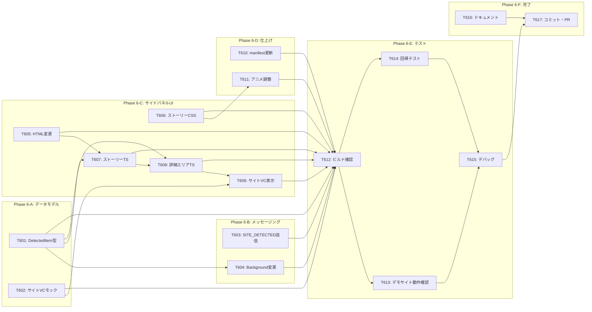

# タスクリスト - FakeAdAlertDemo Phase 6: VCギャラリー サイドパネル

## 1. 概要

Phase 6の設計書に基づくタスク分解。サイドパネルを「単一VC表示」から「マルチVCギャラリー（ストーリーバー型）」にリデザインし、サイトVCと各バナー広告VCを一覧・個別確認できるUIを実現する。

### 前提条件
- Phase 0〜5が完了していること
- Chrome 114以上
- デモニュースサイトが稼働していること

### 完了条件
- サイドパネルにストーリーバー（横スクロール型アイコン一覧）が表示される
- ストーリーバーにサイトVC（青リング）と全バナー広告VC（緑/赤リング）が並ぶ
- アイコンクリックで該当VCの詳細が下部に表示される
- デモニュースサイトのVC（「デイリーニュース Japan」）が表示される
- ストーリーバーは上部sticky、詳細エリアは縦スクロール可能
- 既存のInstagram/TikTok機能にデグレなし

---

## 2. タスク一覧

### Phase 6-A: データモデル・型定義
- [ ] T601: DetectedItem型の追加（vc-types.ts）
- [ ] T602: サイトVCモックデータ追加（vc-mock.ts）

### Phase 6-B: メッセージング・ストレージ
- [ ] T603: Content Script変更 — SITE_DETECTED送信追加（news-site.ts）
- [ ] T604: Background Script変更 — 配列管理＋SITE_DETECTED対応（index.ts）

### Phase 6-C: サイドパネルUI
- [ ] T605: サイドパネルHTML変更（index.html）
- [ ] T606: ストーリーバーCSS実装（style.css）
- [ ] T607: サイドパネルTSリライト — ストーリーバーレンダリング（index.ts）
- [ ] T608: サイドパネルTSリライト — 詳細エリアレンダリング（index.ts）
- [ ] T609: サイトVCヘッダー・詳細表示の実装（index.ts）

### Phase 6-D: 仕上げ
- [ ] T610: manifest.json バージョン更新（0.6.0）
- [ ] T611: 選択アニメーション・グロウエフェクト調整（style.css）

### Phase 6-E: ビルド・テスト
- [ ] T612: ビルド・型チェック
- [ ] T613: デモニュースサイトでの動作確認 ※ブラウザで手動確認
- [ ] T614: Instagram/TikTok回帰テスト ※ブラウザで手動確認
- [ ] T615: デバッグ・UI微調整

### Phase 6-F: 完了
- [ ] T616: ドキュメント更新（README、デモ手順書）
- [ ] T617: コミット・プッシュ・PR作成

---

## 3. タスク詳細

### T601: DetectedItem型の追加

- **要件ID**: REQ-P6-003
- **設計書参照**: design.md §3.1
- **依存関係**: なし
- **対象ファイル**: src/lib/vc-types.ts
- **完了条件**:
  - [ ] `DetectedItem` インターフェースを追加（id, type, advertiserName, platform, result, matchedPattern?, listType?, detectedAt）
  - [ ] 既存の `DetectedAdInfo` はそのまま維持（後方互換）
  - [ ] `pnpm typecheck` エラーなし
- **並列実行**: T602と同時実行可能

---

### T602: サイトVCモックデータ追加

- **要件ID**: REQ-P6-001
- **設計書参照**: design.md §3.2
- **依存関係**: なし
- **対象ファイル**: src/lib/vc-mock.ts
- **完了条件**:
  - [ ] `vcDatabase` に `'daily-news-japan'` エントリを追加
  - [ ] 信頼チェーン: 総務省 → 日本新聞協会 → デイリーニュース Japan
  - [ ] `siteVcDatabase` マッピングを追加（サイト名→VCInfo）
  - [ ] `getSiteVCInfo()` 関数をexport
  - [ ] 既存の `getVCInfo()` に影響なし
  - [ ] `pnpm typecheck` エラーなし
- **並列実行**: T601と同時実行可能

---

### T603: Content Script変更 — SITE_DETECTED送信追加

- **要件ID**: REQ-P6-002
- **設計書参照**: design.md §3.3
- **依存関係**: なし
- **対象ファイル**: src/content/news-site.ts
- **完了条件**:
  - [ ] `notifySiteDetected()` 関数を追加
  - [ ] `chrome.runtime.sendMessage({ type: 'SITE_DETECTED', siteName: 'デイリーニュース Japan', platform: 'news-site' })`
  - [ ] `init()` の先頭で `notifySiteDetected()` を呼び出し
  - [ ] 既存のバナー検出・表示ロジックに変更なし
  - [ ] `pnpm typecheck` エラーなし
- **並列実行**: T601, T602と同時実行可能

---

### T604: Background Script変更

- **要件ID**: REQ-P6-004, REQ-P6-012
- **設計書参照**: design.md §3.4
- **依存関係**: T601（DetectedItem型）
- **対象ファイル**: src/background/index.ts
- **完了条件**:
  - [ ] ストレージキーを `'detectedItems'` に変更
  - [ ] `getDetectedItems()` / `setDetectedItems()` ヘルパー関数を追加
  - [ ] `SITE_DETECTED` メッセージハンドラを追加（配列先頭にサイト情報挿入）
  - [ ] `AD_DETECTED` メッセージハンドラを更新（配列末尾に追加、重複排除）
  - [ ] タブ遷移時（`chrome.tabs.onUpdated`）に配列をクリア
  - [ ] 既存の `setPanelBehavior`、`onClicked`、`onInstalled`、`onStartup` ハンドラは維持
  - [ ] `pnpm typecheck` エラーなし
- **並列実行**: T603と同時実行可能（T601完了後）

---

### T605: サイドパネルHTML変更

- **要件ID**: REQ-P6-005
- **設計書参照**: design.md §3.5
- **依存関係**: なし
- **対象ファイル**: src/sidepanel/index.html
- **完了条件**:
  - [ ] 既存の `<section id="vc-content">` を削除
  - [ ] `<section id="story-bar" class="story-bar-section">` を追加
  - [ ] `<section id="vc-detail" class="panel-section vc-detail-section">` を追加
  - [ ] ヘッダー・ステータス・フッターは維持
- **並列実行**: T606, T607と同時実行可能

---

### T606: ストーリーバーCSS実装

- **要件ID**: REQ-P6-005, REQ-P6-007, NFR-P6-002
- **設計書参照**: design.md §3.7
- **依存関係**: なし
- **対象ファイル**: src/sidepanel/style.css
- **完了条件**:
  - [ ] `.story-bar-section`: sticky、背景ブラー、下線
  - [ ] `.story-bar`: flex、横スクロール、スクロールバー非表示
  - [ ] `.story-icon`: 48px円形、頭文字テキスト、下部ラベル
  - [ ] `.ring-site` / `.ring-verified` / `.ring-fake`: 3色リングカラー
  - [ ] `.story-icon--selected`: リング太め(3px)、グロウエフェクト
  - [ ] 非選択アイコンの半透明化
  - [ ] `.vc-detail-section`: flex:1、overflow-y:auto
  - [ ] `.result-site`: サイトVC用ヘッダー（青グラデーション）
  - [ ] `.panel-container` の高さ・スクロール設定変更
  - [ ] 詳細切り替えアニメーション（fadeInDetail）
- **並列実行**: T605, T607と同時実行可能

---

### T607: サイドパネルTS — ストーリーバーレンダリング

- **要件ID**: REQ-P6-005, REQ-P6-006, REQ-P6-007
- **設計書参照**: design.md §3.6
- **依存関係**: T601（DetectedItem型）、T605（HTML構造）
- **対象ファイル**: src/sidepanel/index.ts
- **完了条件**:
  - [ ] `STORAGE_KEY` を `'detectedItems'` に変更
  - [ ] `selectedItemId` 状態変数を追加
  - [ ] `renderStoryBar()`: 全アイテムのアイコン一覧をレンダリング
  - [ ] `renderStoryIcon()`: 個別アイコンHTML生成（リングカラー、選択状態、頭文字、ラベル）
  - [ ] `getInitial()`: 広告主名から頭文字抽出（日本語1文字、英語2文字）
  - [ ] `selectItem()`: アイテム選択ハンドラ（ストーリーバー更新 + 詳細レンダリング）
  - [ ] アイコンクリックイベントの設定
  - [ ] `chrome.storage.onChanged` の更新（`detectedItems`キー監視）
  - [ ] 未検出時（配列0件）は既存の案内メッセージ表示
  - [ ] 初期状態では先頭アイテム（サイトVC）を自動選択
  - [ ] `pnpm typecheck` エラーなし
- **並列実行**: T608と分担可（同一ファイルだが機能が分離している）

---

### T608: サイドパネルTS — 詳細エリアレンダリング

- **要件ID**: REQ-P6-008, REQ-P6-010, REQ-P6-013
- **設計書参照**: design.md §3.6
- **依存関係**: T601, T602（型・モックデータ）、T607（選択ハンドラ）
- **対象ファイル**: src/sidepanel/index.ts
- **完了条件**:
  - [ ] `renderDetail()`: 選択中アイテムの種類に応じて適切なレンダラーを呼び出し
  - [ ] `renderVCCards()`: 4カード生成の共通関数を抽出（広告情報、検証ステータス、信頼チェーン、ブロックチェーン証明）
  - [ ] `renderVerifiedAd()`: 既存ロジックを`DetectedItem`型対応に更新、ヘッダー + `renderVCCards()`
  - [ ] `renderFakeAd()`: 既存ロジックを`DetectedItem`型対応に更新
  - [ ] `renderNoDetection()`: 変更なし（再利用）
  - [ ] `createExpandableCard()`, `createInfoRow()`, `setupCardListeners()`: 変更なし（再利用）
  - [ ] `platformLabel()`: 変更なし（再利用）
  - [ ] `pnpm typecheck` エラーなし
- **並列実行**: T607と分担可

---

### T609: サイトVCヘッダー・詳細表示の実装

- **要件ID**: REQ-P6-009
- **設計書参照**: design.md §3.8
- **依存関係**: T602（サイトVCデータ）、T608（詳細レンダリング基盤）
- **対象ファイル**: src/sidepanel/index.ts
- **完了条件**:
  - [ ] `renderSiteVC()`: サイトVC専用のレンダリング関数
  - [ ] ヘッダー: 🏢アイコン + 「サイト認証済み - このメディアは検証済みです」
  - [ ] `.result-site` CSSクラスを使用（青グラデーション）
  - [ ] カード4枚は `renderVCCards()` を再利用
  - [ ] `getSiteVCInfo()` でVCInfo取得
  - [ ] `pnpm typecheck` エラーなし
- **並列実行**: 不可（T608に依存）

---

### T610: manifest.json バージョン更新

- **要件ID**: なし（バージョン管理）
- **依存関係**: なし
- **対象ファイル**: manifest.json
- **完了条件**:
  - [ ] `version` を `"0.6.0"` に更新
  - [ ] その他の変更なし
- **並列実行**: 他のタスクと同時実行可能

---

### T611: 選択アニメーション・グロウエフェクト調整

- **要件ID**: NFR-P6-002
- **設計書参照**: design.md §3.7（CSS詳細）
- **依存関係**: T606（ストーリーバーCSS基盤）
- **対象ファイル**: src/sidepanel/style.css
- **完了条件**:
  - [ ] 選択時のリング太さトランジション（200ms ease-out）が滑らか
  - [ ] グロウエフェクト（box-shadow）が適切な強度
  - [ ] 非選択→選択の切り替えがスムーズ
  - [ ] 横スクロール時のパフォーマンス問題がない
  - [ ] hover時のscaleアニメーションが自然
  - [ ] ブラウザでの動作確認（アニメーションの視覚的品質）
- **並列実行**: 不可（T606完了後、ブラウザ確認が必要）

---

### T612: ビルド・型チェック

- **依存関係**: T601〜T611
- **完了条件**:
  - [ ] `pnpm typecheck` エラーなし
  - [ ] `pnpm build` 正常完了
  - [ ] dist/ に更新されたサイドパネルファイルが含まれる
  - [ ] dist/ に既存のContent Script（Instagram/TikTok/NewsPage）が含まれる
- **並列実行**: 不可（全実装完了後）

---

### T613: デモニュースサイトでの動作確認

- **依存関係**: T612
- **完了条件**:
  - [ ] Chrome拡張を再読み込み
  - [ ] デモニュースサイトにアクセス
  - [ ] サイドパネルを開く
  - [ ] ストーリーバーに6つのアイコンが表示される（サイト1 + 認証済み2 + フェイク3）
  - [ ] サイトVCアイコンが先頭、青リング
  - [ ] 認証済み広告アイコンが緑リング
  - [ ] フェイク広告アイコンが赤リング
  - [ ] 初期状態でサイトVCが選択されており、詳細が表示される
  - [ ] サイトVC詳細: 🏢ヘッダー、発行者「デイリーニュース Japan」、信頼チェーン（総務省→日本新聞協会→デイリーニュース）
  - [ ] 認証済み広告アイコンをクリック → 該当VCの詳細に切り替わる
  - [ ] フェイク広告アイコンをクリック → フェイク警告詳細が表示される
  - [ ] ストーリーバーが横スクロール可能
  - [ ] 詳細エリアが縦スクロール可能
  - [ ] ストーリーバーがスクロールに追従（sticky）
  - [ ] 既存のバナーオーバーレイ・バッジが正常動作
  - [ ] 既存のクリックブロック・警告モーダルが正常動作
  - [ ] コンソールエラーなし
- **並列実行**: T614と同時実行可能

---

### T614: Instagram/TikTok回帰テスト

- **依存関係**: T612
- **完了条件**:
  - [ ] Instagramで広告検出 → サイドパネルにストーリーバー表示（サイトVCなし、広告1件のアイコン）
  - [ ] Instagramで認証済み広告 → 緑リングアイコン + 詳細表示
  - [ ] Instagramでフェイク広告 → 赤リングアイコン + 詳細表示
  - [ ] TikTokでも同様の動作確認
  - [ ] バナーオーバーレイ表示に変更なし
  - [ ] 認証バッジ表示に変更なし
  - [ ] Phase 5までの機能にデグレなし
- **並列実行**: T613と同時実行可能

---

### T615: デバッグ・UI微調整

- **依存関係**: T613, T614
- **完了条件**:
  - [ ] テストで発見された不具合の修正
  - [ ] ストーリーバーの見た目・アニメーション微調整
  - [ ] 詳細エリアの表示崩れ修正
  - [ ] コンソールエラーなし
- **並列実行**: 不可

---

### T616: ドキュメント更新

- **依存関係**: なし（並列で事前作業可能）
- **対象ファイル**: README.md, docs/demo-guide.md
- **完了条件**:
  - [ ] README.md のロードマップにPhase 6完了を反映
  - [ ] README.md にストーリーバー機能の説明を追加
  - [ ] docs/demo-guide.md にVCギャラリーの操作手順を追加
  - [ ] サイトVC確認のデモ手順を追加
- **並列実行**: 他のタスクと同時実行可能

---

### T617: コミット・プッシュ・PR作成

- **依存関係**: T612〜T616
- **完了条件**:
  - [ ] 全ファイルをステージング
  - [ ] コミットメッセージ（日本語）
  - [ ] GitHubにプッシュ
  - [ ] PR作成（mainへ）
- **コミットメッセージ例**:
  ```
  feat: Phase 6完了 - VCギャラリー サイドパネル（ストーリーバー型）

  - サイドパネルをマルチVCギャラリーにリデザイン
  - ストーリーバー型UI（横スクロール、色分けリング）を実装
  - デモサイト「デイリーニュース Japan」のサイトVCを追加
  - 検出された全バナー広告のVCを一覧・個別確認可能に
  - Background Scriptを配列管理に変更（SITE_DETECTED対応）
  - 選択アニメーション・グロウエフェクト実装
  ```

---

## 4. 依存関係図



---

## 5. 並列実行計画

| フェーズ | 並列実行可能タスク | 備考 |
|---------|-------------------|------|
| 1 | T601, T602, T603, T605, T606, T610, T616 | 型定義 + モック + Content Script + HTML + CSS + manifest + ドキュメント（全独立） |
| 2 | T604, T607 | Background変更 + ストーリーバーTS（T601完了後） |
| 3 | T608 | 詳細エリアTS（T607完了後） |
| 4 | T609, T611 | サイトVC表示 + アニメーション調整（T608/T606完了後） |
| 5 | T612 | ビルド確認（全実装完了後） |
| 6 | T613, T614 | 動作確認 + 回帰テスト（並列可） |
| 7 | T615 | デバッグ（テスト完了後） |
| 8 | T617 | コミット・PR（全タスク完了後） |

**見積もり**: サイドパネルのindex.tsが最大の変更対象（大幅リライト）。Background Scriptの配列管理変更がデグレリスクの主要ポイント。新規ファイル作成は不要で、既存ファイルの更新のみ。

---

## 6. 品質チェックリスト

- [ ] すべてのタスクが要件IDと紐付いているか
- [ ] Phase 5までの機能が全て維持されるか（回帰テストT614含む）
- [ ] ストーリーバーの6アイコン表示テストが含まれているか（T613）
- [ ] サイトVCの詳細表示テストが含まれているか（T613）
- [ ] Instagram/TikTok回帰テストが含まれているか（T614）
- [ ] アニメーション品質チェックが含まれているか（T611）
- [ ] 並列実行の機会が最大化されているか
- [ ] 既存のDetectedAdInfo型との後方互換が維持されているか
