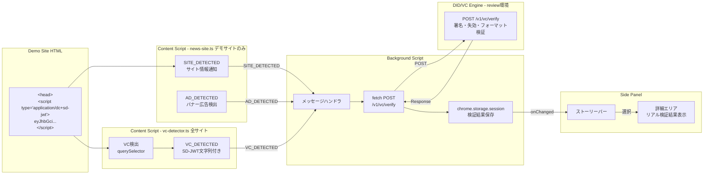
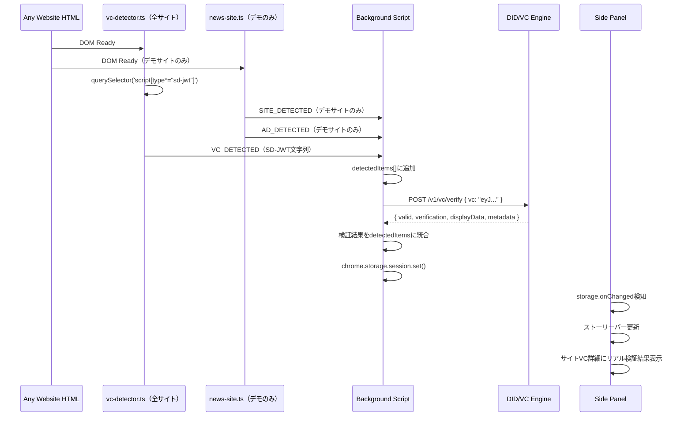

# 技術設計書 - FakeAdAlertDemo Phase 7: コンテンツ証明書VC埋め込み＋リアル検証

## 1. 要件トレーサビリティマトリックス

| 要件ID | 要件内容 | 設計項目 | 既存資産 | 変更理由 |
|--------|---------|---------|---------|---------|
| REQ-P7-001 | HTMLへのVC埋め込み | demo-site/index.html | index.html（head追加） | コンテンツ証明書VCの配置 |
| REQ-P7-002 | 全サイト対応のVC自動検出 | src/content/vc-detector.ts（新規） | なし | 全URL対応の専用Content Script |
| REQ-P7-003 | W3C形式考慮の検出ロジック | src/content/vc-detector.ts | なし | 将来拡張性 |
| REQ-P7-011 | VC検出とデモサイト機能の分離 | manifest.json, src/content/vc-detector.ts | news-site.ts（変更なし） | 責務分離 |
| REQ-P7-004 | Verify API呼び出し | src/background/index.ts | 既存メッセージ処理 | API連携追加 |
| REQ-P7-005 | 検証結果の受信と解釈 | src/lib/vc-types.ts, src/background/index.ts | vc-types.ts | API応答型定義 |
| REQ-P7-006 | エラーハンドリング | src/background/index.ts | なし | 新規ロジック |
| REQ-P7-007 | サイドパネル検証結果表示 | src/sidepanel/index.ts, style.css | サイドパネルUI | リアルデータ表示に切り替え |
| REQ-P7-008 | 検証中ステータス表示 | src/sidepanel/index.ts, style.css | なし | ローディングUI |
| REQ-P7-009 | バナー広告後方互換 | src/background/index.ts | 既存ハンドラ | 影響なし確認 |
| REQ-P7-010 | Instagram/TikTok互換 | - | 変更なし | 影響なし確認 |
| NFR-P7-001 | 検証レスポンス時間 | src/background/index.ts（タイムアウト設定） | なし | 10秒タイムアウト実装 |
| NFR-P7-002 | セキュリティ（レート制限対策） | src/background/index.ts（キャッシュ） | なし | 重複検証回避 |
| CON-P7-001 | review環境依存 | src/background/index.ts（VERIFY_API_URL定数） | なし | 環境切り替え容易化 |
| CON-P7-002 | IETF形式のみ | src/content/vc-detector.ts（セレクタ設計） | なし | dc+sd-jwtのみ実装 |
| CON-P7-003 | サイトVCのみリアル検証 | src/sidepanel/index.ts（フォールバック） | vc-mock.ts | バナーはモック維持 |

---

## 2. アーキテクチャ概要

### 2.1 Phase 6 → Phase 7 の変更要素

```
Phase 6（既存）:
  Content Script → SITE_DETECTED → Background → モックVC参照 → Side Panel（モック表示）

Phase 7（変更後）:
  news-site.ts（デモサイトのみ） → SITE_DETECTED + AD_DETECTED（従来通り）
  vc-detector.ts（全サイト）    → VC_DETECTED（VCテキスト付き）
                                     ↓
  Background → Verify API呼び出し（https://zero-engine-review.vericerts.io/v1/vc/verify）
                                     ↓
  Background → 検証結果をストレージに保存
                                     ↓
  Side Panel → リアル検証結果 + API由来のdisplayData表示
```

### 2.2 全体データフロー（Phase 7）



### 2.3 Chrome拡張メッセージフロー（シーケンス）



---

## 3. 詳細設計

### 3.1 VC埋め込み（demo-site/index.html）

**対象ファイル**: `demo-site/index.html`

`<head>` タグ内に以下を追加:

```html
<head>
  <meta charset="UTF-8">
  <meta name="viewport" content="width=device-width, initial-scale=1.0">
  <title>デイリーニュース Japan</title>

  <!-- Content Proof VC (SD-JWT) -->
  <script id="content-proof-vc" type="application/dc+sd-jwt">
  eyJhbGciOiJFZERTQSIsInR5cCI6ImRjK3NkLWp3dCIs...（完全なSD-JWT + disclosures）
  </script>

  <link rel="preconnect" href="https://fonts.googleapis.com">
  ...
</head>
```

**設計判断**:
- `<script type="application/dc+sd-jwt">` は非標準typeのため、ブラウザはスクリプトとして実行しない（安全）
- `<script type="application/ld+json">` による構造化データ埋め込みと同じパターン
- VCのサイズ（約4KB）はインライン埋め込みとして許容範囲
- `id="content-proof-vc"` でChrome拡張から効率的に取得可能

### 3.2 メッセージ型定義（src/lib/vc-types.ts）

**対象ファイル**: `src/lib/vc-types.ts`

既存の型定義に以下を追加:

```typescript
// VC_DETECTED メッセージ型
export interface VCDetectedMessage {
  type: 'VC_DETECTED';
  vcRaw: string;           // SD-JWT文字列（disclosures含む）
  format: 'dc+sd-jwt' | 'vc+sd-jwt';  // 将来のW3C対応を考慮
  elementId: string;       // HTML要素のid属性
  url: string;             // 検出されたページURL
}

// Verify API レスポンス型
export interface VCVerificationResponse {
  valid: boolean;
  verification: {
    signatureStatus: 'valid' | 'invalid';
    expiryStatus: 'valid' | 'expired';
    issuerStatus: 'trusted' | 'untrusted' | 'unknown';
    revocationStatus: 'valid' | 'revoked' | 'unavailable';
    blockchainStatus: 'valid' | 'invalid' | 'pending' | 'failed' | 'skipped' | 'error';
    formatStatus: 'valid' | 'invalid';
  };
  displayData: Record<string, unknown>;
  metadata: {
    issuer: string | null;
    holder: string | null;
    credentialType: string | null;
    issueDate: string | null;
    expiryDate: string | null;
  };
  error?: {
    code: string;
    message: string;
    details?: string[];
  } | null;
}

// 検証状態を含むDetectedItem拡張
export interface VerificationState {
  status: 'pending' | 'verifying' | 'verified' | 'error';
  result?: VCVerificationResponse;
  errorMessage?: string;
}
```

### 3.3 VC検出専用Content Script（src/content/vc-detector.ts）— 新規作成

**対象ファイル**: `src/content/vc-detector.ts`（新規）

全サイトで動作するVC検出専用の軽量Content Script。`news-site.ts`（デモサイト専用）とは完全に分離。

```typescript
// vc-detector.ts — 全サイト対応のVC検出Content Script
// <script type="application/dc+sd-jwt"> を検出してBackgroundに通知する

function detectContentProofVC(): void {
  // 将来のvc+sd-jwt対応も考慮したセレクタ
  const vcScripts = document.querySelectorAll<HTMLScriptElement>(
    'script[type="application/dc+sd-jwt"], script[type="application/vc+sd-jwt"]'
  );

  if (vcScripts.length === 0) return; // VCがなければ即終了（軽量）

  vcScripts.forEach((script) => {
    const vcRaw = script.textContent?.trim();
    if (!vcRaw) return;

    // typeからフォーマットを判定
    const type = script.getAttribute('type') ?? '';
    const format = type.includes('vc+sd-jwt') ? 'vc+sd-jwt' : 'dc+sd-jwt';

    chrome.runtime.sendMessage({
      type: 'VC_DETECTED',
      vcRaw,
      format,
      elementId: script.id || '',
      url: window.location.href,
    });
  });
}

// ページロード時に実行
detectContentProofVC();
```

**設計判断**:
- `news-site.ts` には一切変更を加えない（バナー広告検出・SITE_DETECTED・AD_DETECTEDは従来通り）
- `vc-detector.ts` はVC検出のみの単一責務で、VCがないページでは `querySelectorAll` 1回で即リターン（パフォーマンス影響なし）
- デモサイトでは `news-site.ts` と `vc-detector.ts` の両方が並行動作する

### 3.3b manifest.json の content_scripts 変更

```json
"content_scripts": [
  {
    "matches": ["https://www.instagram.com/*"],
    "js": ["src/content/instagram.ts"],
    "run_at": "document_idle"
  },
  {
    "matches": ["https://www.tiktok.com/*"],
    "js": ["src/content/tiktok.ts"],
    "run_at": "document_idle"
  },
  {
    "matches": [
      "http://localhost:*/*",
      "https://*.netlify.app/*"
    ],
    "js": ["src/content/news-site.ts"],
    "run_at": "document_idle"
  },
  {
    "matches": ["<all_urls>"],
    "js": ["src/content/vc-detector.ts"],
    "run_at": "document_idle"
  }
]
```

**注意**: `<all_urls>` はChrome Web Store審査で厳しく見られるが、本アプリはデモ用で公開しないため問題なし。

### 3.4 Background Script変更（src/background/index.ts）

**対象ファイル**: `src/background/index.ts`

#### 3.4.1 Verify APIエンドポイント定数

```typescript
const VERIFY_API_URL = 'https://zero-engine-review.vericerts.io/v1/vc/verify';
const VERIFY_TIMEOUT_MS = 10_000;
```

#### 3.4.2 VC_DETECTEDメッセージハンドラ

既存のメッセージハンドラ（SITE_DETECTED, AD_DETECTED）と並列に追加:

```typescript
case 'VC_DETECTED': {
  const { vcRaw, format, elementId, url } = message;

  // 検証中ステータスをストレージに即座に保存
  updateVerificationState(tabId, {
    status: 'verifying',
  });

  // Background Service WorkerからAPI呼び出し（CORS制約なし）
  try {
    const controller = new AbortController();
    const timeout = setTimeout(() => controller.abort(), VERIFY_TIMEOUT_MS);

    const response = await fetch(VERIFY_API_URL, {
      method: 'POST',
      headers: { 'Content-Type': 'application/json' },
      body: JSON.stringify({ vc: vcRaw }),
      signal: controller.signal,
    });
    clearTimeout(timeout);

    if (!response.ok) {
      throw new Error(`API error: ${response.status}`);
    }

    const result: VCVerificationResponse = await response.json();

    updateVerificationState(tabId, {
      status: 'verified',
      result,
    });
  } catch (error) {
    const errorMessage =
      error instanceof DOMException && error.name === 'AbortError'
        ? '検証がタイムアウトしました'
        : error instanceof TypeError
          ? '検証サーバーに接続できません'
          : `検証エラー: ${(error as Error).message}`;

    updateVerificationState(tabId, {
      status: 'error',
      errorMessage,
    });
  }
  break;
}
```

#### 3.4.3 検証状態のストレージ管理

```typescript
async function updateVerificationState(
  tabId: number,
  state: VerificationState,
): Promise<void> {
  const key = `vcVerification_${tabId}`;
  await chrome.storage.session.set({ [key]: state });
}
```

#### 3.4.4 重複検証回避キャッシュ（NFR-P7-002対応）

エンジン側のレート制限（60回/分）に到達するリスクを低減するため、同一VCの重複検証を回避する。

```typescript
// VCハッシュ → 検証結果のインメモリキャッシュ（Background SW存続中のみ有効）
const verificationCache = new Map<string, {
  result: VCVerificationResponse;
  timestamp: number;
}>();

const CACHE_TTL_MS = 5 * 60 * 1000; // 5分

function getCacheKey(vcRaw: string): string {
  // SD-JWT先頭128文字をキーとして使用（完全一致は不要、衝突リスク低い）
  return vcRaw.substring(0, 128);
}

// VC_DETECTEDハンドラ内でキャッシュチェック
const cacheKey = getCacheKey(vcRaw);
const cached = verificationCache.get(cacheKey);
if (cached && Date.now() - cached.timestamp < CACHE_TTL_MS) {
  // キャッシュヒット: API呼び出しをスキップ
  updateVerificationState(tabId, {
    status: 'verified',
    result: cached.result,
  });
  return;
}
// キャッシュミス: API呼び出し後にキャッシュに保存
```

**設計判断**:
- Background Service Workerのメモリ上のMapで管理（永続化不要）
- TTL 5分: デモ中に同じページを繰り返し開いてもAPIを叩かない
- Service Workerが再起動するとキャッシュはクリアされる（問題なし）
- レート制限到達時（HTTP 429）はエラーハンドリングで「検証リクエストが上限に達しました」を表示

### 3.5 manifest.json変更

**対象ファイル**: `manifest.json`

```json
{
  "host_permissions": [
    "https://zero-engine-review.vericerts.io/*"
  ]
}
```

**設計判断**: Chrome拡張の `host_permissions` により、Background Service Workerからのfetch呼び出しはCORS制約を受けない。そのためDID/VC Engine側のCORS設定（`CORS_ORIGIN`環境変数）に変更は不要。

### 3.6 サイドパネル変更（src/sidepanel/index.ts, style.css）

**対象ファイル**: `src/sidepanel/index.ts`, `src/sidepanel/style.css`

#### 3.6.1 サイトVC詳細のリアル検証結果レンダリング

```typescript
function renderRealVerificationResult(
  container: HTMLElement,
  state: VerificationState,
): void {
  switch (state.status) {
    case 'verifying':
      // ローディング表示
      container.innerHTML = renderVerifyingState();
      break;
    case 'verified':
      // 検証結果表示
      container.innerHTML = renderVerifiedResult(state.result!);
      break;
    case 'error':
      // エラー表示
      container.innerHTML = renderErrorState(state.errorMessage!);
      break;
  }
}
```

#### 3.6.2 検証結果の表示構成

```
┌────────────────────────────────┐
│ 🔍 コンテンツ証明書             │
│ ────────────────────────────── │
│ ✅ 検証済み（または ⚠️ / ❌）    │
│                                │
│ 検証詳細:                       │
│   ✅ 署名: 有効                 │
│   ✅ 失効: 有効                 │
│   ✅ フォーマット: 有効          │
│   ✅ 発行者: 信頼済み           │
│   ⏭️ ブロックチェーン: スキップ   │
│                                │
│ ────────────────────────────── │
│ コンテンツ情報:                  │
│   見出し: デイリーニュースJapan...│
│   著者: 山田太郎                 │
│   編集: デイリーニュースJapan編集部│
│   公開日: 2026/3/18             │
│   ジャンル: 教育                 │
│                                │
│ ────────────────────────────── │
│ 発行者:                         │
│   did:web:zero-review.vericerts │
│   .io:org:...                   │
└────────────────────────────────┘
```

#### 3.6.3 検証ステータスアイコンマッピング

| ステータス | アイコン | 色 |
|-----------|---------|-----|
| valid / trusted | ✅ | #22c55e（緑） |
| invalid / untrusted / revoked / expired | ❌ | #ef4444（赤） |
| unknown / unavailable | ⚠️ | #f59e0b（黄） |
| skipped / pending | ⏭️ | #6b7280（グレー） |
| error | 🔴 | #ef4444（赤） |

#### 3.6.4 ローディングUI

```css
.vc-verifying-spinner {
  /* 既存のダークテーマに合わせたスピナー */
  border: 2px solid rgba(255, 255, 255, 0.1);
  border-top-color: #60a5fa;
  border-radius: 50%;
  width: 20px;
  height: 20px;
  animation: spin 0.8s linear infinite;
}
```

#### 3.6.5 サイドパネル側のストレージ監視と detectedItems 統合

サイドパネルは既存の `detectedItems[]`（ストーリーバー用）と新規の `vcVerification_{tabId}`（リアル検証結果）の2つのストレージキーを監視する。

```typescript
// サイドパネル初期化時
chrome.storage.session.onChanged.addListener((changes) => {
  // 既存: detectedItems の変更 → ストーリーバー更新
  if (changes.detectedItems) {
    renderStoryBar(changes.detectedItems.newValue);
  }

  // 新規: vcVerification_{tabId} の変更 → サイトVC詳細更新
  for (const [key, change] of Object.entries(changes)) {
    if (key.startsWith('vcVerification_')) {
      const state: VerificationState = change.newValue;
      updateSiteVCDetail(state);
    }
  }
});

// サイドパネル初回表示時: 現在のタブの検証状態を取得
async function loadCurrentVerificationState(): Promise<void> {
  const [tab] = await chrome.tabs.query({ active: true, currentWindow: true });
  if (!tab?.id) return;

  const key = `vcVerification_${tab.id}`;
  const data = await chrome.storage.session.get(key);
  const state: VerificationState | undefined = data[key];

  if (state) {
    updateSiteVCDetail(state);
  }
}

// サイトVC詳細の更新: リアル検証結果があればそちらを優先、なければモックにフォールバック
function updateSiteVCDetail(state: VerificationState): void {
  const detailContainer = document.getElementById('site-vc-detail');
  if (!detailContainer) return;

  if (state.status === 'verified' && state.result) {
    renderRealVerificationResult(detailContainer, state);
  } else if (state.status === 'verifying') {
    renderVerifyingState(detailContainer);
  } else if (state.status === 'error') {
    // エラー時: モックデータにフォールバック + エラー注記
    renderMockFallback(detailContainer, state.errorMessage);
  }
}
```

**統合の原則**: ストーリーバー（アイコン一覧）は既存の `detectedItems[]` で管理、サイトVC詳細エリアのみ `vcVerification_` で上書きする。2つのストレージキーは独立しており、互いに干渉しない。

### 3.7 サイトVCのデータソース切り替え

**Phase 6→7の段階的移行戦略**:

| データ | Phase 6 | Phase 7 |
|--------|---------|---------|
| サイトVC詳細 | vc-mock.tsのモックデータ | **Verify APIのレスポンス（displayData + metadata）** |
| バナー広告VC詳細 | vc-mock.tsのモックデータ | vc-mock.tsのモックデータ（変更なし） |
| ストーリーバー表示 | detectedItems[]から | detectedItems[]から（変更なし） |

サイトVCがリアル検証結果を持つ場合、詳細表示をリアルデータで上書きする。リアル検証が利用不可（APIエラー等）の場合は、フォールバックとしてモックデータを表示する。

---

## 4. 技術的決定事項

| 決定項目 | 選択 | 理由 |
|---------|------|------|
| VC埋め込み方式 | `<script type="application/dc+sd-jwt">` インライン | `<meta>`はVC長すぎ、`<link>`は追加fetchが必要。`<script>`は`ld+json`の前例あり |
| API呼び出し箇所 | Background Service Worker | Content ScriptからだとCORS制約あり。Background SWからはhost_permissionsでバイパス |
| 検証結果の受け渡し | chrome.storage.session | 既存のdetectedItems管理と同じパターン。onChangedイベントでサイドパネルに通知 |
| エラー時のフォールバック | モックデータ表示 | デモとして検証失敗でもコンテンツ情報は表示したい |
| VCフォーマット対応 | dc+sd-jwt のみ（Phase 7） | review環境のデフォルトフォーマット。vc+sd-jwt対応は将来フェーズ |
| 重複検証回避 | インメモリキャッシュ（Map、TTL 5分） | レート制限（60回/分）到達リスク低減 |

---

## 5. 外部依存

| 依存先 | URL | API | 認証 | 備考 |
|--------|-----|-----|------|------|
| DID/VC Engine（review環境） | `https://zero-engine-review.vericerts.io` | `POST /v1/vc/verify` | 不要（パブリック） | レート制限 60回/分。停止時はフォールバック |

**環境切り替え**: `VERIFY_API_URL` 定数を変更することで staging / production に切り替え可能。

| 環境 | URL |
|------|-----|
| review | `https://zero-engine-review.vericerts.io` |
| staging | `https://zero-engine-stg.vericerts.io` |
| production | `https://zero-engine.vericerts.io` |

---

## 6. 実装ガイドライン

### 6.1 既存コードへの影響最小化

- Content Script（news-site.ts）: **一切変更しない**。バナー広告検出・SITE_DETECTED・AD_DETECTEDは従来通り
- Content Script（vc-detector.ts）: **新規ファイル**として追加。VC検出のみの単一責務
- Background Script（index.ts）: 既存のメッセージハンドラに`VC_DETECTED`ケースを**追加**する
- サイドパネル: 既存のrenderSiteDetails()をリアル検証結果で拡張する。モック表示のコードは残しフォールバックとして利用

### 6.2 テスト戦略

- review環境のVerify APIに実際のVCを送信して正常系を確認
- ネットワーク切断状態でエラーハンドリングを確認
- 無効なVC文字列を送信してAPI側のエラーレスポンスを確認
- 既存のバナー広告検出が動作することをデグレテスト
