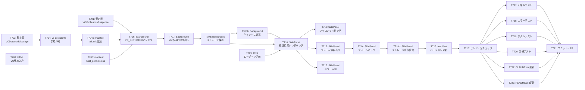

# タスクリスト - FakeAdAlertDemo Phase 7: コンテンツ証明書VC埋め込み＋リアル検証

## 1. 概要

Phase 7の設計書に基づくタスク分解。デモサイトHTMLにSD-JWT形式のVCを埋め込み、Chrome拡張がDID/VC EngineのVerify APIを呼び出してリアルタイム検証を行い、サイドパネルに結果を表示する。

### 前提条件
- Phase 0〜6が完了していること
- DID/VC Engine review環境が稼働していること
- 発行済みコンテンツ証明書VC（SD-JWT形式）が存在すること
- Chrome 114以上

### 完了条件
- デモサイトの `<head>` にSD-JWT形式のVCが埋め込まれている
- Chrome拡張がVCを自動検出し、Verify APIでリアル検証する
- 検証結果（署名、失効、フォーマット、発行者）がサイドパネルに表示される
- 検証失敗時・エラー時に適切な表示がされる
- 既存のバナー広告検出・Instagram/TikTok機能にデグレなし

---

## 2. タスク一覧

### Phase 7-A: 型定義・基盤
- [ ] T701: VCVerificationResponse型・VerificationState型の追加（vc-types.ts）
- [ ] T702: VCDetectedMessage型の追加（vc-types.ts）

### Phase 7-B: デモサイトVC埋め込み
- [ ] T703: demo-site/index.htmlの `<head>` にVC埋め込み

### Phase 7-C: Content Script — VC検出（全サイト対応）
- [ ] T704: vc-detector.ts新規作成 — 全サイト対応のVC検出Content Script
- [ ] T704b: manifest.jsonのcontent_scriptsに `<all_urls>` でvc-detector.ts追加

### Phase 7-D: Background Script — API連携
- [ ] T705: manifest.jsonにhost_permissions追加
- [ ] T706: VC_DETECTEDメッセージハンドラ追加（background/index.ts）
- [ ] T707: Verify API呼び出し＋タイムアウト処理（background/index.ts）
- [ ] T708: 検証結果のchrome.storage.session保存（background/index.ts）
- [ ] T708b: 重複検証回避キャッシュ実装（background/index.ts）

### Phase 7-E: サイドパネル — 検証結果表示
- [ ] T709: 検証中ローディングUI実装（style.css）
- [ ] T710: リアル検証結果レンダリング関数（sidepanel/index.ts）
- [ ] T711: 検証ステータスアイコン＋色マッピング（sidepanel/index.ts）
- [ ] T712: displayDataからのクレーム情報表示（sidepanel/index.ts）
- [ ] T713: エラー表示UI実装（sidepanel/index.ts）
- [ ] T714: モックデータへのフォールバック処理（sidepanel/index.ts）

### Phase 7-E2: サイドパネル — ストレージ監視統合
- [ ] T714b: サイドパネルのvcVerification監視＋detectedItems統合（sidepanel/index.ts）

### Phase 7-F: 仕上げ
- [ ] T715: manifest.jsonバージョン更新（0.7.0）

### Phase 7-G: テスト・確認
- [ ] T716: ビルド・型チェック
- [ ] T717: review環境のVerify APIでの正常系検証テスト
- [ ] T718: エラーハンドリングテスト（ネットワーク切断、無効VC）
- [ ] T719: バナー広告検出のデグレテスト
- [ ] T720: Instagram/TikTok回帰テスト ※ブラウザで手動確認

### Phase 7-H: ドキュメント更新
- [ ] T722: CLAUDE.md更新 — 判定ロジックセクションにリアルVC検証の記載追加
- [ ] T723: README.md更新 — Phase 6/7のロードマップ追加、モック判定の注記更新

### Phase 7-I: 完了
- [ ] T721: コミット・プッシュ・PR作成

---

## 3. タスク詳細

### T701: VCVerificationResponse型・VerificationState型の追加

- **要件ID**: REQ-P7-005, REQ-P7-008
- **設計書参照**: design.md §3.2
- **依存関係**: なし
- **対象ファイル**: `src/lib/vc-types.ts`
- **完了条件**:
  - [ ] VCVerificationResponse型がVerify APIレスポンス構造と一致
  - [ ] VerificationState型（pending / verifying / verified / error）が定義済み
  - [ ] 型チェックがパス
- **並列実行**: T702, T703と同時実行可能

### T702: VCDetectedMessage型の追加

- **要件ID**: REQ-P7-002
- **設計書参照**: design.md §3.2
- **依存関係**: なし
- **対象ファイル**: `src/lib/vc-types.ts`
- **完了条件**:
  - [ ] VCDetectedMessage型にvcRaw, format, elementId, urlが含まれる
  - [ ] format型が `'dc+sd-jwt' | 'vc+sd-jwt'` のユニオン
- **並列実行**: T701, T703と同時実行可能

### T703: demo-site/index.htmlの `<head>` にVC埋め込み

- **要件ID**: REQ-P7-001
- **設計書参照**: design.md §3.1
- **依存関係**: なし
- **対象ファイル**: `demo-site/index.html`
- **完了条件**:
  - [ ] `<script id="content-proof-vc" type="application/dc+sd-jwt">` が `<head>` 内に存在
  - [ ] VCテキストがreview環境で発行された実際のSD-JWT
  - [ ] ブラウザでデモサイトを開いてもJSエラーが発生しない
- **並列実行**: T701, T702と同時実行可能

### T704: vc-detector.ts新規作成

- **要件ID**: REQ-P7-002, REQ-P7-003, REQ-P7-011
- **設計書参照**: design.md §3.3
- **依存関係**: T702
- **対象ファイル**: `src/content/vc-detector.ts`（新規作成）
- **完了条件**:
  - [ ] `vc-detector.ts` が新規ファイルとして作成されている
  - [ ] `script[type="application/dc+sd-jwt"]` と `script[type="application/vc+sd-jwt"]` の両方をセレクタで検出
  - [ ] VCがないページでは `querySelectorAll` 1回で即リターン（軽量）
  - [ ] VC_DETECTEDメッセージがBackgroundに送信される
  - [ ] `news-site.ts` に一切変更がない

### T704b: manifest.jsonのcontent_scriptsにvc-detector.ts追加

- **要件ID**: REQ-P7-002, REQ-P7-011
- **設計書参照**: design.md §3.3b
- **依存関係**: T704
- **対象ファイル**: `manifest.json`
- **完了条件**:
  - [ ] `"matches": ["<all_urls>"]` で `vc-detector.ts` が登録されている
  - [ ] 既存の content_scripts（instagram.ts, tiktok.ts, news-site.ts）に変更がない

### T705: manifest.jsonにhost_permissions追加

- **要件ID**: REQ-P7-004
- **設計書参照**: design.md §3.5
- **依存関係**: なし
- **対象ファイル**: `manifest.json`
- **完了条件**:
  - [ ] `"host_permissions": ["https://zero-engine-review.vericerts.io/*"]` が追加
- **並列実行**: T701〜T704と同時実行可能

### T706: VC_DETECTEDメッセージハンドラ追加

- **要件ID**: REQ-P7-004, REQ-P7-009
- **設計書参照**: design.md §3.4.2
- **依存関係**: T701, T702, T704b, T705
- **対象ファイル**: `src/background/index.ts`
- **完了条件**:
  - [ ] `VC_DETECTED` メッセージを受信して処理するケースが追加
  - [ ] 既存のSITE_DETECTED, AD_DETECTEDハンドラに影響なし

### T707: Verify API呼び出し＋タイムアウト処理

- **要件ID**: REQ-P7-004, REQ-P7-006
- **設計書参照**: design.md §3.4.1, §3.4.2
- **依存関係**: T706
- **対象ファイル**: `src/background/index.ts`
- **完了条件**:
  - [ ] `POST /v1/vc/verify` に正しいリクエストボディを送信
  - [ ] 10秒タイムアウトでAbortController使用
  - [ ] ネットワークエラー、APIエラー、タイムアウトで適切なエラーメッセージ生成

### T708: 検証結果のchrome.storage.session保存

- **要件ID**: REQ-P7-005
- **設計書参照**: design.md §3.4.3
- **依存関係**: T707
- **対象ファイル**: `src/background/index.ts`
- **完了条件**:
  - [ ] 検証中（verifying）→ 検証完了（verified）/ エラー（error）のステート遷移が正しい
  - [ ] `vcVerification_{tabId}` キーでストレージに保存

### T709: 検証中ローディングUI実装

- **要件ID**: REQ-P7-008
- **設計書参照**: design.md §3.6.4
- **依存関係**: なし
- **対象ファイル**: `src/sidepanel/style.css`
- **完了条件**:
  - [ ] スピナーアニメーションCSS追加
  - [ ] ダークテーマに合ったローディングUI
- **並列実行**: T710〜T714と同時実行可能

### T710: リアル検証結果レンダリング関数

- **要件ID**: REQ-P7-007
- **設計書参照**: design.md §3.6.1
- **依存関係**: T701, T709
- **対象ファイル**: `src/sidepanel/index.ts`
- **完了条件**:
  - [ ] `renderRealVerificationResult()` 関数が実装
  - [ ] verifying / verified / error の3状態をハンドリング

### T711: 検証ステータスアイコン＋色マッピング

- **要件ID**: REQ-P7-007
- **設計書参照**: design.md §3.6.3
- **依存関係**: T710
- **対象ファイル**: `src/sidepanel/index.ts`
- **完了条件**:
  - [ ] 各ステータス（valid, invalid, trusted, untrusted, unknown, skipped等）に対応するアイコンと色
  - [ ] 全体の検証サマリー（検証済み / 検証警告 / 検証失敗）の判定ロジック

### T712: displayDataからのクレーム情報表示

- **要件ID**: REQ-P7-007
- **設計書参照**: design.md §3.6.2
- **依存関係**: T710
- **対象ファイル**: `src/sidepanel/index.ts`
- **完了条件**:
  - [ ] headline, author, datePublished, editor, genreの表示
  - [ ] displayDataの構造に応じた動的レンダリング

### T713: エラー表示UI実装

- **要件ID**: REQ-P7-006
- **設計書参照**: design.md §3.6.1
- **依存関係**: T710
- **対象ファイル**: `src/sidepanel/index.ts`
- **完了条件**:
  - [ ] ネットワークエラー、タイムアウト、APIエラーの各メッセージ表示
  - [ ] エラー時もUIが崩れない

### T714: モックデータへのフォールバック処理

- **要件ID**: REQ-P7-009
- **設計書参照**: design.md §3.7
- **依存関係**: T710, T712
- **対象ファイル**: `src/sidepanel/index.ts`
- **完了条件**:
  - [ ] Verify APIエラー時にvc-mock.tsのモックデータで表示
  - [ ] フォールバック時に「モックデータで表示中」の注記表示

### T715: manifest.jsonバージョン更新

- **要件ID**: -（リリース管理）
- **設計書参照**: -
- **依存関係**: T706〜T714完了後
- **対象ファイル**: `manifest.json`
- **完了条件**:
  - [ ] version: "0.7.0" に更新

### T716: ビルド・型チェック

- **要件ID**: -（品質ゲート）
- **依存関係**: T701〜T715すべて
- **完了条件**:
  - [ ] `pnpm build` 成功
  - [ ] `pnpm typecheck` エラーなし
  - [ ] `pnpm lint` エラーなし

### T717: review環境のVerify APIでの正常系検証テスト

- **要件ID**: REQ-P7-004, REQ-P7-005, REQ-P7-007
- **依存関係**: T716
- **完了条件**: ※ブラウザで手動確認
  - [ ] デモサイトを開くとVCが自動検出される
  - [ ] サイドパネルに「検証中...」が表示される
  - [ ] 検証完了後にリアル検証結果が表示される
  - [ ] 各検証項目（署名、失効、フォーマット、発行者）のステータスが正しい

### T718: エラーハンドリングテスト

- **要件ID**: REQ-P7-006
- **依存関係**: T716
- **完了条件**: ※ブラウザで手動確認
  - [ ] ネットワーク切断時にエラーメッセージ表示
  - [ ] 無効なVC文字列でAPIエラー時の表示確認
  - [ ] エラー後にモックデータへフォールバック

### T719: バナー広告検出のデグレテスト

- **要件ID**: REQ-P7-009
- **依存関係**: T716
- **完了条件**: ※ブラウザで手動確認
  - [ ] デモサイトの5つのバナー広告が引き続き検出される
  - [ ] バナーのオーバーレイ・バッジ表示が正常
  - [ ] ストーリーバーにバナー広告VCが表示される

### T720: Instagram/TikTok回帰テスト

- **要件ID**: REQ-P7-010
- **依存関係**: T716
- **完了条件**: ※ブラウザで手動確認
  - [ ] Instagram/TikTokでの広告検出が動作
  - [ ] サイドパネル表示が正常

### T708b: 重複検証回避キャッシュ実装

- **要件ID**: NFR-P7-002
- **設計書参照**: design.md §3.4.4
- **依存関係**: T708
- **対象ファイル**: `src/background/index.ts`
- **完了条件**:
  - [ ] インメモリMap（SD-JWT先頭128文字キー、TTL 5分）でキャッシュ
  - [ ] キャッシュヒット時はAPI呼び出しをスキップ
  - [ ] HTTP 429（レート制限）受信時に適切なエラーメッセージ表示

### T714b: サイドパネルのvcVerification監視＋detectedItems統合

- **要件ID**: REQ-P7-007
- **設計書参照**: design.md §3.6.5
- **依存関係**: T714
- **対象ファイル**: `src/sidepanel/index.ts`
- **完了条件**:
  - [ ] `chrome.storage.session.onChanged` で `vcVerification_{tabId}` キーを監視
  - [ ] サイドパネル初回表示時に現在タブの検証状態をロード
  - [ ] detectedItems[]（ストーリーバー）とvcVerification（詳細エリア）が独立動作

### T722: CLAUDE.md更新

- **要件ID**: -（ドキュメント整備）
- **依存関係**: T716
- **対象ファイル**: `CLAUDE.md`
- **完了条件**:
  - [ ] 判定ロジックセクション: 「実際のVC検証は行わない（モック）」にPhase 7のリアル検証を追記
  - [ ] サイトVCのリアル検証フロー（Verify API連携）を記載

### T723: README.md更新

- **要件ID**: -（ドキュメント整備）
- **依存関係**: T716
- **対象ファイル**: `README.md`
- **完了条件**:
  - [ ] 開発ロードマップにPhase 6（VCギャラリーサイドパネル）とPhase 7（コンテンツ証明書VC埋め込み＋リアル検証）を追加
  - [ ] 「モック判定」の注記にサイトVCリアル検証の例外を追記

### T721: コミット・プッシュ・PR作成

- **要件ID**: -（完了タスク）
- **依存関係**: T716〜T723すべて
- **完了条件**:
  - [ ] 日本語コミットメッセージで作成
  - [ ] mainブランチへプッシュ（またはfeatureブランチ＋PR）

---

## 4. 依存関係図

## 5. 並列実行計画

| フェーズ | 並列実行可能タスク | 概要 |
|---------|-------------------|------|
| 7-A | T701, T702, T703, T705 | 型定義、HTML埋め込み、manifest変更 |
| 7-B | T704 → T704b | vc-detector.ts新規作成 + manifest登録 |
| 7-C | T706 → T707 → T708 → T708b | Background Script API連携＋キャッシュ（順次） |
| 7-D | T709, T710 → T711, T712, T713 → T714 → T714b | サイドパネルUI＋ストレージ統合 |
| 7-E | T715 → T716 | 仕上げ・ビルド |
| 7-F | T717, T718, T719, T720, T722, T723 | テスト＋ドキュメント更新（並列実行可能） |
| 7-G | T721 | コミット・PR |
